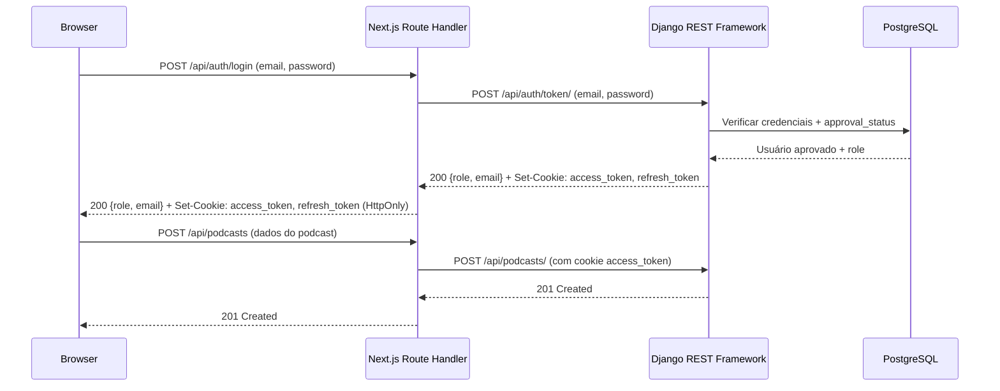
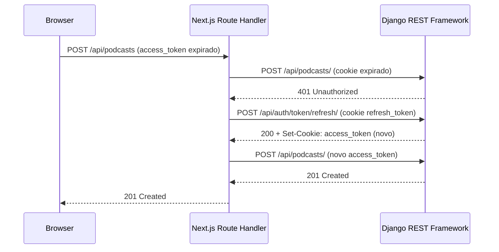

# Design Document — API Authentication Strategy

## Overview

Este documento descreve a arquitetura técnica da estratégia de autenticação JWT para o Podigger, cobrindo o backend Django REST Framework e o frontend Next.js 16 (App Router).

A solução adota **JWT com ambos os tokens armazenados em cookies HttpOnly**, eliminando qualquer exposição de tokens ao JavaScript do browser. O frontend usa **Route Handlers do Next.js como proxy server-side** para todas as operações autenticadas, garantindo que os cookies nunca sejam manipulados pelo código client-side.

### Decisões de Biblioteca

**Backend — `djangorestframework-simplejwt`**

Recomendado por ser a biblioteca JWT mais madura e mantida para DRF, com suporte nativo a:
- Autenticação por campo customizado (email em vez de username)
- Configuração de expiração via settings
- Blacklist de tokens (opcional, para logout server-side)
- Integração direta com `DEFAULT_AUTHENTICATION_CLASSES` do DRF

Versão recomendada: `djangorestframework-simplejwt==5.4.0`

**Frontend — sem biblioteca adicional**

O Next.js 16 com App Router e Route Handlers nativos é suficiente para o padrão de proxy server-side adotado. Não há necessidade de `next-auth` ou similar, pois os tokens ficam em cookies HttpOnly gerenciados pelo backend e o estado de autenticação (role, email) é mantido em contexto React em memória.

---

## Architecture

### Visão Geral do Fluxo de Autenticação



### Fluxo de Renovação de Token



### Separação de Responsabilidades

```
Browser (client-side)
├── Estado em memória: { role, email, isAuthenticated }
├── Formulários: login, register, add-podcast
└── Sem acesso direto a tokens JWT

Next.js Route Handlers (server-side)
├── /api/auth/login     → proxy para POST /api/auth/token/
├── /api/auth/logout    → apaga cookies HttpOnly
├── /api/auth/refresh   → proxy para POST /api/auth/token/refresh/
├── /api/auth/register  → proxy para POST /api/auth/register/
└── /api/proxy/[...path] → proxy genérico para endpoints autenticados

Django REST Framework
├── /api/auth/token/          → emite access + refresh tokens como cookies
├── /api/auth/token/refresh/  → renova access token via cookie refresh
├── /api/auth/register/       → registro público
├── /api/auth/users/          → gestão de usuários (Admin only)
└── /api/podcasts/, /api/episodes/, etc. → endpoints de conteúdo
```

---

## Components and Interfaces

### Backend — Novos Componentes

#### 1. Custom User Model (`accounts/models.py`)

O Django usa `username` como campo de autenticação padrão. É necessário um modelo customizado que use `email` como identificador único.

```python
class User(AbstractBaseUser, PermissionsMixin):
    email = models.EmailField(unique=True)
    role = models.CharField(
        max_length=20,
        choices=[("admin", "Admin"), ("editor", "Editor"), ("reader", "Reader")],
        default="reader",
    )
    approval_status = models.CharField(
        max_length=20,
        choices=[("pending", "Pending"), ("approved", "Approved")],
        default="pending",
    )
    is_active = models.BooleanField(default=True)
    is_staff = models.BooleanField(default=False)
    created_at = models.DateTimeField(auto_now_add=True)

    USERNAME_FIELD = "email"
    REQUIRED_FIELDS = []

    objects = UserManager()
```

#### 2. Custom Token Serializer (`accounts/serializers.py`)

Sobrescreve o serializer padrão do simplejwt para:
- Autenticar por `email` em vez de `username`
- Verificar `approval_status == "approved"` antes de emitir tokens
- Retornar `role` e `email` no corpo da resposta

#### 3. Custom Token View (`accounts/views.py`)

Sobrescreve `TokenObtainPairView` para:
- Definir cookies HttpOnly `access_token` e `refresh_token` na resposta
- Retornar apenas `{ "role": "...", "email": "..." }` no body (sem tokens no body)

#### 4. Cookie-Based JWT Authentication (`accounts/authentication.py`)

Classe de autenticação customizada que herda de `JWTAuthentication` e lê o token do cookie `access_token` em vez do header `Authorization`.

```python
class CookieJWTAuthentication(JWTAuthentication):
    def authenticate(self, request):
        raw_token = request.COOKIES.get("access_token")
        if raw_token is None:
            return None
        validated_token = self.get_validated_token(raw_token)
        return self.get_user(validated_token), validated_token
```

#### 5. Permission Classes (`accounts/permissions.py`)

```python
class IsAdminRole(BasePermission):
    def has_permission(self, request, view):
        return (
            request.user.is_authenticated
            and request.user.role == "admin"
        )

class IsEditorOrAdmin(BasePermission):
    def has_permission(self, request, view):
        return (
            request.user.is_authenticated
            and request.user.role in ("editor", "admin")
        )
```

#### 6. User Management Views (`accounts/views.py`)

- `RegisterView` — endpoint público para criação de conta
- `UserListView` — lista usuários (Admin only)
- `UserApproveView` — aprova conta (Admin only)
- `UserRoleUpdateView` — atualiza papel (Admin only)

### Frontend — Novos Componentes

#### 1. Auth Context (`src/contexts/AuthContext.tsx`)

Contexto React que mantém em memória:
```typescript
interface AuthState {
  user: { email: string; role: "admin" | "editor" | "reader" } | null;
  isAuthenticated: boolean;
  isLoading: boolean;
}
```

#### 2. Route Handlers (`src/app/api/auth/`)

```
src/app/api/auth/
├── login/route.ts      → POST: proxy para /api/auth/token/
├── logout/route.ts     → POST: apaga cookies HttpOnly
├── refresh/route.ts    → POST: proxy para /api/auth/token/refresh/
└── register/route.ts   → POST: proxy para /api/auth/register/
```

#### 3. Proxy Route Handler (`src/app/api/proxy/[...path]/route.ts`)

Proxy genérico que encaminha requisições autenticadas ao backend, incluindo automaticamente o cookie `access_token`. Implementa lógica de retry com refresh automático em caso de 401.

#### 4. Middleware de Proteção de Rotas (`src/middleware.ts`)

Next.js middleware que verifica o estado de autenticação para rotas protegidas e redireciona para `/auth/unauthorized` com parâmetro `?next=<url>` quando necessário.

#### 5. Páginas de Autenticação

```
src/app/
├── login/page.tsx
├── register/page.tsx
└── auth/
    ├── unauthorized/page.tsx
    ├── forbidden/page.tsx
    └── pending/page.tsx
```

---

## Data Models

### User Model

| Campo | Tipo | Descrição |
|-------|------|-----------|
| `id` | `BigAutoField` | PK |
| `email` | `EmailField(unique=True)` | Identificador de login |
| `password` | `CharField` | Hash da senha (gerenciado pelo Django) |
| `role` | `CharField(choices)` | `admin`, `editor`, `reader` |
| `approval_status` | `CharField(choices)` | `pending`, `approved` |
| `is_active` | `BooleanField` | Controle de conta ativa |
| `is_staff` | `BooleanField` | Acesso ao Django Admin |
| `created_at` | `DateTimeField` | Data de criação |

### JWT Token Payload (Access Token)

```json
{
  "token_type": "access",
  "exp": 1234567890,
  "iat": 1234567590,
  "jti": "uuid",
  "user_id": 42,
  "email": "user@example.com",
  "role": "editor"
}
```

O `role` e `email` são incluídos no payload via `TokenObtainPairSerializer` customizado para evitar consultas adicionais ao banco em cada requisição autenticada.

### Cookie Attributes

| Cookie | `HttpOnly` | `Secure` | `SameSite` | `Max-Age` | `Path` |
|--------|-----------|---------|-----------|----------|--------|
| `access_token` | `True` | `True` (prod) | `Lax` | `300` (5 min) | `/` |
| `refresh_token` | `True` | `True` (prod) | `Lax` | `86400` (1 dia) | `/api/auth/token/refresh/` |

O `refresh_token` tem `Path=/api/auth/token/refresh/` para limitar o escopo de envio automático pelo browser apenas ao endpoint de renovação.

### Configurações Django (`SIMPLE_JWT`)

```python
SIMPLE_JWT = {
    "ACCESS_TOKEN_LIFETIME": timedelta(minutes=env.int("JWT_ACCESS_TOKEN_MINUTES", default=5)),
    "REFRESH_TOKEN_LIFETIME": timedelta(days=env.int("JWT_REFRESH_TOKEN_DAYS", default=1)),
    "ROTATE_REFRESH_TOKENS": False,
    "BLACKLIST_AFTER_ROTATION": False,
    "ALGORITHM": "HS256",
    "SIGNING_KEY": SECRET_KEY,
    "AUTH_HEADER_TYPES": ("Bearer",),
    "USER_ID_FIELD": "id",
    "USER_ID_CLAIM": "user_id",
    "TOKEN_OBTAIN_SERIALIZER": "accounts.serializers.EmailTokenObtainPairSerializer",
}
```

### DRF Authentication Configuration

```python
REST_FRAMEWORK = {
    "DEFAULT_AUTHENTICATION_CLASSES": [
        "accounts.authentication.CookieJWTAuthentication",
        "rest_framework.authentication.SessionAuthentication",  # Django Admin
        "rest_framework.authentication.BasicAuthentication",    # Django Admin
    ],
    "DEFAULT_PERMISSION_CLASSES": [
        "rest_framework.permissions.IsAuthenticatedOrReadOnly",
    ],
    # ... demais configurações existentes
}
```

### URL Structure

```python
# config/urls.py
urlpatterns = [
    path("admin/", admin.site.urls),
    path("api/auth/", include("accounts.urls")),
    path("api/", include("podcasts.urls")),
    path("health/", health_check, name="health_check"),
]

# accounts/urls.py
urlpatterns = [
    path("token/", TokenObtainCookieView.as_view(), name="token_obtain"),
    path("token/refresh/", TokenRefreshCookieView.as_view(), name="token_refresh"),
    path("register/", RegisterView.as_view(), name="register"),
    path("users/", UserListView.as_view(), name="user_list"),
    path("users/<int:pk>/approve/", UserApproveView.as_view(), name="user_approve"),
    path("users/<int:pk>/", UserRoleUpdateView.as_view(), name="user_update"),
]
```

---

## Correctness Properties

*Uma propriedade é uma característica ou comportamento que deve ser verdadeiro em todas as execuções válidas de um sistema — essencialmente, uma declaração formal sobre o que o sistema deve fazer. Propriedades servem como ponte entre especificações legíveis por humanos e garantias de corretude verificáveis por máquinas.*

A biblioteca de property-based testing recomendada para o backend Python é **`hypothesis`** (versão `hypothesis==6.135.0`). Para o frontend TypeScript, **`fast-check`** (versão `fast-check==3.23.2`).

Cada teste de propriedade deve ser configurado com no mínimo 100 iterações.

---

### Property 1: Login bem-sucedido emite tokens e retorna role/email

*Para qualquer* usuário aprovado com email e senha válidos, uma requisição `POST /api/auth/token/` deve retornar HTTP 200, definir os cookies HttpOnly `access_token` e `refresh_token` na resposta, e incluir `role` e `email` no corpo da resposta.

**Validates: Requirements 1.1, 1.8**

---

### Property 2: Expiração do Access Token

*Para qualquer* login bem-sucedido, o payload decodificado do `access_token` deve ter `exp - iat <= 300` segundos (5 minutos).

**Validates: Requirements 1.4**

---

### Property 3: Expiração do Refresh Token

*Para qualquer* login bem-sucedido, o payload decodificado do `refresh_token` deve ter `exp - iat <= 86400` segundos (1 dia).

**Validates: Requirements 1.5**

---

### Property 4: Autenticação por email

*Para qualquer* usuário aprovado, o login deve funcionar exclusivamente com o campo `email` como identificador — uma requisição com `username` em vez de `email` deve ser rejeitada com HTTP 400 ou HTTP 401.

**Validates: Requirements 1.7**

---

### Property 5: Renovação de token (round-trip)

*Para qualquer* usuário autenticado com `refresh_token` válido e não expirado, uma requisição `POST /api/auth/token/refresh/` deve retornar HTTP 200 e emitir um novo `access_token` via cookie HttpOnly.

**Validates: Requirements 2.1**

---

### Property 6: Registro cria conta com status pending e role reader

*Para qualquer* combinação de email único e senha válida (≥ 8 caracteres), uma requisição `POST /api/auth/register/` deve retornar HTTP 201 e criar uma conta com `approval_status = "pending"` e `role = "reader"`.

**Validates: Requirements 3.2**

---

### Property 7: Validação de senha no registro

*Para qualquer* senha com menos de 8 caracteres, uma requisição `POST /api/auth/register/` deve retornar HTTP 400 com mensagem descritiva dos critérios não atendidos.

**Validates: Requirements 3.4, 3.5**

---

### Property 8: Controle de acesso admin (consolidado)

*Para qualquer* requisição aos endpoints de gerenciamento de usuários (`GET /api/auth/users/`, `POST /api/auth/users/{id}/approve/`, `PATCH /api/auth/users/{id}/`) com token de usuário não-Admin (Reader, Editor, ou sem token), a API deve retornar HTTP 403 ou HTTP 401 respectivamente.

**Validates: Requirements 4.1, 4.3, 4.4, 4.5, 5.6**

---

### Property 9: Aprovação de conta muda status para approved

*Para qualquer* usuário com `approval_status = "pending"`, após uma requisição `POST /api/auth/users/{id}/approve/` por um Admin, o `approval_status` do usuário deve ser `"approved"`.

**Validates: Requirements 4.2**

---

### Property 10: Validação de papel inválido

*Para qualquer* valor de `role` que não seja `"admin"`, `"editor"` ou `"reader"`, uma requisição `PATCH /api/auth/users/{id}/` deve retornar HTTP 400 com mensagem de erro descritiva.

**Validates: Requirements 4.6**

---

### Property 11: Autenticação obrigatória para escrita (consolidado)

*Para qualquer* endpoint de conteúdo (`/api/podcasts/`, `/api/episodes/`, etc.) e qualquer método de escrita (`POST`, `PUT`, `PATCH`, `DELETE`), uma requisição sem cookie `access_token` válido deve retornar HTTP 401.

**Validates: Requirements 5.1, 5.4**

---

### Property 12: Reader não pode escrever (consolidado)

*Para qualquer* endpoint de conteúdo e qualquer método de escrita, uma requisição com `access_token` válido de um usuário com `role = "reader"` deve retornar HTTP 403.

**Validates: Requirements 5.2, 5.5**

---

### Property 13: Token lido exclusivamente do cookie

*Para qualquer* token JWT válido enviado via header `Authorization: Bearer <token>` (em vez do cookie `access_token`), a API deve tratar a requisição como não autenticada e retornar HTTP 401 para endpoints protegidos.

**Validates: Requirements 5.7, 14.5**

---

### Property 14: Leitura pública sem autenticação

*Para qualquer* endpoint de conteúdo (`/api/podcasts/`, `/api/episodes/`, `/api/popular-terms/`) e método `GET`, uma requisição sem autenticação deve retornar HTTP 200.

**Validates: Requirements 6.1, 6.2, 6.3, 6.4**

---

### Property 15: Atributos de segurança dos cookies

*Para qualquer* login bem-sucedido em ambiente com `DEBUG=False`, os cookies `access_token` e `refresh_token` definidos na resposta devem ter os atributos `HttpOnly=True` e `Secure=True`.

**Validates: Requirements 7.1, 7.2**

---

### Property 16: Logout apaga cookies

*Para qualquer* usuário autenticado, após acionar o logout via Route Handler, os cookies `access_token` e `refresh_token` devem ser apagados (resposta com `Set-Cookie` contendo `Max-Age=0` ou `expires` no passado).

**Validates: Requirements 10.1**

---

### Property 17: Redirecionamento preserva URL de origem

*Para qualquer* URL protegida acessada sem autenticação válida, o redirecionamento para `/auth/unauthorized` deve incluir o parâmetro `?next=<url-original>` na query string.

**Validates: Requirements 13.5**

---

### Property 18: Visibilidade do formulário de podcast por papel

*Para qualquer* estado de autenticação onde `role` é `"reader"`, `null` (não autenticado), ou ausente, o formulário de cadastro de podcast não deve ser renderizado. Para `role = "editor"` ou `role = "admin"`, o formulário deve ser renderizado.

**Validates: Requirements 9.1**

---

## Error Handling

### Backend — Respostas de Erro Padronizadas

Todos os erros de autenticação e autorização devem retornar JSON com a estrutura:

```json
{
  "detail": "Mensagem descritiva do erro"
}
```

| Cenário | Status | Mensagem |
|---------|--------|----------|
| Credenciais inválidas | 401 | `"Credenciais inválidas."` |
| Conta aguarda aprovação | 403 | `"Sua conta aguarda aprovação de um administrador."` |
| Token ausente/inválido | 401 | `"Token de autenticação não fornecido ou inválido."` |
| Token expirado | 401 | `"Token de autenticação expirado."` |
| Permissão insuficiente | 403 | `"Você não tem permissão para realizar esta ação."` |
| Email já cadastrado | 400 | `"Este email já está cadastrado."` |
| Senha muito curta | 400 | `"A senha deve ter no mínimo 8 caracteres."` |
| Papel inválido | 400 | `"Papel inválido. Valores aceitos: admin, editor, reader."` |

**Princípio de segurança**: Erros de autenticação (401) nunca devem revelar se o email existe ou não no sistema — a mensagem deve ser genérica para evitar enumeração de usuários.

### Frontend — Tratamento de Erros nos Route Handlers

Os Route Handlers devem:
1. Capturar erros de rede e retornar 503 com mensagem genérica
2. Repassar status codes do backend (401, 403, 400) com o body original
3. Nunca expor stack traces ou detalhes internos ao browser

### Lógica de Retry com Refresh Automático

```typescript
// Pseudocódigo do proxy genérico
async function proxyRequest(request: Request, path: string) {
  const response = await forwardToBackend(request, path);
  
  if (response.status === 401) {
    const refreshed = await attemptTokenRefresh();
    if (refreshed) {
      return forwardToBackend(request, path); // retry com novo token
    }
    return redirectTo("/auth/unauthorized?next=" + path);
  }
  
  return response;
}
```

---

## Testing Strategy

### Abordagem Dual

A estratégia combina testes de propriedade (para verificar comportamento universal) com testes de exemplo (para cenários específicos e integração).

### Backend — Testes de Propriedade (Hypothesis)

Biblioteca: `hypothesis==6.135.0` com `pytest-django`

Cada propriedade listada na seção "Correctness Properties" deve ser implementada como um único teste de propriedade com no mínimo 100 iterações (padrão do Hypothesis).

Exemplo de estrutura:
```python
# Feature: api-authentication-strategy, Property 6: Registro cria conta com status pending e role reader
@given(
    email=emails(),
    password=text(min_size=8, alphabet=printable).filter(lambda p: len(p) >= 8),
)
@settings(max_examples=100)
def test_registration_creates_pending_reader(email, password):
    response = client.post("/api/auth/register/", {"email": email, "password": password})
    assert response.status_code == 201
    user = User.objects.get(email=email)
    assert user.approval_status == "pending"
    assert user.role == "reader"
```

### Backend — Testes de Exemplo (pytest-django)

Cenários específicos que complementam os testes de propriedade:
- Login com conta `pending` retorna 403 com mensagem correta
- Refresh com token expirado retorna 401
- Registro com email duplicado retorna 400
- Django Admin continua funcionando com sessão (smoke test)
- Endpoints de configuração JWT leem variáveis de ambiente (smoke test)

### Frontend — Testes de Propriedade (fast-check)

Biblioteca: `fast-check==3.23.2` com `vitest` (já instalado)

Propriedades testáveis no frontend:
- Property 17: Redirecionamento preserva URL de origem (geração de URLs aleatórias)
- Property 18: Visibilidade do formulário por papel (geração de estados de auth aleatórios)

Exemplo:
```typescript
// Feature: api-authentication-strategy, Property 17: Redirecionamento preserva URL de origem
import fc from "fast-check";

test("redirect preserves origin URL", () => {
  fc.assert(
    fc.property(fc.webPath(), (path) => {
      const redirectUrl = buildUnauthorizedRedirect(path);
      expect(new URL(redirectUrl).searchParams.get("next")).toBe(path);
    }),
    { numRuns: 100 }
  );
});
```

### Frontend — Testes de Exemplo (vitest + Testing Library)

Cenários específicos:
- Página `/login` renderiza campos email e password
- Página `/register` renderiza campos email, password, password_confirm
- Login com conta pending exibe mensagem sem redirecionar
- Login com credenciais inválidas exibe mensagem genérica
- Logout redireciona para `/`
- Rota protegida sem autenticação redireciona para `/login`
- Páginas `/auth/unauthorized`, `/auth/forbidden`, `/auth/pending` renderizam sem erro

### Cobertura de Testes

| Camada | Tipo | Ferramenta | Propriedades |
|--------|------|-----------|-------------|
| Backend API | Propriedade | Hypothesis | Properties 1–16 |
| Backend API | Exemplo | pytest-django | Cenários específicos |
| Frontend UI | Propriedade | fast-check | Properties 17–18 |
| Frontend UI | Exemplo | vitest + Testing Library | Fluxos de UI |
| Integração | Smoke | pytest | Configuração, Django Admin |

### Configuração de Testes de Propriedade

- Mínimo de **100 iterações** por teste de propriedade
- Cada teste deve ter comentário de tag no formato: `# Feature: api-authentication-strategy, Property N: <texto>`
- Testes de propriedade do backend devem usar banco de dados em memória (SQLite) ou fixtures isoladas
- Testes de propriedade do frontend devem mockar chamadas de rede
