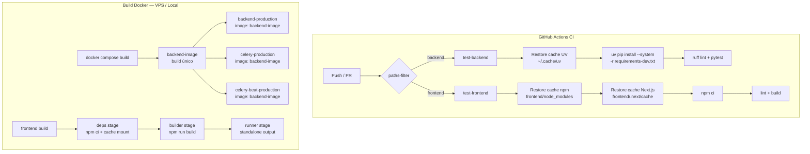

# Design Técnico — Otimização de Build

## Visão Geral

Este documento descreve as mudanças técnicas necessárias para otimizar o processo de build do projeto Podigger. O objetivo é reduzir o tempo de build no CI e no VPS, diminuir o tamanho das imagens Docker de produção e tornar o pipeline mais eficiente e reproduzível.

As otimizações se dividem em quatro eixos principais:

1. **Dependências Python**: separação prod/dev, substituição de pip por UV, psycopg2 compilado em produção.
2. **Dockerfiles**: remoção de instruções redundantes, cache mounts BuildKit, UV no backend.
3. **CI (GitHub Actions)**: cache de UV, cache do `.next/cache`, `NEXT_TELEMETRY_DISABLED`.
4. **Frontend**: bundle analyzer, otimizações do `next.config.ts`, eliminação de builds redundantes no docker-compose.

---

## Arquitetura

### Fluxo de Build Otimizado



### Estratégia de Cache por Camada

| Contexto | Ferramenta | Cache Key | Benefício |
|---|---|---|---|
| CI backend | `actions/cache` | hash(requirements-dev.txt) | Evita reinstalação completa |
| CI frontend npm | `actions/setup-node cache` | hash(package-lock.json) | Evita `npm ci` completo |
| CI frontend Next.js | `actions/cache` | OS + hash(package-lock.json) + hash(src/**) | Build incremental |
| Docker backend | `--mount=type=cache,target=/root/.cache/uv` | Persistido entre builds locais | UV reutiliza wheel cache |
| Docker frontend | `--mount=type=cache,target=/root/.npm` | Persistido entre builds locais | npm reutiliza registry cache |

---

## Componentes e Interfaces

### 1. Arquivos de Dependências Python

**Estrutura atual** (único arquivo):
```
backend/requirements.txt  ← prod + dev misturados
```

**Estrutura proposta**:
```
backend/requirements.txt       ← apenas dependências de produção
backend/requirements-dev.txt   ← inclui requirements.txt + deps de dev
```

**Interface entre arquivos**: `requirements-dev.txt` inclui `requirements.txt` via diretiva `-r`:
```
# requirements-dev.txt
-r requirements.txt
pytest>=7.0.0
pytest-django>=4.0.0
...
```

### 2. Dockerfiles

Três Dockerfiles são modificados:

| Arquivo | Tipo | Mudança principal |
|---|---|---|
| `backend/Dockerfile` | dev, single-stage | pip → UV via COPY --from |
| `backend/Dockerfile.production` | prod, multi-stage | pip → UV, novo estágio implícito via COPY --from |
| `frontend/Dockerfile.production` | prod, multi-stage | remover instruções redundantes, cache mount npm |

### 3. CI (`.github/workflows/ci.yml`)

Dois jobs são modificados:

- `test-backend`: adiciona cache UV, substitui pip por UV
- `test-frontend`: adiciona cache `.next/cache`, define `NEXT_TELEMETRY_DISABLED=1`

### 4. `docker-compose.production.yml`

Introduz um serviço `backend-image` dedicado ao build, e os serviços `celery-production` e `celery-beat-production` passam a referenciar a imagem via `image:` em vez de `build:`.

### 5. `frontend/next.config.ts`

Adiciona configurações de otimização e integra `@next/bundle-analyzer`.

### 6. `Makefile`

Adiciona targets `build-analyze`, `deps-check` e `build-production`.

---

## Modelos de Dados

Esta feature não introduz novos modelos de dados de aplicação. As "estruturas de dados" relevantes são os arquivos de configuração.

### `backend/requirements.txt` (produção)

```
# Dependências de produção do Podigger backend.
# Para instalar: uv pip install -r requirements.txt
# Para desenvolvimento, use requirements-dev.txt

Django==5.2.13
djangorestframework>=3.16.1,<4.0
psycopg2==2.9.11          # compilado — não usar psycopg2-binary em produção
django-cors-headers==4.0.0
celery==5.5.3
redis==7.1.0
gunicorn>=20.1.0,<24.0
uvicorn==0.38.0
django-environ>=0.10.0
django-redis>=5.4.0
django-filter>=23.2
feedparser>=6.0.10
requests>=2.31.0
urllib3>=2.6.3
zipp>=3.19.1
```

### `backend/requirements-dev.txt`

```
# Dependências de desenvolvimento do Podigger backend.
# Inclui todas as dependências de produção mais ferramentas de dev/test.
# Para instalar: uv pip install -r requirements-dev.txt

-r requirements.txt

# Testes
pytest>=7.0.0
pytest-django>=4.0.0
pytest-mock>=3.10.0
pytest-cov>=4.1.0

# Dados de teste
Faker==19.9.0

# Qualidade de código
ruff>=0.8.0,<0.9.0

# Versionamento
commitizen>=3.13.0

# Driver PostgreSQL para dev (binário pré-compilado, mais fácil de instalar)
psycopg2-binary==2.9.11
```

> **Nota**: `psycopg2-binary` em dev sobrescreve `psycopg2` de produção. Isso é intencional — em dev não precisamos compilar o driver. Em produção, `psycopg2` (compilado) é mais estável e não carrega bibliotecas compartilhadas desnecessárias.

### `backend/Dockerfile` (dev, single-stage com UV)

```dockerfile
# Copia o binário UV da imagem oficial (sem instalar via pip ou curl)
COPY --from=ghcr.io/astral-sh/uv:latest /uv /uvx /bin/

FROM python:3.12-slim

COPY --from=ghcr.io/astral-sh/uv:latest /uv /uvx /bin/

RUN apt-get update \
    && apt-get install -y --no-install-recommends build-essential libpq-dev gcc curl \
    && rm -rf /var/lib/apt/lists/*

WORKDIR /app

COPY requirements.txt /app/requirements.txt
RUN uv pip install --system --no-cache -r /app/requirements.txt

COPY . /app

ENV PYTHONDONTWRITEBYTECODE=1
ENV PYTHONUNBUFFERED=1

EXPOSE 8000
CMD ["python", "manage.py", "runserver", "0.0.0.0:8000"]
```

### `backend/Dockerfile.production` (multi-stage com UV)

```dockerfile
# syntax=docker/dockerfile:1

# Estágio 1: builder — instala dependências com UV
FROM python:3.12-slim AS builder

COPY --from=ghcr.io/astral-sh/uv:latest /uv /uvx /bin/

RUN apt-get update && \
    apt-get install -y --no-install-recommends \
    build-essential libpq-dev gcc curl && \
    rm -rf /var/lib/apt/lists/*

WORKDIR /app

COPY requirements.txt .
RUN --mount=type=cache,target=/root/.cache/uv \
    uv pip install --system --no-cache -r requirements.txt

# Estágio 2: runtime — imagem mínima sem ferramentas de build
FROM python:3.12-slim

RUN apt-get update && \
    apt-get install -y --no-install-recommends libpq5 curl && \
    rm -rf /var/lib/apt/lists/*

RUN useradd -m -u 1000 app && \
    mkdir -p /app /app/staticfiles /app/media && \
    chown -R app:app /app

WORKDIR /app

# Copia pacotes instalados pelo UV (instalados em --system, ficam em /usr/local)
COPY --from=builder --chown=app:app /usr/local/lib/python3.12/site-packages /usr/local/lib/python3.12/site-packages
COPY --from=builder --chown=app:app /usr/local/bin /usr/local/bin

COPY --chown=app:app manage.py pyproject.toml pytest.ini ./
COPY --chown=app:app config ./config
COPY --chown=app:app podcasts ./podcasts

ENV PYTHONDONTWRITEBYTECODE=1 \
    PYTHONUNBUFFERED=1 \
    DJANGO_SETTINGS_MODULE=config.settings

USER app

ARG DJANGO_SECRET_KEY=build-only-dummy-key
RUN python manage.py collectstatic --noinput || true

EXPOSE 8000

HEALTHCHECK --interval=30s --timeout=10s --start-period=40s --retries=3 \
    CMD curl -f http://localhost:8000/health/ || exit 1

CMD ["gunicorn", "config.wsgi:application", "--bind", "0.0.0.0:8000", "--workers", "4", "--timeout", "120"]
```

> **Decisão de design — `--system` vs `--user`**: O Dockerfile atual usa `pip install --user`, copiando de `/root/.local` para `/home/app/.local`. Com UV e `--system`, os pacotes vão para `/usr/local/lib/python3.12/site-packages`, que é o local padrão do Python. Isso simplifica o `PATH` e elimina a necessidade de configurar `PATH=/home/app/.local/bin:$PATH`.

### `frontend/Dockerfile.production` (otimizado)

```dockerfile
# syntax=docker/dockerfile:1

FROM node:24.14.0-alpine AS deps
WORKDIR /app
RUN apk add --no-cache libc6-compat
ENV NEXT_TELEMETRY_DISABLED=1
COPY package.json package-lock.json ./
RUN --mount=type=cache,target=/root/.npm \
    npm ci --cache /root/.npm

FROM node:24.14.0-alpine AS builder
WORKDIR /app
RUN apk add --no-cache libc6-compat
COPY --from=deps /app/node_modules ./node_modules
COPY next.config.ts postcss.config.mjs tsconfig.json ./
COPY package.json package-lock.json ./
COPY public ./public
COPY src ./src
ARG NEXT_PUBLIC_API_URL
ARG NEXT_PUBLIC_ENVIRONMENT
ENV NEXT_PUBLIC_API_URL=$NEXT_PUBLIC_API_URL \
    NEXT_PUBLIC_ENVIRONMENT=$NEXT_PUBLIC_ENVIRONMENT \
    NEXT_TELEMETRY_DISABLED=1 \
    NODE_ENV=production
# TypeScript disponível em node_modules/.bin/tsc — não instalar globalmente
RUN npm run build

FROM node:24.14.0-alpine AS runner
WORKDIR /app
RUN apk add --no-cache libc6-compat && \
    addgroup -S nextjs -g 1001 && \
    adduser -S nextjs -u 1001
ENV NODE_ENV=production \
    NEXT_TELEMETRY_DISABLED=1 \
    PORT=3000 \
    HOSTNAME=0.0.0.0
COPY --from=builder --chown=nextjs:nextjs /app/.next/standalone ./
COPY --from=builder --chown=nextjs:nextjs /app/.next/static ./.next/static
COPY --from=builder --chown=nextjs:nextjs /app/public ./public
USER nextjs
EXPOSE 3000
HEALTHCHECK --interval=30s --timeout=5s --start-period=10s --retries=3 \
    CMD node -e "require('http').get('http://localhost:3000/api/health',r=>process.exit(r.statusCode===200?0:1))"
CMD ["node", "server.js"]
```

**Mudanças em relação ao atual**:
- Removido: `RUN npm list next || npm install`
- Removido: `RUN npm install -g typescript`
- Adicionado: `--mount=type=cache,target=/root/.npm` no `npm ci`
- Adicionado: `ENV NEXT_TELEMETRY_DISABLED=1` no estágio `deps`

### `frontend/next.config.ts` (otimizado)

```typescript
import type { NextConfig } from 'next';
import bundleAnalyzer from '@next/bundle-analyzer';

const withBundleAnalyzer = bundleAnalyzer({
  enabled: process.env.ANALYZE === 'true',
});

const nextConfig: NextConfig = {
  output: 'standalone',
  compress: true,
  poweredByHeader: false,
  images: {
    formats: ['image/avif', 'image/webp'],
  },
  experimental: {
    optimizePackageImports: ['clsx', 'tailwind-merge'],
  },
};

export default withBundleAnalyzer(nextConfig);
```

### `docker-compose.production.yml` (build único para backend)

```yaml
services:
  # Serviço dedicado ao build da imagem do backend
  # Não executa nenhum processo — apenas constrói a imagem
  backend-image:
    build:
      context: ./backend
      dockerfile: Dockerfile.production
      args:
        - ENVIRONMENT=production
    image: podigger-backend:production

  backend-production:
    image: podigger-backend:production
    depends_on:
      backend-image:
        condition: service_completed_successfully
    # ... demais configurações sem `build:`

  celery-production:
    image: podigger-backend:production
    depends_on:
      backend-image:
        condition: service_completed_successfully
    # ... sem `build:`

  celery-beat-production:
    image: podigger-backend:production
    depends_on:
      backend-image:
        condition: service_completed_successfully
    # ... sem `build:`
```

> **Decisão de design — serviço `backend-image`**: O Docker Compose não tem um conceito nativo de "build once, use many". A abordagem mais simples é definir um serviço com `build:` + `image:` (que nomeia a imagem construída) e os demais serviços referenciam apenas `image:`. O serviço `backend-image` pode ser um serviço que termina imediatamente (ex: `command: ["true"]`) ou pode ser omitido se o build for feito manualmente antes do `up`. A abordagem recomendada é executar `docker compose build backend-image` antes do `docker compose up`.

### `.github/workflows/ci.yml` (jobs otimizados)

**Job `test-backend` — mudanças**:

```yaml
- name: Cache UV
  uses: actions/cache@v4
  with:
    path: ~/.cache/uv
    key: ${{ runner.os }}-uv-${{ hashFiles('backend/requirements-dev.txt') }}
    restore-keys: |
      ${{ runner.os }}-uv-

- name: Install UV and dependencies
  run: |
    pip install uv
    uv pip install --system -r backend/requirements-dev.txt
```

**Job `test-frontend` — mudanças**:

```yaml
env:
  NEXT_TELEMETRY_DISABLED: 1

steps:
  # ... checkout, setup-node (já tem cache npm) ...

  - name: Cache Next.js build
    uses: actions/cache@v4
    with:
      path: frontend/.next/cache
      key: ${{ runner.os }}-nextjs-${{ hashFiles('frontend/package-lock.json') }}-${{ hashFiles('frontend/src/**') }}
      restore-keys: |
        ${{ runner.os }}-nextjs-${{ hashFiles('frontend/package-lock.json') }}-
        ${{ runner.os }}-nextjs-
```

### `Makefile` (novos targets)

```makefile
# Análise de bundle do frontend
build-analyze:
	@echo "Analisando bundle do frontend..."
	@cd frontend && ANALYZE=true npm run build
	@echo "Relatórios gerados em frontend/.next/analyze/"

# Verificação de dependências desatualizadas
deps-check:
	@echo "=== Backend (Python) ==="
	@cd backend && uv pip list --outdated
	@echo ""
	@echo "=== Frontend (Node.js) ==="
	@cd frontend && npm outdated || true

# Build de produção com BuildKit habilitado
build-production:
	@echo "Construindo imagens de produção com BuildKit..."
	@DOCKER_BUILDKIT=1 docker compose -f docker-compose.production.yml build
	@echo "Build concluído!"
```

---

## Propriedades de Corretude

*Uma propriedade é uma característica ou comportamento que deve ser verdadeiro em todas as execuções válidas de um sistema — essencialmente, uma afirmação formal sobre o que o sistema deve fazer. Propriedades servem como ponte entre especificações legíveis por humanos e garantias de corretude verificáveis por máquina.*

A maioria dos critérios de aceitação desta feature são verificações de configuração (EXAMPLE) — verificar que um arquivo contém ou não contém determinada instrução. Essas verificações são melhor cobertas por testes de exemplo diretos.

Três critérios se qualificam como propriedades universais:

### Propriedade 1: requirements.txt não contém dependências de desenvolvimento

*Para qualquer* linha no arquivo `requirements.txt` de produção, essa linha não deve corresponder a nenhuma dependência exclusiva de desenvolvimento (pytest, pytest-django, pytest-mock, pytest-cov, Faker, ruff, commitizen).

**Valida: Requisito 1.1**

### Propriedade 2: Bundle analyzer ativado se e somente se ANALYZE=true

*Para qualquer* valor da variável de ambiente `ANALYZE`, a configuração do `next.config.ts` deve ativar o bundle analyzer se e somente se `ANALYZE === 'true'`. Para qualquer outro valor (undefined, 'false', '1', string vazia), o analyzer deve estar desativado.

**Valida: Requisitos 6.2, 6.3**

### Propriedade 3: Exatamente um serviço com build do backend no docker-compose

*Para qualquer* configuração válida do `docker-compose.production.yml`, exatamente um serviço deve conter a chave `build:` referenciando o `Dockerfile.production` do backend. Os demais serviços que usam a imagem do backend devem referenciar apenas `image:`.

**Valida: Requisito 4.1**

---

## Tratamento de Erros

### UV — falha na instalação de dependências

- **Cenário**: `uv pip install` falha por dependência incompatível ou rede indisponível.
- **Comportamento esperado**: o build Docker falha com código de saída não-zero, interrompendo o pipeline. Nenhuma imagem parcial é publicada.
- **Mitigação**: UV exibe mensagens de erro detalhadas com sugestões de resolução. O cache mount (`--mount=type=cache`) não persiste estado corrompido entre builds.

### psycopg2 compilado — falha na compilação

- **Cenário**: `psycopg2` (sem `-binary`) requer `libpq-dev` e `gcc` para compilar. Se as dependências de sistema não estiverem presentes no estágio builder, o build falha.
- **Comportamento esperado**: o estágio `builder` do `Dockerfile.production` já instala `build-essential`, `libpq-dev` e `gcc`. A falha seria um sinal de que essas dependências foram removidas inadvertidamente.
- **Mitigação**: manter `build-essential libpq-dev gcc` no `apt-get install` do estágio builder.

### Cache do Next.js — cache corrompido

- **Cenário**: o cache do `.next/cache` restaurado está corrompido ou incompatível com a versão atual do Next.js.
- **Comportamento esperado**: o Next.js detecta inconsistências e executa build completo automaticamente, ignorando o cache corrompido.
- **Mitigação**: a chave de cache inclui o hash do `package-lock.json`, então uma atualização do Next.js invalida o cache automaticamente.

### docker-compose — imagem do backend não construída antes do `up`

- **Cenário**: `docker compose up` é executado sem que `backend-image` tenha sido construído previamente.
- **Comportamento esperado**: o Docker Compose tenta construir a imagem automaticamente se `build:` estiver definido no serviço `backend-image`.
- **Mitigação**: documentar no `Makefile` e no README que `make build-production` deve ser executado antes do primeiro `up`.

### Bundle analyzer — ANALYZE=true em produção

- **Cenário**: a variável `ANALYZE=true` é definida acidentalmente em um build de produção.
- **Comportamento esperado**: o build gera relatórios HTML adicionais mas a aplicação funciona normalmente. Os relatórios não são incluídos na imagem Docker (ficam em `.next/analyze/` que não é copiado para o runner).
- **Mitigação**: a configuração do `next.config.ts` usa `process.env.ANALYZE` que não é definida no Dockerfile de produção.

---

## Estratégia de Testes

### Testes de Exemplo (configuração)

A maioria das verificações desta feature são testes de configuração — verificar que arquivos contêm ou não contêm determinadas instruções. Esses testes devem ser implementados como testes de exemplo simples.

**Ferramentas recomendadas**:
- Backend: `pytest` com leitura de arquivos
- Frontend: `vitest` com leitura de arquivos

**Exemplos de testes de configuração**:

```python
# backend/tests/test_requirements_separation.py

def test_requirements_prod_has_no_dev_dependencies():
    """requirements.txt não deve conter dependências de desenvolvimento."""
    dev_only = {'pytest', 'pytest-django', 'pytest-mock', 'pytest-cov',
                'faker', 'ruff', 'commitizen'}
    with open('requirements.txt') as f:
        lines = [l.strip().lower() for l in f if l.strip() and not l.startswith('#')]
    packages = {l.split('>=')[0].split('==')[0].split('<')[0] for l in lines if not l.startswith('-r')}
    assert packages.isdisjoint(dev_only), \
        f"Dependências de dev encontradas em requirements.txt: {packages & dev_only}"

def test_requirements_dev_includes_prod():
    """requirements-dev.txt deve incluir requirements.txt."""
    with open('requirements-dev.txt') as f:
        content = f.read()
    assert '-r requirements.txt' in content

def test_requirements_prod_uses_psycopg2_not_binary():
    """requirements.txt deve usar psycopg2 compilado, não psycopg2-binary."""
    with open('requirements.txt') as f:
        content = f.read().lower()
    assert 'psycopg2-binary' not in content
    assert 'psycopg2' in content
```

```typescript
// frontend/src/__tests__/config.test.ts

import { describe, it, expect } from 'vitest';

describe('next.config.ts', () => {
  it('deve ter compress habilitado', async () => {
    const { default: config } = await import('../../next.config');
    expect(config.compress).toBe(true);
  });

  it('deve ter poweredByHeader desabilitado', async () => {
    const { default: config } = await import('../../next.config');
    expect(config.poweredByHeader).toBe(false);
  });

  it('deve ter formatos de imagem configurados', async () => {
    const { default: config } = await import('../../next.config');
    expect(config.images?.formats).toContain('image/avif');
    expect(config.images?.formats).toContain('image/webp');
  });
});
```

### Testes de Propriedade

Para os três critérios identificados como propriedades universais, recomenda-se o uso de `hypothesis` (Python) e `fast-check` (TypeScript).

**Configuração mínima**: 100 iterações por propriedade.

#### Propriedade 1 — requirements.txt não contém deps de dev

```python
# Feature: build-optimization, Property 1: requirements.txt não contém dependências de desenvolvimento
from hypothesis import given, settings
from hypothesis import strategies as st

DEV_ONLY_PACKAGES = {'pytest', 'pytest-django', 'pytest-mock', 'pytest-cov',
                     'faker', 'ruff', 'commitizen'}

@given(st.lists(
    st.sampled_from(list(DEV_ONLY_PACKAGES)),
    min_size=1, max_size=5
))
@settings(max_examples=100)
def test_no_dev_deps_in_prod_requirements(dev_packages_subset):
    """Para qualquer subconjunto de dependências de dev, nenhuma deve aparecer em requirements.txt."""
    with open('requirements.txt') as f:
        lines = [l.strip().lower() for l in f if l.strip() and not l.startswith('#')]
    packages = {l.split('>=')[0].split('==')[0].split('<')[0]
                for l in lines if not l.startswith('-r')}
    for pkg in dev_packages_subset:
        assert pkg not in packages, \
            f"Dependência de dev '{pkg}' encontrada em requirements.txt"
```

#### Propriedade 2 — Bundle analyzer ativado se e somente se ANALYZE=true

```typescript
// Feature: build-optimization, Property 2: bundle analyzer ativado se e somente se ANALYZE=true
import { fc } from '@fast-check/vitest';
import { describe, it } from 'vitest';

describe('bundle analyzer activation', () => {
  it('deve ativar analyzer somente quando ANALYZE=true', () => {
    fc.assert(
      fc.property(
        fc.oneof(
          fc.constant('true'),
          fc.constant('false'),
          fc.constant(''),
          fc.constant(undefined),
          fc.string(),
        ),
        (analyzeValue) => {
          const originalEnv = process.env.ANALYZE;
          process.env.ANALYZE = analyzeValue as string;
          const isEnabled = process.env.ANALYZE === 'true';
          process.env.ANALYZE = originalEnv;
          // O analyzer deve estar ativo se e somente se ANALYZE === 'true'
          return isEnabled === (analyzeValue === 'true');
        }
      ),
      { numRuns: 100 }
    );
  });
});
```

#### Propriedade 3 — Exatamente um serviço com build do backend

```python
# Feature: build-optimization, Property 3: exatamente um serviço com build do backend
import yaml
from hypothesis import given, settings
from hypothesis import strategies as st

@given(st.just('docker-compose.production.yml'))
@settings(max_examples=100)
def test_single_backend_build_service(compose_file):
    """Para qualquer leitura do docker-compose.production.yml, exatamente um serviço
    deve ter a chave build: referenciando Dockerfile.production do backend."""
    with open(compose_file) as f:
        compose = yaml.safe_load(f)
    services_with_build = [
        name for name, svc in compose.get('services', {}).items()
        if isinstance(svc, dict)
        and 'build' in svc
        and svc.get('build', {}).get('dockerfile') == 'Dockerfile.production'
        and 'backend' in svc.get('build', {}).get('context', '')
    ]
    assert len(services_with_build) == 1, \
        f"Esperado 1 serviço com build do backend, encontrado {len(services_with_build)}: {services_with_build}"
```

### Testes de Fumaça (Smoke Tests)

- Verificar que `docker compose build` completa sem erros após as mudanças.
- Verificar que `docker compose up` inicia todos os serviços com saúde (healthcheck passing).
- Verificar que o CI passa com as novas configurações de cache.

### Abordagem Dual

| Tipo | Ferramenta | Foco |
|---|---|---|
| Testes de exemplo | pytest / vitest | Verificações de configuração específicas |
| Testes de propriedade | hypothesis / fast-check | Invariantes universais (3 propriedades) |
| Testes de fumaça | CI / docker compose | Integração end-to-end |

Os testes de propriedade devem ser executados com mínimo de **100 iterações** cada. Os testes de exemplo cobrem os casos concretos; os testes de propriedade garantem que as invariantes se mantêm para qualquer entrada válida.
