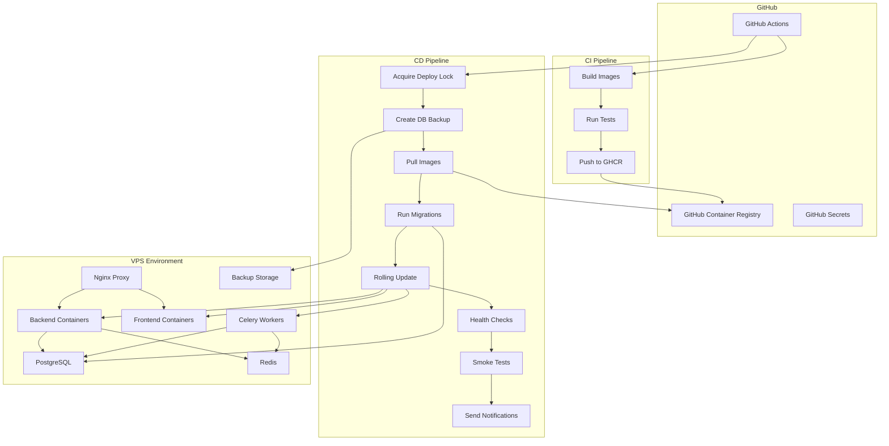

# Design Document: VPS Reliable CI/CD Strategy (Lite Version)

## Overview

This design document specifies a robust, reliable, and minimalist CI/CD strategy for deploying the Podigger application to VPS environments. The solution addresses current deployment instability issues including race conditions, inadequate health checks, builds during deployment, and ineffective rollback mechanisms.

### Design Goals

1. **Zero-Downtime Deployments**: Maintain service availability during updates using rolling update strategies
2. **Automated Rollback**: Detect failures automatically and revert to stable versions without manual intervention
3. **Resource Stability**: Prevent OOM kills and resource contention through explicit limits and reservations
4. **Fast Deployments**: Complete application deployments in under 5 minutes through pre-built images and optimized workflows
5. **Operational Simplicity**: Use native Docker and GitHub Actions features without additional orchestration complexity

### Key Design Decisions

**Image Registry Strategy**: GitHub Container Registry (ghcr.io) provides zero-cost container storage for public repositories with unlimited retention. Images are built once in CI and reused across environments, eliminating build-time variability and VPS resource consumption during deployments.

**Deployment Orchestration**: Docker Compose with custom deployment scripts provides sufficient orchestration for VPS environments. While Kubernetes offers more features, Docker Compose reduces operational complexity and resource overhead for small-to-medium deployments.

**Health Check Architecture**: Three-tier health check system (startup, liveness, readiness) ensures containers are fully initialized before receiving traffic and automatically recovers from degraded states.

**Rollback Strategy**: Automated rollback triggered by health check failures or smoke test failures, with optional database restoration from pre-deployment backups.

**Observability Approach**: Native Docker logging with JSON driver and GitHub Actions reporting provides sufficient visibility for troubleshooting without requiring external observability infrastructure (Prometheus, Grafana, Loki can be added later).

## Architecture

### System Components



### Deployment Flow

The deployment process follows a strict sequence to ensure safety and reliability:

1. **Lock Acquisition**: Prevent concurrent deployments using file-based locking
2. **Pre-Deployment Backup**: Create database backup before any changes
3. **Image Pull**: Download pre-built images from GHCR by commit SHA
4. **Database Migration**: Execute migrations in isolated container before deployment
5. **Rolling Update**: Start new containers, wait for health checks, stop old containers
6. **Health Verification**: Verify startup, liveness, and readiness probes pass
7. **Smoke Testing**: Execute critical functionality tests
8. **Notification**: Send deployment status to Discord/Slack
9. **Lock Release**: Remove deployment lock file

### Rollback Flow

Automated rollback is triggered when:
- Startup probes fail after maximum retries
- Smoke tests fail after deployment
- Manual rollback is initiated via GitHub Actions

Rollback sequence:
1. **Identify Previous Version**: Retrieve last successful deployment image tag
2. **Pull Previous Images**: Download previous version from GHCR
3. **Database Restoration** (if migrations were applied): Restore from pre-deployment backup
4. **Deploy Previous Version**: Use same rolling update strategy
5. **Verify Health**: Ensure previous version is healthy
6. **Send Alert**: Notify team of rollback with failure details

## Components and Interfaces

### CI Pipeline Component

**Responsibility**: Build, test, and publish Docker images to GitHub Container Registry

**Workflow Trigger**: Push to main branch or pull request

**Steps**:
1. Checkout code
2. Set up Docker Buildx for multi-platform builds
3. Authenticate to GHCR using `GITHUB_TOKEN`
4. Build backend image with layer caching
5. Build frontend image with layer caching
6. Run unit tests and linting
7. Tag images with commit SHA and branch name
8. Push images to GHCR
9. Optionally clean up images older than 30 days

**Image Naming Convention**:
```
ghcr.io/{owner}/{repo}/backend:sha-{commit_sha}
ghcr.io/{owner}/{repo}/backend:{branch_name}
ghcr.io/{owner}/{repo}/frontend:sha-{commit_sha}
ghcr.io/{owner}/{repo}/frontend:{branch_name}
```

**Authentication**: Uses built-in `GITHUB_TOKEN` with `packages: write` permission

**Outputs**:
- Docker images in GHCR
- Image tags (commit SHA, branch name)
- Build artifacts (test results, lint reports)

### CD Pipeline Component

**Responsibility**: Deploy pre-built images to VPS environments with zero downtime

**Workflow Trigger**: 
- Manual dispatch for production
- Automatic on main branch push for staging

**Inputs**:
- Environment (staging/production)
- Commit SHA (defaults to latest)
- Rollback flag (optional)

**Steps**:
1. Acquire deployment lock via SSH
2. Create database backup
3. Pull images from GHCR
4. Run database migrations
5. Execute rolling update
6. Verify health checks
7. Run smoke tests
8. Send notifications
9. Release deployment lock

**SSH Connection**: Uses SSH key authentication with connection multiplexing for performance

**Deployment Lock**: File-based lock at `/tmp/deploy-{environment}.lock` containing workflow run ID, deployer, and timestamp

**Outputs**:
- Deployment status (success/failure)
- Deployment summary (duration, services updated, resource usage)
- Logs and diagnostics

### Health Check System

**Three-Tier Health Check Architecture**:

#### Startup Probe
**Purpose**: Verify container has successfully initialized before accepting traffic

**Configuration**:
- Backend: 10s initial delay, 10s timeout, 30 retries, 2s interval (max 60s total)
- Frontend: 5s initial delay, 5s timeout, 30 retries, 2s interval (max 60s total)

**Behavior**: If startup probe fails after max retries, container is marked as failed and deployment is aborted

**Implementation**: HTTP GET request to `/health/startup` endpoint

#### Liveness Probe
**Purpose**: Detect when container has entered an unrecoverable state and needs restart

**Configuration**:
- Backend: 30s interval, 10s timeout, 3 failure threshold
- Frontend: 30s interval, 5s timeout, 3 failure threshold

**Behavior**: After 3 consecutive failures, Docker restarts the container

**Implementation**: HTTP GET request to `/health/live` endpoint

#### Readiness Probe
**Purpose**: Determine when container is ready to receive traffic

**Configuration**:
- Backend: 10s interval, 5s timeout, 3 failure threshold
- Frontend: 10s interval, 3s timeout, 3 failure threshold

**Behavior**: After 3 consecutive failures, container is removed from load balancing but not restarted

**Implementation**: HTTP GET request to `/health/ready` endpoint

**Health Endpoint Requirements**:
- Return HTTP 200 when healthy and all dependencies available
- Return HTTP 503 when degraded but running
- Include dependency checks (database, Redis connectivity)
- Respond within 100ms for quick detection
- Include basic metrics (response time, dependency status)

### Rolling Update Strategy

**Objective**: Update containers without service interruption

**Process**:
1. Start new container with updated image
2. Wait for startup probe to pass (max 60s)
3. Wait for readiness probe to pass
4. Add new container to load balancer
5. Remove old container from load balancer
6. Send SIGTERM to old container
7. Wait for graceful shutdown (30s timeout)
8. Send SIGKILL if timeout exceeded
9. Remove old container

**Graceful Shutdown Configuration**:
```yaml
stop_grace_period: 30s
```

**Deployment Order**:
- Database migrations (before container updates)
- Backend containers (one at a time)
- Celery workers (one at a time)
- Frontend containers (one at a time)
- Nginx (if configuration changed)

**Concurrency**: Deploy one container at a time in production to minimize risk

### Backup System

**Backup Types**:
1. **Pre-Deployment Backup**: Created before every production deployment
2. **Scheduled Backup**: Daily at 2 AM UTC via cron in db-backup container

**Backup Process**:
1. Execute `pg_dump` with compression
2. Store in `/opt/podigger-{env}/backups/` directory
3. Name format: `backup-YYYYMMDD-HHMMSS.sql.gz`
4. Verify file size > 0 bytes
5. Log backup size and timestamp

**Retention Policy**:
- Production: 7 daily backups
- Staging: 3 daily backups

**Backup Verification**: CD pipeline verifies latest backup exists and is recent (< 7 days) before deployment

**Restoration Process**:
1. Stop application containers
2. Decompress backup file
3. Drop and recreate database
4. Restore from SQL dump
5. Verify restoration success
6. Restart application containers

### Smoke Test Suite

**Purpose**: Verify critical functionality after deployment

**Tests**:
1. Backend health endpoint returns HTTP 200
2. Frontend homepage returns HTTP 200
3. Database connectivity (execute simple query)
4. Redis connectivity (PING command)
5. Celery worker processing (submit test task)
6. Static files served correctly (check CSS file)
7. API authentication endpoint functional
8. API basic CRUD operation

**Timeout**: 2 minutes total

**Failure Handling**: Any smoke test failure triggers automatic rollback

**Implementation**: Shell script executed via SSH on VPS using curl and psql commands

### Notification System

**Notification Events**:
- Deployment start
- Deployment success
- Deployment failure
- Rollback triggered
- Backup failure

**Notification Channel**: Discord webhook (configurable for Slack)

**Notification Content**:
- Event type (color-coded: green=success, red=failure, yellow=rollback)
- Environment (staging/production)
- Commit SHA and message
- Deployer username
- Branch name
- Deployment duration
- Link to GitHub Actions run
- Error details (for failures)
- Resource usage comparison (for success)

**Configuration**: Webhook URL stored in GitHub Secrets

### Resource Management

**Resource Limits and Reservations**:

| Service | Memory Limit | Memory Reservation | CPU Limit | CPU Reservation |
|---------|--------------|-------------------|-----------|-----------------|
| Backend | 1GB | 512MB | 1.0 | 0.5 |
| Frontend | 512MB | 256MB | 0.5 | 0.25 |
| Celery Worker | 1GB | 512MB | 1.0 | 0.5 |
| PostgreSQL | 2GB | 1GB | 2.0 | 1.0 |
| Redis | 512MB | 256MB | 0.5 | 0.25 |
| Nginx | 256MB | 128MB | 0.25 | 0.125 |

**OOM Handling**: When container exceeds memory limit, Docker restarts container and logs OOM event

**Resource Monitoring**: CD pipeline collects `docker stats` output during deployment and logs warnings when:
- Container exceeds 90% memory usage
- Container is restarting frequently
- Disk usage exceeds 85%

### Logging System

**Log Driver**: JSON file driver with rotation

**Configuration**:
```yaml
logging:
  driver: json-file
  options:
    max-size: "10m"
    max-file: "3"
```

**Log Access**: Via `docker compose logs` command

**Log Structure**:
- Automatic timestamps
- Container names
- Request IDs (when available in application logs)

**Deployment Logging**: CD pipeline captures and displays last 50 lines of container logs in failure reports

**Log Retention**: Logs retained on VPS disk until manual cleanup or disk space management

## Data Models

### Deployment Lock File

**Location**: `/tmp/deploy-{environment}.lock`

**Format**: JSON
```json
{
  "workflow_run_id": "1234567890",
  "deployer": "username",
  "timestamp": "2026-01-15T10:30:00Z",
  "environment": "production"
}
```

**Staleness Threshold**: 45 minutes

**Behavior**:
- Fresh lock (< 45 min): Deployment fails with error message
- Stale lock (> 45 min): Lock removed and new lock created
- Lock removed on deployment completion or failure

### Deployment History

**Storage**: GitHub Actions artifacts and VPS file system

**Format**: JSON
```json
{
  "deployment_id": "uuid",
  "timestamp": "2026-01-15T10:30:00Z",
  "environment": "production",
  "commit_sha": "abc123",
  "deployer": "username",
  "status": "success|failure|rolled_back",
  "duration_seconds": 180,
  "services_updated": ["backend", "frontend"],
  "image_tags": {
    "backend": "sha-abc123",
    "frontend": "sha-abc123"
  },
  "previous_image_tags": {
    "backend": "sha-def456",
    "frontend": "sha-def456"
  },
  "backup_file": "backup-20260115-103000.sql.gz",
  "health_check_results": {
    "backend": "passed",
    "frontend": "passed"
  },
  "smoke_test_results": {
    "backend_health": "passed",
    "frontend_health": "passed",
    "database_connectivity": "passed",
    "redis_connectivity": "passed",
    "celery_worker": "passed"
  },
  "resource_usage": {
    "backend": {"cpu": "45%", "memory": "512MB"},
    "frontend": {"cpu": "20%", "memory": "256MB"}
  }
}
```

**Retention**: Last 10 deployments per environment

### Docker Compose Configuration

**File Structure**:
- `docker-compose.base.yml`: Shared configuration
- `docker-compose.staging.yml`: Staging overrides
- `docker-compose.production.yml`: Production overrides

**Key Configuration Elements**:
```yaml
services:
  backend:
    image: ghcr.io/owner/repo/backend:${IMAGE_TAG}
    deploy:
      resources:
        limits:
          cpus: '1.0'
          memory: 1G
        reservations:
          cpus: '0.5'
          memory: 512M
    healthcheck:
      test: ["CMD", "curl", "-f", "http://localhost:8000/health/live"]
      interval: 30s
      timeout: 10s
      retries: 3
      start_period: 10s
    stop_grace_period: 30s
    logging:
      driver: json-file
      options:
        max-size: "10m"
        max-file: "3"
    environment:
      - DATABASE_URL=${DATABASE_URL}
      - REDIS_URL=${REDIS_URL}
```

### Environment Configuration

**Secret Management**: GitHub Secrets for sensitive values

**Required Secrets**:
- `SSH_PRIVATE_KEY`: SSH key for VPS access
- `VPS_HOST`: VPS hostname or IP
- `VPS_USER`: SSH username
- `DATABASE_URL`: PostgreSQL connection string
- `REDIS_URL`: Redis connection string
- `SECRET_KEY`: Django secret key
- `DISCORD_WEBHOOK_URL`: Notification webhook
- `GHCR_TOKEN`: Personal access token for GHCR (if needed)

**Environment File Generation**: CD pipeline generates `.env` files dynamically from secrets

**Validation**: CD pipeline validates all required variables are present before deployment

**Documentation**: `.env.example` files document all configuration options with descriptions

## Error Handling

### Deployment Failure Scenarios

#### Image Pull Failure
**Cause**: Network issues, authentication failure, image not found

**Detection**: Docker pull command exit code

**Handling**:
1. Retry pull up to 3 times with exponential backoff
2. If all retries fail, abort deployment
3. Send failure notification with error details
4. Release deployment lock

**Recovery**: Manual investigation of GHCR authentication and network connectivity

#### Migration Failure
**Cause**: SQL errors, schema conflicts, timeout

**Detection**: Migration command exit code

**Handling**:
1. Abort deployment immediately
2. Do not proceed to container updates
3. Database remains in pre-migration state
4. Send failure notification with migration logs
5. Release deployment lock

**Recovery**: Fix migration code and redeploy, or manually rollback database if needed

#### Health Check Failure
**Cause**: Application errors, dependency unavailability, configuration issues

**Detection**: Startup probe fails after 30 retries

**Handling**:
1. Trigger automatic rollback
2. Pull previous image tags
3. Deploy previous version
4. Verify previous version is healthy
5. Send rollback notification with failure details

**Recovery**: Investigate logs, fix issues, redeploy

#### Smoke Test Failure
**Cause**: Application logic errors, integration issues

**Detection**: Smoke test script exit code

**Handling**:
1. Trigger automatic rollback
2. Deploy previous version
3. Send rollback notification with test failure details

**Recovery**: Investigate test failures, fix issues, redeploy

#### Backup Failure
**Cause**: Disk space, permissions, database connectivity

**Detection**: pg_dump exit code or file size check

**Handling**:
1. Abort deployment immediately
2. Do not proceed with any changes
3. Send failure notification
4. Release deployment lock

**Recovery**: Investigate disk space, permissions, database connectivity

#### Lock Acquisition Failure
**Cause**: Concurrent deployment in progress

**Detection**: Lock file exists and is fresh (< 45 min)

**Handling**:
1. Fail deployment with clear error message
2. Include lock holder information (workflow run ID, deployer, timestamp)
3. Do not proceed with deployment

**Recovery**: Wait for current deployment to complete or manually remove stale lock

### Rollback Failure Scenarios

#### Previous Image Not Found
**Cause**: Image deleted from GHCR, deployment history corrupted

**Detection**: Docker pull command exit code

**Handling**:
1. Log error with missing image tag
2. Attempt to use last known good version from deployment history
3. If no valid previous version found, manual intervention required
4. Send critical alert notification

**Recovery**: Manual deployment of known good version

#### Database Restoration Failure
**Cause**: Backup file corrupted, disk space, permissions

**Detection**: pg_restore exit code

**Handling**:
1. Log error with restoration details
2. Do not proceed with application rollback
3. Database remains in current state
4. Send critical alert notification
5. Manual intervention required

**Recovery**: Manual database restoration from backup or point-in-time recovery

### Resource Exhaustion

#### OOM Kill
**Cause**: Container exceeds memory limit

**Detection**: Docker logs OOM event

**Handling**:
1. Docker automatically restarts container
2. If container repeatedly OOM kills (> 3 times in 5 minutes), mark deployment as failed
3. Trigger rollback
4. Send alert with resource usage details

**Recovery**: Investigate memory leaks, increase memory limits, optimize application

#### Disk Space Exhaustion
**Cause**: Logs, images, backups consuming disk space

**Detection**: `df` command shows > 85% usage

**Handling**:
1. Log warning in deployment report
2. Continue deployment if > 15% free space remains
3. If < 10% free space, abort deployment
4. Send alert notification

**Recovery**: Clean up old logs, images, backups; increase disk size

#### CPU Throttling
**Cause**: Container exceeds CPU limit

**Detection**: `docker stats` shows CPU at limit

**Handling**:
1. Log warning in deployment report
2. Continue deployment (CPU throttling does not cause failure)
3. Monitor application performance

**Recovery**: Investigate CPU-intensive operations, optimize code, increase CPU limits

### Network Failures

#### SSH Connection Failure
**Cause**: Network issues, firewall, SSH key issues

**Detection**: SSH command exit code

**Handling**:
1. Retry SSH connection up to 3 times
2. If all retries fail, abort deployment
3. Send failure notification
4. Release deployment lock (if acquired)

**Recovery**: Investigate network connectivity, SSH configuration, firewall rules

#### GHCR Authentication Failure
**Cause**: Token expired, insufficient permissions

**Detection**: Docker login exit code

**Handling**:
1. Retry authentication once
2. If retry fails, abort deployment
3. Send failure notification with authentication error

**Recovery**: Regenerate GITHUB_TOKEN or Personal Access Token, verify permissions

## Testing Strategy

This CI/CD infrastructure feature is **not suitable for property-based testing** because it involves:
- Infrastructure configuration and orchestration (Docker Compose, GitHub Actions)
- External service integration (GHCR, VPS, Discord webhooks)
- Deployment state management and one-shot operations
- Behavior that does not vary meaningfully with input (deployment either succeeds or fails)

Instead, the testing strategy focuses on **integration tests**, **smoke tests**, and **manual validation**.

### Integration Testing

**Scope**: Test deployment pipeline end-to-end in staging environment

**Test Cases**:

1. **Successful Deployment Flow**
   - Trigger deployment to staging
   - Verify images pulled from GHCR
   - Verify migrations executed
   - Verify containers started with new images
   - Verify health checks pass
   - Verify smoke tests pass
   - Verify notification sent

2. **Deployment with Migration**
   - Create migration that adds database column
   - Deploy to staging
   - Verify migration executed successfully
   - Verify application uses new column
   - Verify rollback restores previous schema

3. **Concurrent Deployment Prevention**
   - Start deployment to staging
   - Attempt second deployment while first is running
   - Verify second deployment fails with lock error
   - Verify lock released after first deployment completes

4. **Stale Lock Handling**
   - Create lock file with timestamp > 45 minutes ago
   - Trigger deployment
   - Verify stale lock removed
   - Verify new lock created
   - Verify deployment proceeds

5. **Resource Limit Enforcement**
   - Deploy application to staging
   - Verify containers have correct memory and CPU limits
   - Simulate memory exhaustion
   - Verify container restarted by Docker

6. **Backup Creation and Verification**
   - Trigger deployment to staging
   - Verify backup created before deployment
   - Verify backup file exists and size > 0
   - Verify backup file name format correct

7. **Graceful Shutdown**
   - Deploy application to staging
   - Send in-flight requests during deployment
   - Verify requests complete before old containers stop
   - Verify no 502/503 errors during deployment

### Smoke Testing

**Scope**: Verify critical functionality after deployment

**Test Cases**:

1. **Backend Health Endpoint**
   - Execute: `curl -f http://localhost:8000/health/live`
   - Expected: HTTP 200 response

2. **Frontend Homepage**
   - Execute: `curl -f http://localhost:3000/`
   - Expected: HTTP 200 response with HTML content

3. **Database Connectivity**
   - Execute: `psql -c "SELECT 1"`
   - Expected: Query returns 1

4. **Redis Connectivity**
   - Execute: `redis-cli PING`
   - Expected: Response "PONG"

5. **Celery Worker Processing**
   - Execute: Submit test task via API
   - Expected: Task completes within 10 seconds

6. **Static Files Serving**
   - Execute: `curl -f http://localhost/static/css/main.css`
   - Expected: HTTP 200 response with CSS content

7. **API Authentication**
   - Execute: `curl -X POST http://localhost:8000/api/auth/login -d '{"username":"test","password":"test"}'`
   - Expected: HTTP 200 response with token

8. **API CRUD Operation**
   - Execute: Create, read, update, delete test resource via API
   - Expected: All operations succeed with correct HTTP status codes

**Execution**: Shell script executed via SSH after deployment completes

**Timeout**: 2 minutes total

**Failure Handling**: Any smoke test failure triggers automatic rollback

### Rollback Testing

**Scope**: Verify automatic and manual rollback functionality

**Test Cases**:

1. **Automatic Rollback on Health Check Failure**
   - Deploy version with failing health check
   - Verify startup probe fails after 30 retries
   - Verify automatic rollback triggered
   - Verify previous version deployed
   - Verify previous version healthy
   - Verify rollback notification sent

2. **Automatic Rollback on Smoke Test Failure**
   - Deploy version with failing smoke test
   - Verify smoke test fails
   - Verify automatic rollback triggered
   - Verify previous version deployed
   - Verify rollback notification sent

3. **Manual Rollback**
   - Trigger manual rollback workflow
   - Specify target commit SHA
   - Verify specified version deployed
   - Verify health checks pass
   - Verify rollback notification sent

4. **Rollback with Database Restoration**
   - Deploy version with migration
   - Trigger rollback
   - Verify database restored from backup
   - Verify previous schema in place
   - Verify application functional

### Disaster Recovery Testing

**Scope**: Verify disaster recovery procedures

**Test Cases**:

1. **Database Restoration from Backup**
   - Simulate database corruption
   - Follow documented restoration procedure
   - Verify database restored successfully
   - Verify application functional
   - Measure restoration time (should be < 2 hours)

2. **Full Environment Rebuild**
   - Simulate VPS failure
   - Provision new VPS
   - Follow documented rebuild procedure
   - Deploy latest version from GHCR
   - Restore database from backup
   - Verify application functional
   - Measure rebuild time (should be < 2 hours)

3. **Backup Retention Verification**
   - Verify 7 daily backups exist for production
   - Verify 3 daily backups exist for staging
   - Verify old backups automatically deleted

### Security Testing

**Scope**: Verify security hardening measures

**Test Cases**:

1. **SSH Key Authentication**
   - Verify password authentication disabled
   - Verify only SSH key authentication works
   - Verify SSH key rotated annually

2. **Secret Management**
   - Verify no secrets in repository
   - Verify secrets stored in GitHub Secrets
   - Verify secrets not logged in GitHub Actions output
   - Verify .env files generated dynamically

3. **GHCR Authentication**
   - Verify GHCR requires authentication for image pulls
   - Verify GITHUB_TOKEN or PAT used
   - Verify token has minimal required permissions

4. **Firewall Configuration**
   - Verify UFW enabled on VPS
   - Verify only SSH (22), HTTP (80), HTTPS (443) ports open
   - Verify all other ports blocked

### Performance Testing

**Scope**: Verify deployment performance targets

**Test Cases**:

1. **Application-Only Deployment Duration**
   - Deploy application code change (no migrations)
   - Measure total deployment time
   - Expected: < 5 minutes

2. **Deployment with Migrations Duration**
   - Deploy with database migration
   - Measure total deployment time
   - Expected: < 10 minutes

3. **Rollback Duration**
   - Trigger rollback (application only)
   - Measure rollback time
   - Expected: < 5 minutes

4. **Database Restoration Duration**
   - Restore database from backup
   - Measure restoration time
   - Expected: < 15 minutes

5. **Image Pull Performance**
   - Measure time to pull images from GHCR
   - Expected: < 2 minutes for all images

### Configuration Consistency Testing

**Scope**: Verify staging and production configuration consistency

**Test Cases**:

1. **Docker Compose Structure**
   - Compare staging and production docker-compose files
   - Verify same services defined
   - Verify same resource limits
   - Verify same health check configuration
   - Report any differences

2. **Deployment Script Consistency**
   - Verify same deployment scripts used for both environments
   - Verify only environment parameter differs

3. **Configuration Drift Detection**
   - Run configuration comparison script
   - Verify no unexpected differences
   - Report any drift in deployment summary

### Manual Validation

**Scope**: Manual verification of deployment quality

**Validation Steps**:

1. **Deployment Notification Review**
   - Verify Discord notification received
   - Verify notification contains correct information
   - Verify notification color coding correct

2. **GitHub Actions Summary Review**
   - Verify deployment summary generated
   - Verify summary contains health check results
   - Verify summary contains smoke test results
   - Verify summary contains resource usage

3. **Log Review**
   - Review container logs for errors
   - Verify no unexpected warnings
   - Verify request IDs present (when available)

4. **Resource Usage Review**
   - Review docker stats output
   - Verify no containers near memory limits
   - Verify no containers restarting frequently

5. **Backup Verification**
   - Verify backup file created
   - Verify backup file size reasonable
   - Verify backup file timestamp correct

### Test Execution Schedule

**CI Pipeline Tests**: Run on every push and pull request
- Unit tests
- Linting
- Image build verification

**Staging Deployment Tests**: Run on every merge to main
- Integration tests
- Smoke tests
- Rollback tests

**Production Deployment Tests**: Run on manual production deployment
- Smoke tests only (integration tests run in staging)

**Disaster Recovery Tests**: Run quarterly
- Database restoration
- Full environment rebuild

**Security Tests**: Run monthly
- SSH configuration
- Secret management
- Firewall rules

**Performance Tests**: Run weekly in staging
- Deployment duration
- Rollback duration
- Image pull performance

### Test Documentation

**Test Results**: Stored in GitHub Actions artifacts

**Test Reports**: Generated in GitHub Actions summary

**Test Metrics**: Tracked over time
- Deployment success rate
- Deployment duration
- Rollback frequency
- Test failure rate

**Test Maintenance**: Tests reviewed and updated quarterly

---

## Summary

This design provides a robust, reliable, and minimalist CI/CD strategy for VPS deployments using native Docker and GitHub Actions features. The architecture emphasizes:

- **Zero-downtime deployments** through rolling updates and health checks
- **Automated rollback** for rapid recovery from failures
- **Resource stability** through explicit limits and monitoring
- **Operational simplicity** without requiring complex orchestration tools
- **Comprehensive testing** through integration, smoke, and disaster recovery tests

The design addresses all 20 requirements and provides a solid foundation for reliable deployments. Advanced observability features (Prometheus, Grafana, Loki) can be added incrementally as the system matures.
