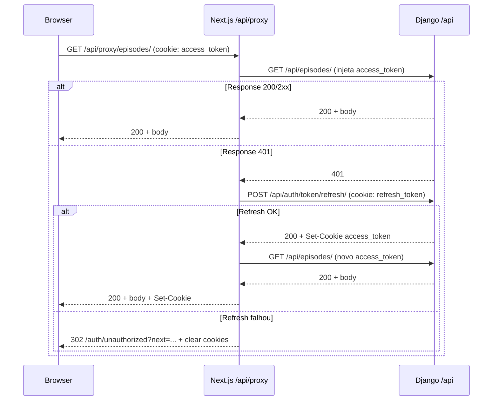

# ADR-007: Proxy Catch-all com Auto-Refresh no Next.js

> Status: Aceito
> Data: 2026-05-01
> Contexto: Introduzido no commit `94ca2f2` ("feat: creating auth logic and integration")

## Contexto e problema

O frontend Next.js (`podigger-frontend`) e o backend Django (`podigger-backend`) rodam em **subdomínios diferentes** (commit `8608d59`: "fix(deploy): update subdomains to dash-separated format for SSL compatibility"):

- `app.podigger.com` → Next.js
- `api.podigger.com` → Django

O cookie `access_token` é **escopado por host** — então o browser não envia o cookie do `api.podigger.com` para o `app.podigger.com` em chamadas diretas. Além disso, o access token tem TTL de 5 minutos, então chamadas autenticadas vão rotineiramente expirar.

## Decisão

Criar um **Route Handler catch-all** no Next.js (`/api/proxy/[...path]`) que:

1. Recebe qualquer chamada autenticada do frontend.
2. Encaminha para o Django com o cookie `access_token` injetado.
3. Se o Django retornar 401 → tenta refresh usando o `refresh_token` cookie.
4. Se refresh OK → replay da request original com o novo token.
5. Se refresh falhou → 302 para `/auth/unauthorized?next=...` + clear cookies.

### Fluxo

### Detalhe técnico importante

🟢 O body da request é **pré-lido em `ArrayBuffer`** antes da primeira tentativa, porque streams do Fetch API só podem ser consumidos uma vez, e o replay (após refresh) precisa do body de novo.

🟢 Fonte: `frontend/src/app/api/proxy/[...path]/route.ts:160-208`.

## Consequências

### Positivas
- 🟢 **Frontend não conhece o host do Django** — toda chamada passa por `/api/proxy/...`.
- 🟢 **Auto-refresh transparente** — usuário não vê 401 visível enquanto o refresh token for válido.
- 🟢 **Defesa em camadas** — middleware Edge bloqueia antes do proxy rodar.
- 🟢 **Refresh em cookie path restrito** garante que o refresh é usado **só** pelo proxy.

### Negativas
- 🟡 **Latência dobrada** no pior caso (refresh + replay) — ~50-200ms.
- 🟡 **Complexidade do retry** é não-trivial (lê body 2x, gerencia 2 Set-Cookie, decide 401 vs redirect).
- 🟡 **Endpoint monolítico** — qualquer rota do Django é roteada pelo mesmo handler; erros de path são descobertos tarde.

## Alternativas consideradas

1. **Renomear subdomínios para mesmo host**: rejeitada. O Nginx faz proxy reverso e separar concerns é mais limpo.
2. **Refresh proativo (timer)**: rejeitada. Mais complexo; auto-refresh reativo é suficiente.
3. **Token em header em vez de cookie**: rejeitada. Perderia a proteção HttpOnly.

## Notas de operação

- 🟢 O proxy usa `getSetCookie()` (canônico) com fallback para `headers.get('set-cookie')` para máxima compatibilidade de runtime.
- 🟢 O 302 de logout (`buildLogoutRedirect`) preserva a `path` original para re-tentativa após re-login.
