# C4 — Nível 3: Componentes

> Gerado pelo Arquiteto em 2026-06-05
> Decomposição dos containers-chave em seus componentes internos.
> Foco: **Backend Django** (containers `backend` e `celery_worker`) e **Frontend Next.js** (container `frontend`).

**Escala de confiança:** 🟢 CONFIRMADO | 🟡 INFERIDO | 🔴 LACUNA

---

## 1. Backend Django — Componentes

```mermaid
C4Component
    title Backend Django — Componentes

    Container_Ext(nginx, "Nginx", "Reverse proxy")
    Container_Ext(frontend, "Frontend Next.js", "Cliente HTTP")
    ContainerDb_Ext(postgres, "PostgreSQL 15", "Persistência")
    ContainerDb_Ext(redis, "Redis 7", "Broker + cache")
    System_Ext_2(rss, "Feeds RSS/Atom", "Externos")

    Container_Boundary(backend, "Backend Django") {
        Component(urls_root, "config.urls", "URLconf raiz", "Agrega routers de accounts e podcasts; serve /admin/ e /health/")
        Component(settings, "config.settings", "Django settings", "DRF, JWT, throttle, CORS, CSRF, DB, Redis, app registry")
        Component(celery_app, "config.celery", "Celery app", "Configura broker + result backend; autodiscover de tasks")

        Component(auth_urls, "accounts.urls", "URLconf auth", "Roteia /api/auth/token/, /register/, /users/, etc.")
        Component(auth_views, "accounts.views", "DRF views", "TokenObtainCookieView, TokenRefreshCookieView, RegisterView, UserListView, UserApproveView, UserRoleUpdateView")
        Component(auth_serializers, "accounts.serializers", "DRF serializers", "EmailTokenObtainPairSerializer (adiciona role/email, bloqueia pending), RegisterSerializer (≥8 chars)")
        Component(auth_models, "accounts.models", "Django models", "User custom (email único, role, approval_status) + UserManager")
        Component(auth_perms, "accounts.permissions", "DRF permissions", "IsAdminRole, IsEditorOrAdmin")
        Component(auth_class, "accounts.authentication", "DRF auth", "CookieJWTAuthentication (lê access_token do cookie)")

        Component(pod_urls, "podcasts.urls", "URLconf podcasts", "DRF DefaultRouter: podcasts, episodes, topic-suggestions, popular-terms")
        Component(pod_views, "podcasts.views", "DRF views", "PodcastViewSet (CRUD + recent), EpisodeViewSet (search via Manager), TopicSuggestionViewSet, PopularTermViewSet")
        Component(pod_serializers, "podcasts.serializers", "DRF serializers", "PodcastSerializer, EpisodeSerializer, TopicSuggestionSerializer, PopularTermSerializer")
        Component(pod_models, "podcasts.models", "Django models", "Podcast, Episode, Tag, PodcastLanguage, PopularTerm, TopicSuggestion, BaseModel abstrata, EpisodeManager (search FTS+trigram)")
        Component(pod_services, "podcasts.services", "Service layer", "PodcastService (create_podcast, atomic), EpisodeUpdater (populate batch), feed_parser (is_valid_feed, _strip_html)")
        Component(pod_tasks, "podcasts.tasks", "Celery tasks", "add_episode, update_base, update_total_episodes, remove_podcasts")
        Component(pod_health, "podcasts.health", "Health view", "DB+Redis (Redis soft), retorna 200/503")
    }

    Rel(nginx, urls_root, "HTTPS /api/auth/, /api/, /admin/, /health/", "HTTP")
    Rel(frontend, urls_root, "HTTPS /api/auth/, /api/, /health/", "HTTP")

    Rel(urls_root, auth_urls, "include(/api/auth/)")
    Rel(urls_root, pod_urls, "include(/api/)")
    Rel(urls_root, pod_health, "GET /health/")

    Rel(auth_urls, auth_views, "dispatch")
    Rel(auth_views, auth_serializers, "validate, create")
    Rel(auth_views, auth_perms, "check_permission")
    Rel(auth_views, auth_class, "authenticate")
    Rel(auth_serializers, auth_models, "create_user, query")
    Rel(auth_class, auth_models, "query by id do token")

    Rel(pod_urls, pod_views, "DRF router")
    Rel(pod_views, pod_serializers, "serialize")
    Rel(pod_views, pod_perms_via_views, "RBAC", "is_editor_or_admin")
    Rel(pod_views, pod_models, "ORM queries")
    Rel(pod_models, pod_services, "manager.search, signals")
    Rel(pod_services, rss, "HTTP GET RSS/Atom")

    Rel(pod_serializers, pod_models, "from_model")
    Rel(pod_models, postgres, "ORM")
    Rel(pod_views, redis, "cache via django-redis")

    Rel(celery_app, pod_tasks, "autodiscover")
    Rel(pod_tasks, pod_services, "call service layer")
    Rel(pod_tasks, pod_models, "ORM write")
    Rel(pod_tasks, redis, "consume from broker")
    Rel(pod_tasks, postgres, "ORM write")

    Rel(settings, auth_models, "AUTH_USER_MODEL")
    Rel(settings, auth_class, "AUTHENTICATION_CLASSES")
```

---

## 1.1 Componentes do Backend (tabela)

### App `accounts`

| Componente | Arquivo | Função | Funções-chave |
|-----------|---------|--------|---------------|
| `urls` | `accounts/urls.py` | Roteamento | `token/`, `token/refresh/`, `register/`, `users/`, `users/<pk>/approve/`, `users/<pk>/` |
| `views` | `accounts/views.py` | Controllers | `TokenObtainCookieView.post` (set cookies), `TokenRefreshCookieView.post`, `RegisterView.create`, `UserListView.get`, `UserApproveView.post`, `UserRoleUpdateView.patch` |
| `serializers` | `accounts/serializers.py` | Validação | `EmailTokenObtainPairSerializer.validate` (gate de approval), `RegisterSerializer.validate_password` (≥8 chars) |
| `models` | `accounts/models.py` | Persistência | `User` (email unique, role, approval_status), `UserManager.create_user/create_superuser` |
| `permissions` | `accounts/permissions.py` | RBAC | `IsAdminRole` (admin), `IsEditorOrAdmin` (editor+admin) |
| `authentication` | `accounts/authentication.py` | Auth custom | `CookieJWTAuthentication.authenticate` (lê cookie em vez de header) |

### App `podcasts`

| Componente | Arquivo | Função | Funções-chave |
|-----------|---------|--------|---------------|
| `urls` | `podcasts/urls.py` | Roteamento | DRF DefaultRouter: 4 ViewSets |
| `views` | `podcasts/views.py` | Controllers | `PodcastViewSet` (CRUD + `recent` custom action), `EpisodeViewSet` (search via Manager), `TopicSuggestionViewSet`, `PopularTermViewSet` |
| `serializers` | `podcasts/serializers.py` | Validação | `PodcastSerializer`, `EpisodeSerializer` (com nested podcast+tags), `TopicSuggestionSerializer`, `PopularTermSerializer` |
| `models` | `podcasts/models.py` | Persistência + busca | `BaseModel` (abstrata), `Podcast`, `PodcastLanguage`, `Episode` + `EpisodeManager.search` (FTS + trigram fallback), `Tag`, `PopularTerm`, `TopicSuggestion` |
| `services/feed_parser` | `podcasts/services/feed_parser.py` | Integração RSS | `is_valid_feed` (bozo==0), `_strip_html` (regex), `parse_feed` |
| `services/podcast_service` | `podcasts/services/podcast_service.py` | Caso de uso | `PodcastService.create_podcast` (atomic, idempotente, dispara Celery) |
| `services/updater` | `podcasts/services/updater.py` | Sync feed→DB | `EpisodeUpdater.populate` (batch, idempotente, log+skip em erro) |
| `tasks` | `podcasts/tasks.py` | Async | `add_episode` (criação), `update_base` (periódico), `update_total_episodes`, `remove_podcasts` |
| `health` | `podcasts/health.py` | Health check | `health_check` (DB+Redis soft) |

### App `config`

| Componente | Arquivo | Função |
|-----------|---------|--------|
| `urls` | `config/urls.py` | Agrega routers; serve `/admin/`, `/health/` |
| `settings` | `config/settings.py` | DRF, JWT, throttle, CORS, CSRF, DB, Redis, app registry |
| `celery` | `config/celery.py` | App Celery; autodiscover; broker config |
| `asgi` / `wsgi` | `config/asgi.py`, `config/wsgi.py` | Entry points ASGI/WSGI |

---

## 2. Frontend Next.js — Componentes

```mermaid
C4Component
    title Frontend Next.js — Componentes

    Person_Ext(user, "Usuário (browser)", "Cookie HttpOnly")
    Container_Ext(nginx, "Nginx", "Reverse proxy")
    Container_Ext(backend, "Backend Django", "API REST")

    Container_Boundary(frontend, "Frontend Next.js") {
        Component(middleware, "Edge Middleware", "src/middleware.ts", "Guard de borda: bloqueia /add-podcast e /admin/* sem access_token. Redireciona a /auth/unauthorized.")

        Component(page_home, "HomePage (RSC)", "src/app/page.tsx", "Página inicial server-rendered. Embute HomeClient.")
        Component(page_login, "LoginPage", "src/app/login/page.tsx", "Client. Form de login. Trata 200/401/403/429.")
        Component(page_register, "RegisterPage", "src/app/register/page.tsx", "Client. Form de cadastro. Valida password===passwordConfirm.")
        Component(page_add_podcast, "AddPodcastPage", "src/app/add-podcast/page.tsx", "Client. Defesa em camadas: re-checa role no client.")
        Component(page_about, "AboutPage", "src/app/about/page.tsx", "Server. About + versão.")
        Component(page_unauth, "UnauthorizedPage", "src/app/auth/unauthorized/page.tsx", "Página de redirecionamento após 401/refresh-failed.")
        Component(page_forbidden, "ForbiddenPage", "src/app/auth/forbidden/page.tsx", "Exibe ROLE_LABELS do role atual em PT-BR.")
        Component(page_pending, "PendingPage", "src/app/auth/pending/page.tsx", "Mensagem de aprovação pendente.")

        Component(layout_root, "RootLayout", "src/app/layout.tsx", "Providers: ThemeProvider + AuthProvider. lang='en' (assimetria, DT-9).")
        Component(layout_nav, "Navbar", "src/components/layout/Navbar.tsx", "Top nav + BottomNav mobile. Sem toggle de tema (DT-10).")

        Component(rh_auth_login, "Route Handler /api/auth/login", "src/app/api/auth/login/route.ts", "POST → Django; forwarda Set-Cookie literal.")
        Component(rh_auth_logout, "Route Handler /api/auth/logout", "src/app/api/auth/logout/route.ts", "POST → clear cookies (Max-Age=0).")
        Component(rh_proxy, "Route Handler /api/proxy/[...path]", "src/app/api/proxy/[...path]/route.ts", "GET/POST/PUT/PATCH/DELETE → Django. Injeta access_token. Auto-refresh em 401.")
        Component(rh_health, "Route Handler /api/health", "src/app/api/health/route.ts", "GET → status + timestamp + env.")

        Component(auth_ctx, "AuthContext", "src/contexts/AuthContext.tsx", "Estado global: user, isAuthenticated, isLoading, login, logout, setUser")
        Component(theme_ctx, "ThemeProvider", "src/components/providers/ThemeProvider.tsx", "Tema dark/light. Default dark. Sem toggle (DT-10).")

        Component(api_client, "api.ts", "src/lib/api.ts", "fetchEpisodes, fetchPodcasts, addPodcast. baseURL via NEXT_PUBLIC_API_URL.")
        Component(utils, "utils.ts", "src/lib/utils.ts", "cn (clsx+twMerge), formatDuration, formatDate")
        Component(constants, "constants.ts", "src/lib/constants.ts", "APP_VERSION, SOCIAL_LINKS")

        Component(feature_home, "HomeClient", "src/components/home/HomeClient.tsx", "Composição: SearchHero + EpisodeList + PodcastList")
        Component(feature_search, "SearchHero", "src/components/search/SearchHero.tsx", "Hero de busca: input + botão Buscar")
        Component(feature_episode_list, "EpisodeList", "src/components/home/EpisodeList.tsx", "Lista paginada de episódios com loadMore")
        Component(feature_podcast_card, "PodcastCard", "src/components/podcasts/PodcastCard.tsx", "Card de podcast")
        Component(feature_episode_card, "EpisodeCard / EpisodeCardCompact", "src/components/episodes/", "Cards de episódio (variants)")

        Component(ui_button, "Button", "src/components/ui/Button.tsx", "4 variants, 4 sizes, isLoading, forwardRef")
        Component(ui_card, "Card", "src/components/ui/Card.tsx", "hoverable prop")
        Component(ui_input, "Input", "src/components/ui/Input.tsx", "alias de InputHTMLAttributes")
        Component(ui_badge, "Badge", "src/components/ui/Badge.tsx", "4 variants")
        Component(ui_icon, "Icon", "src/components/ui/Icon.tsx", "Material Symbols Rounded via fontVariationSettings")
        Component(ui_loading, "Loading (Spinner/Skeleton/FullPageLoading)", "src/components/ui/Loading.tsx", "3 componentes")
    }

    Rel(user, nginx, "HTTPS", "443")
    Rel(nginx, middleware, "Edge request")
    Rel(middleware, page_home, "allow", "GET /")
    Rel(middleware, page_add_podcast, "deny → /auth/unauthorized", "filtra por access_token")
    Rel(middleware, rh_proxy, "allow")

    Rel(page_home, layout_root, "rendered within")
    Rel(page_login, layout_nav, "contains Navbar")
    Rel(layout_root, theme_ctx, "wraps children")
    Rel(layout_root, auth_ctx, "wraps children")
    Rel(layout_nav, auth_ctx, "useAuth()")

    Rel(page_home, feature_home, "renders")
    Rel(feature_home, feature_search, "embute")
    Rel(feature_home, feature_episode_list, "embute")
    Rel(feature_home, api_client, "fetchEpisodes, fetchPodcasts")
    Rel(feature_episode_list, feature_episode_card, "renderiza lista")
    Rel(feature_search, ui_button, "Botão Buscar")
    Rel(feature_search, ui_input, "Campo de busca")
    Rel(feature_episode_card, ui_card, "Container")
    Rel(feature_episode_card, ui_badge, "Tags")
    Rel(feature_episode_card, ui_icon, "Ícones")
    Rel(feature_podcast_card, ui_card, "Container")
    Rel(feature_podcast_card, ui_icon, "Ícones")
    Rel(rh_proxy, backend, "GET/POST/PUT/PATCH/DELETE com access_token cookie", "HTTPS interno")
    Rel(rh_auth_login, backend, "POST com body", "HTTPS interno")
    Rel(rh_auth_logout, backend, "—", "apenas local clear cookies")
    Rel(page_login, rh_auth_login, "POST")
    Rel(layout_nav, rh_auth_logout, "POST on logout")
    Rel(feature_home, rh_proxy, "fetch via /api/proxy/*")
    Rel(page_add_podcast, rh_proxy, "POST /api/proxy/podcasts/")
    Rel(page_add_podcast, ui_button, "Submit + Cancel")
    Rel(page_add_podcast, ui_input, "name, feed")

    Rel(page_login, ui_button, "Submit")
    Rel(page_login, ui_input, "email, password")
    Rel(page_register, ui_input, "email, password, passwordConfirm")
```



---

## 2.1 Componentes do Frontend (tabela)

### Pages (RSC + Client islands)

| Página | Tipo | Rota | Função | Auth? |
|--------|------|------|--------|-------|
| `HomePage` | RSC | `/` | Página inicial; embute `HomeClient` | Pública |
| `LoginPage` | Client | `/login` | Form de login (200/401/403) | Pública |
| `RegisterPage` | Client | `/register` | Form de cadastro | Pública |
| `AddPodcastPage` | Client | `/add-podcast` | Form de adição de podcast | Requer editor+admin |
| `AboutPage` | RSC | `/about` | About + versão | Pública |
| `UnauthorizedPage` | RSC | `/auth/unauthorized` | Redirecionamento após 401/refresh-failed | Pública |
| `ForbiddenPage` | RSC | `/auth/forbidden` | Mensagem de role insuficiente | Pública |
| `PendingPage` | RSC | `/auth/pending` | Conta aguardando aprovação | Pública |

### Route Handlers (API)

| Handler | Métodos | Função | Observação |
|---------|---------|--------|------------|
| `/api/auth/login/route.ts` | POST | Encaminha login ao Django; forwarda `Set-Cookie` | 🟡 Login proxy: usa `headers.getSetCookie()` com fallback |
| `/api/auth/logout/route.ts` | POST | Clear cookies localmente (Max-Age=0); **não chama backend** | 🔴 Lacuna AI-5: não invalida JWT |
| `/api/proxy/[...path]/route.ts` | GET/POST/PUT/PATCH/DELETE | Proxy catch-all com auto-refresh | 🟢 Core do design (ADR-007) |
| `/api/health/route.ts` | GET | Health check superficial do frontend | Não checa backend |

### Componentes de feature

| Componente | Localização | Função |
|------------|-------------|--------|
| `HomeClient` | `src/components/home/` | Composição: SearchHero + EpisodeList + PodcastList |
| `SearchHero` | `src/components/search/` | Input de busca + botão Buscar |
| `EpisodeList` | `src/components/home/` | Lista paginada com loadMore |
| `PodcastCard` | `src/components/podcasts/` | Card de podcast |
| `EpisodeCard` / `EpisodeCardCompact` | `src/components/episodes/` | Variants: mobile-large vs desktop-compact |
| `Navbar` / `BottomNav` | `src/components/layout/` | Top nav + bottom nav mobile |
| `EmptyState` | `src/components/common/` | 3 estados: no-results, no-episodes, error |

### Design System (`src/components/ui/`)

| Componente | Variants | Props notáveis | Notas |
|------------|----------|----------------|-------|
| `Button` | primary, secondary, ghost, outline × sm/md/lg/icon | `isLoading`, `forwardRef` | Esconde `children` quando `isLoading` |
| `Card` | — | `hoverable`, `forwardRef` | `hover:shadow + translateY(-1)` |
| `Input` | — | alias de `InputHTMLAttributes` | `forwardRef` |
| `Badge` | primary, secondary, outline, ghost | — | Sem `forwardRef` |
| `Icon` | — | `name`, `fill`, `weight`, `grade`, `opticalSize` | Material Symbols Rounded via `fontVariationSettings` |
| `LoadingSpinner` | — | `className`, SVG attrs | CSS `animate-spin` |
| `Skeleton` | — | `className`, div attrs | `animate-pulse + rounded-md + bg-slate` |
| `FullPageLoading` | — | — | Overlay fixo, z-100, `backdrop-blur-sm` |

### Contexts e Providers

| Componente | Estado | Notas |
|------------|--------|-------|
| `AuthContext` | `user`, `isAuthenticated`, `isLoading`, `login()`, `logout()`, `setUser()` | 🟡 `isLoading` sempre `false` (constante) |
| `ThemeProvider` | `theme: 'light' \| 'dark'` | Default `dark`; persiste em `localStorage['podigger-theme']`; sem toggle exposto (DT-10) |

### Lib

| Arquivo | Função |
|---------|--------|
| `lib/api.ts` | `fetchEpisodes(q, page)`, `fetchPodcasts(search, page)`, `addPodcast(name, feed)`. Base URL via `NEXT_PUBLIC_API_URL`. |
| `lib/utils.ts` | `cn(...)` (clsx+twMerge), `formatDuration(s)`, `formatDate(d)` (PT-BR) |
| `lib/constants.ts` | `APP_VERSION`, `SOCIAL_LINKS` (`as const`) |

---

## 3. Celery Worker — Componentes

| Componente | Localização | Função | Trigger |
|------------|-------------|--------|---------|
| `add_episode` | `podcasts/tasks.py:12-22` | Popula episódios de um feed recém-adicionado | `PodcastService.create_podcast` (criação) |
| `update_base` | `podcasts/tasks.py:25-40` | Revalida todos os feeds | Periódico (Celery Beat) |
| `update_total_episodes` | `podcasts/tasks.py:43-52` | Recalcula `Podcast.total_episodes` | Encadeado após `update_base` |
| `remove_podcasts` | `podcasts/tasks.py:55-72` | Deleta podcasts sem episódios | Periódico (Celery Beat) |

> O worker é um container thin — reusa o image do backend e importa os mesmos componentes (`podcasts.services`, `podcasts.models`). Não há camada de domínio própria.

---

## 4. Pontos de extensão e acoplamentos críticos

| Acoplamento | Local | Risco | Mitigação atual |
|--------------|-------|-------|-----------------|
| `frontend/lib/api.ts` → backend DRF endpoints | Funções `fetchEpisodes`, `addPodcast` | Mudança de shape no backend quebra frontend sem aviso | 🟡 Sem OpenAPI/contrato gerado (lacuna) |
| `AuthContext.user.role` → gating de UI no client | `AddPodcastPage`, `ForbiddenPage` | Defesa depende do role em memória; user pode manipular | 🟢 Middleware re-checa no edge (R-AUTH-12) |
| `EpisodeManager.search` → `PopularTerm` | `models.py:EpisodeManager.search` | Toda busca (mesmo vazia) escreve no banco | 🟡 Sem rate limit específico (AI-4) |
| `CookieJWTAuthentication` ↔ cookies do Next.js | `accounts/authentication.py` | Mudança de path/attribute do cookie exige alinhamento entre Django e Next | 🟢 Hard-coded em ambos os lados |
| `EpisodeUpdater` ↔ `feedparser` | `services/updater.py`, `services/feed_parser.py` | Feeds malformados causam exception; isolamento por try/except | 🟢 Try/except por item (R-CEL-05) |
| `ThemeProvider` ↔ Navbar | Falta toggle | Usuário não consegue trocar de tema na UI | 🔴 Feature incompleta (DT-10) |

---

## 5. Confiança

| Elemento | Confiança | Origem |
|----------|-----------|--------|
| Estrutura de `accounts` (6 arquivos) | 🟢 | `backend/accounts/*.py` |
| Estrutura de `podcasts` (8+ arquivos) | 🟢 | `backend/podcasts/**/*.py` |
| 4 ViewSets DRF | 🟢 | `podcasts/urls.py` |
| 6 endpoints de auth | 🟢 | `accounts/urls.py` |
| Frontend: 6 pages + 8 route handlers | 🟢 | `src/app/**/page.tsx`, `src/app/api/**/route.ts` |
| Design system: 8 componentes | 🟢 | `src/components/ui/*.tsx` |
| Lacunas DT-9, DT-10 | 🟡 | Inferido de ausência |
| AI-4, AI-5, R-USER-08 | 🔴 | Lacunas reconhecidas em `domain.md` |
