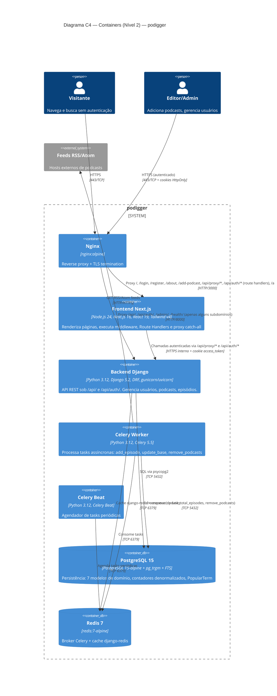

# C4 — Nível 2: Containers

> Gerado pelo Arquiteto em 2026-06-05
> Decomposição do sistema em aplicações executáveis, serviços de dados e middleware.

**Escala de confiança:** 🟢 CONFIRMADO | 🟡 INFERIDO | 🔴 LACUNA

---

## 1. Diagrama

---

## 2. Tabela de containers

| Container | Tecnologia | Build | Porta | Responsabilidade | Escala | Confiança |
|-----------|-----------|-------|-------|------------------|--------|-----------|
| **Nginx** | `nginx:alpine` | `nginx-proxy/` (config em `conf.d/`) | 80, 443 | TLS termination, reverse proxy, subdomínios dash-separated | 1+ instâncias | 🟢 |
| **Frontend Next.js** | Node.js 24 + Next.js 16.2 | `frontend/Dockerfile(.production)` | 3000 | Render RSC, Route Handlers (auth/proxy/health), Edge Middleware, Design System | 1+ instâncias | 🟢 |
| **Backend Django** | Python 3.12 + Django 5.2.13 + DRF | `backend/Dockerfile(.production)` (gunicorn prod / uvicorn dev) | 8000 | API REST, modelos ORM, serialização, RBAC, throttling, health check | 1+ instâncias | 🟢 |
| **Celery Worker** | Python 3.12 + Celery 5.5.3 | mesmo image do backend | — | Tasks assíncronas (add_episode, update_base, update_total_episodes, remove_podcasts) | 1+ instâncias | 🟢 |
| **Celery Beat** | Python 3.12 + Celery Beat | mesmo image do backend | — | Agendador de tasks periódicas | **1 instância** (singleton) | 🟡 |
| **PostgreSQL 15** | `postgres:15-alpine` + `pg_trgm` | volume persistente | 5432 | Persistência, FTS (config `portuguese`), similaridade trigrama | 1 (sem replica) | 🟢 |
| **Redis 7** | `redis:7-alpine` | volume persistente | 6379 | Broker Celery + cache django-redis | 1 | 🟢 |

---

## 3. Decisões de comunicação

### 3.1 Frontend ↔ Backend

- **Toda chamada autenticada** passa pelo proxy Next.js (`/api/proxy/[...path]`).
- O proxy injeta o cookie `access_token` automaticamente.
- O Django recebe cookies HttpOnly (não header `Authorization`).
- O Route Handler do login (`/api/auth/login`) e logout (`/api/auth/logout`) são pontes diretas (não passam pelo proxy genérico) para permitir manipular `Set-Cookie` no edge.
- 🟡 **Implicação:** existe um hop extra (Next.js → Django) em toda chamada, mas isola cookies, CSRF e a URL do backend.

### 3.2 Backend ↔ PostgreSQL

- Conexão persistente via `psycopg2` (prod) / `psycopg2-binary` (dev).
- Django ORM faz pool automático.
- 🟡 **Sem pool explícito (PgBouncer).** Em produção atual, escala vertical.

### 3.3 Backend ↔ Redis

- `django-redis` para cache.
- `celery[redis]` para broker.
- **Soft dependency** desde commit `a3827a2` — health check não falha se Redis estiver fora.

### 3.4 Celery Worker ↔ Feeds RSS

- `feedparser` + `requests` para fetch HTTP.
- **Sem retry exponencial explícito** observado — falhas de feed individual são logadas e seguem o batch (R-CEL-05).

---

## 4. Configuração de runtime

### 4.1 Backend

| Variável | Origem | Uso |
|----------|--------|-----|
| `DJANGO_SECRET_KEY` | `django-environ` (`os.environ`) | Assinatura de sessão e JWT |
| `DJANGO_DEBUG` | env | Modo debug |
| `DJANGO_ALLOWED_HOSTS` | env | Hosts permitidos |
| `DATABASE_URL` | env | Conexão PostgreSQL |
| `REDIS_URL` | env | Broker + cache |
| `CORS_ALLOWED_ORIGINS` | env | Origens permitidas |
| `CSRF_TRUSTED_ORIGINS` | env | Origens confiáveis para CSRF |
| `SECURE_PROXY_SSL_HEADER` | setting | Reconhece HTTPS via header do proxy (commit `5d4efa1`) |
| `REST_FRAMEWORK.throttle_scope` | setting | Scopes `anon`, `user`, `login`, `register` |

### 4.2 Frontend

| Variável | Origem | Uso |
|----------|--------|-----|
| `NEXT_PUBLIC_API_URL` | env | URL do backend Django (todos Route Handlers) |
| `NEXT_PUBLIC_ENVIRONMENT` | env | Tag no `/api/health` |
| `NEXT_PUBLIC_APP_VERSION` | env | Versão exibida na About |

### 4.3 Docker Compose (multi-arquivo)

| Arquivo | Stack |
|---------|-------|
| `docker-compose.yml` | Stack completa (backend + db + redis + celery + frontend) |
| `docker-compose.base.yml` | Serviços base compartilhados |
| `docker-compose.local.yml` | Apenas Postgres + Redis (sem app, para dev fora de container) |
| `docker-compose.staging.yml` | Configs de staging |
| `docker-compose.production.yml` | Configs de produção |

---

## 5. Saúde e observabilidade

| Sinal | Onde | Cobertura |
|-------|------|-----------|
| **Health check backend** | `podcasts/health.py` (exposto em `/health/`) | DB + Redis (soft) |
| **Health check frontend** | `src/app/api/health/route.ts` | Apenas `200` (não checa backend) |
| **Logs estruturados** | Não observados | 🟡 Apenas logs padrão Django/Next |
| **Métricas (Prometheus/etc)** | Não observadas | 🔴 Lacuna — sem instrumentação explícita |
| **Tracing distribuído** | Não observado | 🔴 Lacuna — sem OpenTelemetry |

---

## 6. Confiança

| Elemento | Confiança | Origem |
|----------|-----------|--------|
| Containers e tecnologias | 🟢 | `Dockerfile`s, `docker-compose*.yml`, `surface.json` |
| Celery Beat singleton | 🟡 | Inferido (padrão Celery; não documentado explicitamente) |
| Soft dependency Redis | 🟢 | ADR-004 + commit `a3827a2` |
| Sem PgBouncer | 🟢 | Não mencionado em `requirements.txt` nem `docker-compose*.yml` |
| Sem observabilidade centralizada | 🟢 | Não há libs APM/OTel em deps |
