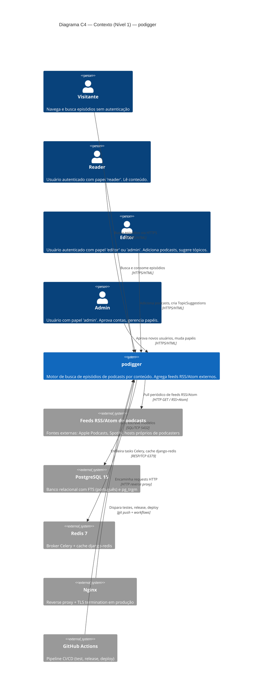

# C4 — Nível 1: Contexto

> Gerado pelo Arquiteto em 2026-06-05
> Visão do sistema no ambiente: quem usa, do que depende, com que se integra.

**Escala de confiança:** 🟢 CONFIRMADO | 🟡 INFERIDO | 🔴 LACUNA

---

## 1. Diagrama

---

## 2. Personas (usuários do sistema)

| Persona | Autenticação | Capacidades observadas | Origem |
|---------|--------------|------------------------|--------|
| **Visitante** | Anônimo (cookie `anon`) | Buscar episódios, listar podcasts, ler descrições | `AnonRateThrottle` em todas as views públicas |
| **Reader** | Cookie `access_token` (5min) + `refresh_token` (24h) | Tudo do visitante + `AuthContext.user.role === "reader"` | `accounts/models.py:User.role="reader"` default |
| **Editor** | Igual a Reader, com `role="editor"` | Tudo do Reader + `POST /api/podcasts/`, gerenciar TopicSuggestions | `IsEditorOrAdmin.has_permission` |
| **Admin** | Igual a Reader, com `role="admin"` | Tudo do Editor + `POST /api/auth/users/{id}/approve/`, `PATCH /api/auth/users/{id}/` (mudança de papel) | `IsAdminRole.has_permission` |

**Notas:**
- 🟡 Aprovação de novos usuários é **ortogonal** ao papel (ADR-008): um editor também precisa ser aprovado antes de logar. Status `pending` bloqueia o login (R-USER-04).
- 🟡 Personas Editor/Admin compartilham a mesma rota de aprovação; não há fluxo de "promoção" dedicado — admin usa `PATCH /api/auth/users/{id}/` para mudar o papel.

---

## 3. Sistemas externos

| Sistema | Direção | Protocolo | Propósito | Risco se indisponível |
|---------|---------|-----------|-----------|------------------------|
| **Feeds RSS/Atom de podcasts** | Pull (saída) | HTTP GET | Origem dos episódios | 🟡 `add_episode` falha para feeds específicos; demais continuam |
| **PostgreSQL 15** | Bidirecional | SQL sobre TCP | Persistência única | 🔴 Sistema inteiro indisponível |
| **Redis 7** | Bidirecional | RESP sobre TCP | Broker Celery + cache | 🟢 **Soft dependency** desde commit `a3827a2` — health check tolera |
| **Nginx** | Entrada | HTTP/HTTPS | Reverse proxy de borda (TLS) | 🔴 Em produção, sem proxy = sem TLS; em dev, sem impacto |
| **GitHub Actions** | Saída (push trigger) | HTTPS | CI/CD | 🟡 Deploy não dispara; sistema em produção continua |

---

## 4. Fronteiras do sistema

**Dentro do sistema podigger (escopo da engenharia reversa):**
- Backend Django (`backend/`) — apps `accounts`, `podcasts`, `config`
- Frontend Next.js (`frontend/`) — App Router, design system, proxy catch-all, route handlers
- Infraestrutura de containerização (`docker-compose*.yml`, Dockerfiles)
- Configuração de runtime (`pyproject.toml`, `package.json`, `Makefile`)

**Fora do sistema (considerado contexto):**
- Infraestrutura de provisionamento (cloud, k8s) — não detectada; produção roda em Docker Compose
- DNS / CDN / WAF — não observados na base de código
- Monitoramento e logging centralizado — não detectado no código (apenas logs padrão Django/Next)
- Email transacional — não detectado; `EMAIL_BACKEND` é o default Django (console em dev)

---

## 5. Confiança

| Elemento | Confiança | Origem |
|----------|-----------|--------|
| Personas e seus limites | 🟢 | `accounts/permissions.py`, `accounts/serializers.py` (R-USER-04..07) |
| PostgreSQL + Redis | 🟢 | `config/settings.py`, `surface.json` |
| Soft dependency Redis | 🟢 | ADR-004 + `podcasts/health.py` (commit `a3827a2`) |
| Nginx | 🟢 | `nginx-proxy/conf.d/`, docker-compose produção |
| CI/CD | 🟢 | `.github/workflows/` (5 workflows) |
| Feeds RSS/Atom externos | 🟢 | `services/feed_parser.py`, `requirements.txt:feedparser` |
