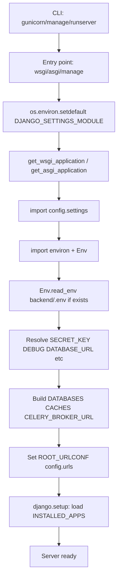
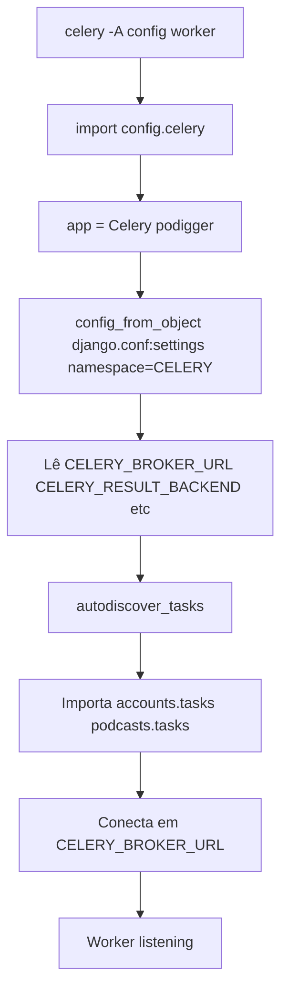
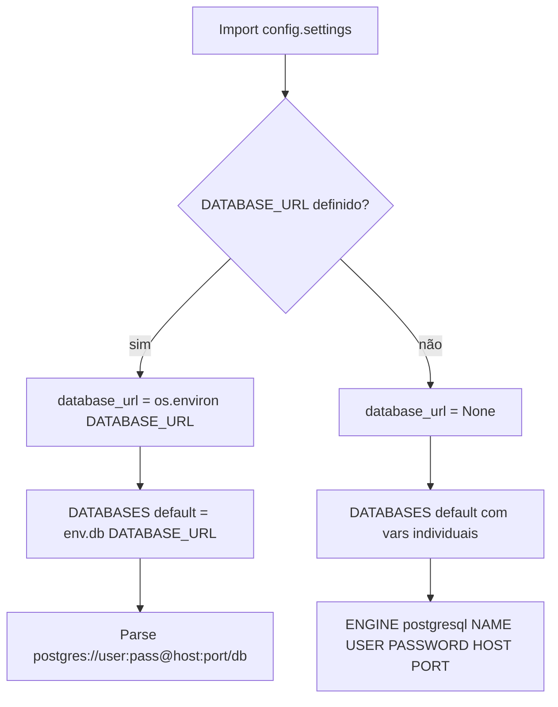
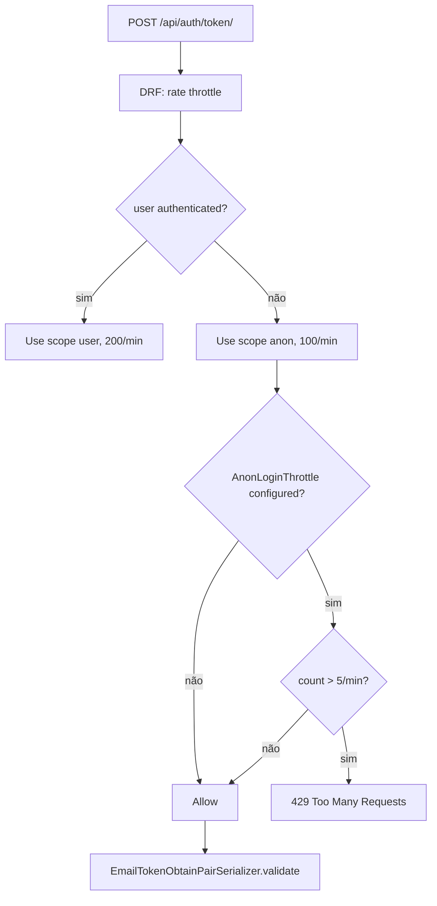
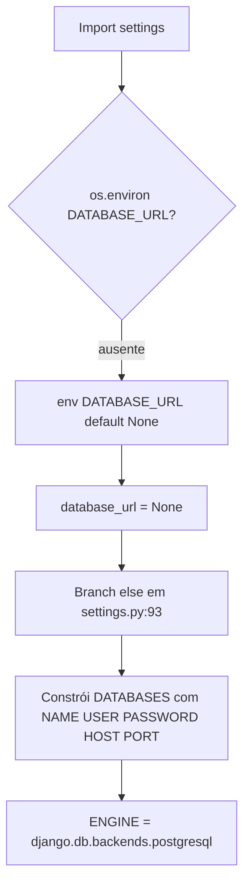
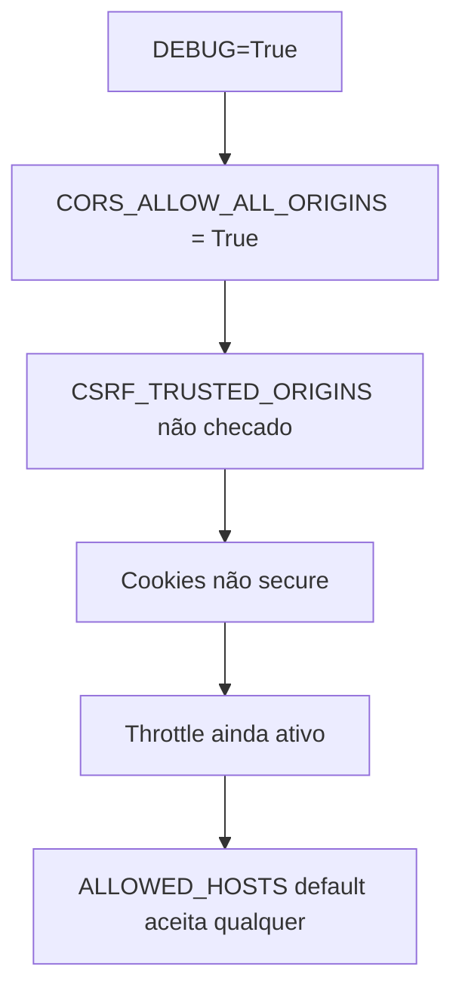
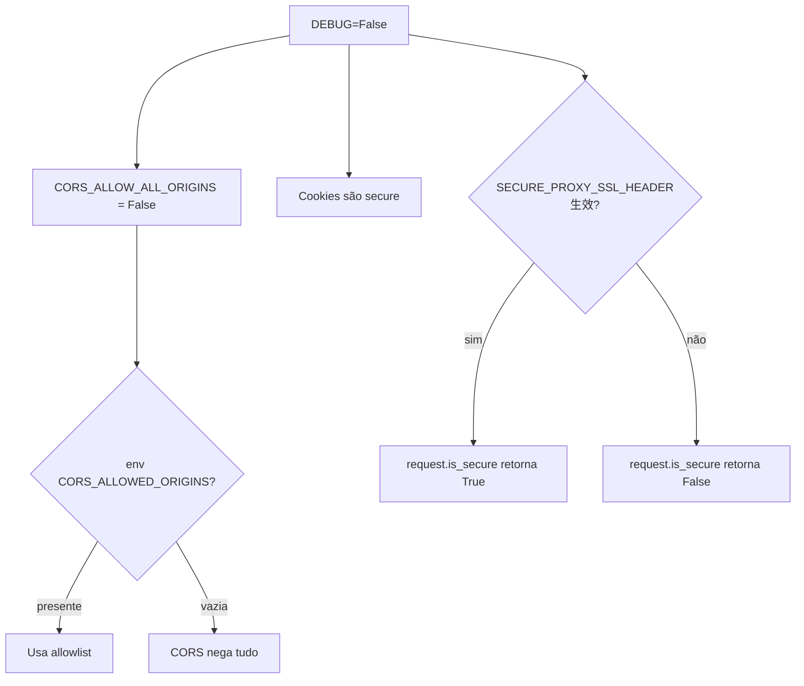

# config, Design Técnico

> Spec gerada pelo Redator em 2026-06-05
> `doc_level` = `completo`
> Unit: `backend/config/`
> Companion: `config/requirements.md`

**Escala de confiança:** 🟢 CONFIRMADO | 🟡 INFERIDO | 🔴 LACUNA

---

## Interface

O pacote `config` não expõe endpoints HTTP próprios além do `health_check` (importado de `podcasts.health`). Toda a "interface" é o conjunto de variáveis que ele consome e o que ele exporta para o runtime Django/Celery/ASGI/WSGI.

### Variáveis de ambiente consumidas

| Variável | Tipo | Default | Onde é usada |
|----------|------|---------|--------------|
| `DJANGO_SECRET_KEY` | str | `"dev-secret-key"` | `SECRET_KEY` (também `SIMPLE_JWT.SIGNING_KEY`) |
| `DJANGO_DEBUG` | bool | `True` | `DEBUG` |
| `DJANGO_ALLOWED_HOSTS` | list[str] | `["*"]` | `ALLOWED_HOSTS` |
| `DATABASE_URL` | str (Postgres DSN) | `None` | `DATABASES.default` (via `env.db()`) |
| `DATABASE_NAME` | str | `"podigger"` | `DATABASES.default.NAME` (fallback) |
| `DATABASE_USER` | str | `"docker"` | `DATABASES.default.USER` |
| `DATABASE_PASSWORD` | str | `"docker"` | `DATABASES.default.PASSWORD` |
| `DATABASE_HOST` | str | `"localhost"` | `DATABASES.default.HOST` |
| `DATABASE_PORT` | str | `"5432"` | `DATABASES.default.PORT` |
| `REDIS_URL` | str | `"redis://localhost:6379/1"` | `CACHES.default.LOCATION` |
| `CELERY_BROKER_URL` | str | `"redis://localhost:6379/0"` | `CELERY_BROKER_URL` |
| `CELERY_RESULT_BACKEND` | str | `"redis://localhost:6379/0"` | `CELERY_RESULT_BACKEND` |
| `JWT_ACCESS_TOKEN_MINUTES` | int | `5` | `SIMPLE_JWT.ACCESS_TOKEN_LIFETIME` |
| `JWT_REFRESH_TOKEN_DAYS` | int | `1` | `SIMPLE_JWT.REFRESH_TOKEN_LIFETIME` |
| `CORS_ALLOWED_ORIGINS` | list[str] | `[]` | `CORS_ALLOWED_ORIGINS` (apenas produção) |
| `CSRF_TRUSTED_ORIGINS` | list[str] | `[]` | `CSRF_TRUSTED_ORIGINS` (apenas produção) |

> 🟢 **Precedência:** `DATABASE_URL` > `DATABASE_*` individuais. Para JWT, Redis e CORS, env var > default.

### Símbolos públicos

| Símbolo | Tipo | Proveniência | Onde é importado |
|---------|------|--------------|------------------|
| `config.settings` | módulo Python | `config/settings.py` | `manage.py`, `wsgi.py`, `asgi.py`, `celery.py` |
| `config.urls.urlpatterns` | list[path] | `config/urls.py` | Django router raiz |
| `config.celery.app` | `celery.Celery` | `config/celery.py` | `celery -A config worker`, `celery -A config beat` |
| `config.wsgi.application` | WSGI app | `config/wsgi.py` | Gunicorn (`gunicorn config.wsgi:application`) |
| `config.asgi.application` | ASGI app | `config/asgi.py` | Daphne/Uvicorn |
| `config.__version__` | str | `config/__version__.py` | `podcasts.health` |
| `podcasts.health.health_check` | view | `podcasts/health.py` | `config/urls` (rota `/health/`) |

## Fluxo Principal: Boot da aplicação

1. `python manage.py runserver` ou `gunicorn config.wsgi:application` dispara Python e importa o entry point.
2. O entry point (`wsgi.py`/`asgi.py`/`manage.py`) faz `os.environ.setdefault("DJANGO_SETTINGS_MODULE", "config.settings")` e então chama `get_wsgi_application()` / `get_asgi_application()`.
3. `django/conf/__init__.py` carrega `config.settings`:
   1. `import environ; env = environ.Env(...)`.
   2. Lê `backend/.env` (se existir) sem sobrescrever env vars reais (`environ.Env.read_env(...)`).
   3. Resolve cada chave (SECRET_KEY, DEBUG, DATABASE_URL, etc.).
4. `django.setup()` registra apps de `INSTALLED_APPS`, importa models, configura signals.
5. `urls.urlpatterns` é avaliado — inclui `admin/`, `api/auth/`, `api/`, `health/`.
6. O servidor está pronto para servir requests.

🟢 **Por que `setdefault`**: nunca sobrescreve `DJANGO_SETTINGS_MODULE` se o caller já o definiu (permite testes com settings alternativos via `DJANGO_SETTINGS_MODULE=config.settings_test`).

## Fluxo Principal: Boot do Celery worker

1. `celery -A config worker -l info` é executado.
2. Celery CLI importa `config.celery` (resolvido por `-A`).
3. `app = Celery("podigger")` é instanciado; `app.config_from_object("django.conf:settings", namespace="CELERY")` faz Celery ler todas as chaves `CELERY_*` do Django settings.
4. `app.autodiscover_tasks()` itera sobre `INSTALLED_APPS` e importa `<app>.tasks` de cada uma — descobre `accounts.tasks` e `podcasts.tasks`.
5. O worker conecta no `CELERY_BROKER_URL` (Redis db 0) e fica escutando.

🟢 **Celery beat** (tarefas periódicas) usa o mesmo app; configuração de schedule mora em `CELERY_BEAT_SCHEDULE` se definida (não presente no código atual — periodicidade inferida em `podcasts/tasks.py`).

## Fluxo Principal: Carregamento de `DATABASE_URL`

🟢 **Cross-ref:** `settings.py:89-113`.

## Fluxo Principal: Throttle em login

🟢 **Detalhe:** o escopo `login` é atribuído por view (`throttle_scope = "login"`), não automaticamente. `EmailTokenObtainPairView` herda de `TokenObtainPairView` que usa `AnonRateThrottle`; o escopo custom é aplicado via decorator ou subclasse (cross-ref `accounts/views.py`).

## Dependências

- **Django 5.2.13** — framework web, ORM, migrations, settings loader.
- **django-environ** — leitura de `.env` + parser de `DATABASE_URL`.
- **djangorestframework 3.16+** — API framework, throttling, renderers, paginação.
- **djangorestframework-simplejwt 5.5.1** — JWT (access/refresh/blacklist).
- **django-cors-headers** — middleware CORS (primeiro no MIDDLEWARE).
- **django-filter** — `DjangoFilterBackend` para `?field=value`.
- **celery 5.5.3** — fila assíncrona.
- **redis 7.1.0** (lib) + `django-redis` (não-fixada) — cache e broker.
- **PostgreSQL 15** — banco relacional.
- **Material Symbols Rounded** (não é dependência do backend, apenas referenciado em CSS de frontend — não incluso aqui).

## Decisões de Design Identificadas

| Decisão | Evidência no código | Confiança |
|---------|---------------------|-----------|
| 12-factor: tudo configurável por env var | `django-environ` + `.env.example/.staging.example/.production.example` | 🟢 |
| Banco com `DATABASE_URL` OU vars individuais | `settings.py:89-113` | 🟢 |
| Redis db 0 para broker, db 1 para cache (separa namespaces) | `CELERY_BROKER_URL` default `:6379/0`, `REDIS_URL` default `:6379/1` | 🟢 |
| Custom user via `AUTH_USER_MODEL` (não `User` default) | `settings.py:52` | 🟢 |
| JWT HS256 (não RS256) — simplicidade para 1 backend | `SIMPLE_JWT.ALGORITHM = "HS256"` | 🟢 |
| Refresh token rotacionado (sem blacklist) | `SIMPLE_JWT.ROTATE_REFRESH_TOKENS=True`, `BLACKLIST_AFTER_ROTATION=False`, `TOKEN_BLACKLIST_ENABLED=False` (Perna 2026-06-06) | 🟢 |
| CORS permissivo em DEBUG, restrito em produção | `settings.py:189-194` | 🟢 |
| Throttling por escopo (login 5/min, register 3/min) | `settings.py:178-183` | 🟢 |
| `corsheaders` ANTES de `SecurityMiddleware` | ordem em `MIDDLEWARE` | 🟢 |
| Apenas `JSONRenderer` (sem browsable API) | `DEFAULT_RENDERER_CLASSES` | 🟢 |
| Paginação `PageNumberPagination` (não cursor) | `DEFAULT_PAGINATION_CLASS` | 🟢 |
| `PAGE_SIZE = 10` (não 20 ou 50) | `settings.py:176` | 🟢 |
| Sem `MinimumLengthValidator` na senha — assumido pelo serializer | `AUTH_PASSWORD_VALIDATORS` (apenas `UserAttributeSimilarityValidator`) | 🟡 |
| `ALLOWED_HOSTS=["*"]` em dev | `settings.py:28` | 🟢 |
| `SECRET_KEY` com default `dev-secret-key` | `settings.py:24-25` | 🟢 |
| `SIMPLE_JWT.SIGNING_KEY = SECRET_KEY` | `settings.py:210` | 🟢 |
| `TOKEN_OBTAIN_SERIALIZER` customizado em `accounts.serializers` | `settings.py:214` | 🟢 |

## Estado Interno

O pacote `config` não mantém **estado de execução** próprio — é um módulo de configuração puro. O "estado" é:

- As variáveis do módulo `config.settings` ficam em `django.conf.settings`, um objeto lazy proxy. Cada atributo é resolvido no primeiro acesso e cacheado.
- A instância `app` em `config.celery` é um singleton Celery: o worker mantém estado de conexões Redis, scheduler interno e registro de tasks.
- A aplicação ASGI/WSGI é stateless — cada request é independente.

> 🟢 Não há mutação de settings em runtime (o Django desencoraja isso; `override_settings` em testes é a única exceção).

## Observabilidade

- **Logs do Django:** saída padrão para stderr — formato depende de `LOGGING` config (não-customizado neste projeto, usa defaults).
- **Celery worker logs:** `-l info` mostra conexão, tasks recebidas, exceptions. Tasks em `podcasts/tasks.py` emitem logs estruturados (cross-ref `podcasts/tasks.py:80+`).
- **Health check:** `GET /health/` retorna 200 JSON com `status` e `version` (implementado em `podcasts/health.py`).
- **Métricas:** não há Prometheus/middleware de métricas customizado. Monitoramento é externo (docker stats, k8s probes, nginx access logs).
- **Audit log:** não há audit log de mudanças em `User` (gap R-USER-08, ver `accounts/requirements.md`).

> 🟡 Em produção, recomenda-se adicionar `django-prometheus` ou `django-structlog` para tracing e métricas padronizadas.

## Riscos e Lacunas

- 🔴 **R-CFG-26** — Sem fail-fast em produção: `SECRET_KEY="dev-secret-key"` e `ALLOWED_HOSTS=["*"]` são defaults perigosos. Se produção esquecer de injetar env vars, a app sobe insegura. Sugestão: adicionar um bloco `if not DEBUG: assert "dev" not in SECRET_KEY; assert ALLOWED_HOSTS != ["*"]`.
- 🟡 **R-CFG-24** — `AUTH_PASSWORD_VALIDATORS` não inclui `MinimumLengthValidator`. A validação de 8 chars está apenas no `RegisterSerializer` da app `accounts`. Se a criação de usuário fosse feita por outro caminho (Django admin, management command), a senha poderia ter 1 char.
- 🟡 **CORS_ALLOWED_ORIGINS** default `[]` em produção — se vazio, requests cross-origin falham silenciosamente (CORS nega sem Access-Control-Allow-Origin). Sem health-check explícito disso, ops pode não perceber.
- 🟡 **Celery broker db 0 + cache db 1** compartilham a mesma instância Redis. Em produção, separar em instâncias (ou ao menos em databases lógicos distintos) reduz blast radius.
- 🟡 **Sem `CELERY_TASK_TRACK_STARTED`** ou `CELERY_TASK_TIME_LIMIT` configurado. Tasks que travam (ex.: `feed_parser` em RSS lento) podem acumular workers.
- 🟡 **Sem `LOGGING` customizado** — Django usa defaults (console handler, `INFO` no root). Em produção, melhor enviar para stdout JSON para agregadores (Loki, Datadog).
- 🟡 **`SECURE_PROXY_SSL_HEADER`** confia em qualquer header `X-Forwarded-Proto: https` do proxy. Se o backend for exposto sem proxy, um atacante pode forçar `https://` enviando o header. Em produção, garantir que apenas Nginx chega ao Django.
- 🟡 **Sem `SESSION_COOKIE_SECURE`** explícito (default `False`) — mas o sistema usa JWT, não sessions Django para API, então o risco é apenas no Django Admin. Aceitável.
- 🟡 **`LANGUAGE_CODE = "en-us"`** mas mensagens da app são PT-BR — admin Django aparece em inglês, app em PT-BR. Inconsistência menor.
- 🔴 **R-CFG-26** já promovido como gap no Detective (DT-1 a DT-15 em `architecture.md`).

## Fluxo alternativo: `DATABASE_URL` ausente

🟢 Compatibilidade com Docker Compose (que injeta `DATABASE_HOST=db`, etc., e não `DATABASE_URL`).

## Fluxo alternativo: DEBUG=True (dev)

🟢 Permite `http://localhost:3000` falar com `http://localhost:8000` sem fricção.

## Fluxo alternativo: DEBUG=False (produção)

🟢 `SECURE_PROXY_SSL_HEADER` requer header `X-Forwarded-Proto: https` no request; Nginx envia, requisições diretas ao Django (sem proxy) são HTTP plain.

## Notas para o implementador

- 🟢 **Version bump:** alterar `config/__version__.py` é o jeito canônico de propagar versão para o `/health/` e para o CI.
- 🟢 **Para adicionar uma nova env var:** seguir o padrão `env("NOME", default=...)` (django-environ) + adicionar ao `.env.example` + documentar em `config/requirements.md`.
- 🟢 **Para adicionar nova app:** incluir em `INSTALLED_APPS` (settings.py:34-49) e opcionalmente em `urls.py` se expor HTTP.
- 🟡 **Não mutar settings em runtime.** Use `override_settings` em testes, e em código de produção, derive tudo de env vars.
- 🟡 **Se for adicionar cache LRU em memória** (ex.: `python-memcached`), o backend muda; mas como `django-redis` é o caminho oficial, mantenha.
- 🟡 **JWT algorithm upgrade** (ex.: para RS256) requer regenerar tokens; aceitar migração gradual.
- 🔴 **Fail-fast em produção** está nos planos (ver `architecture.md` tech debt DT-9/DT-11).
