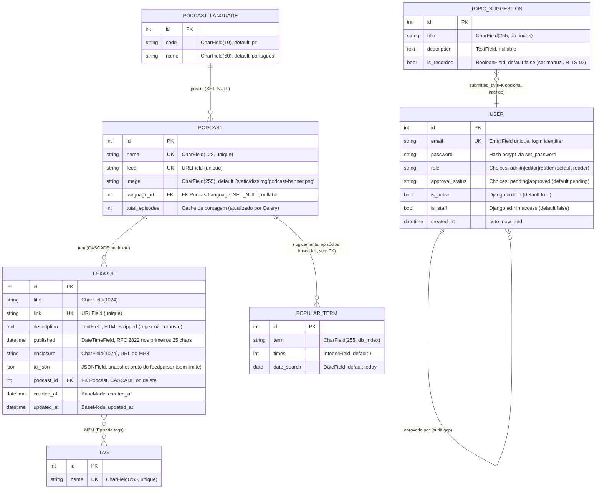

# ERD Completo — podigger

> Gerado pelo Arquiteto em 2026-06-05
> Modelo Entidade-Relacionamento de toda a persistência PostgreSQL.
> 7 entidades, 1 model abstrata, 1 M2M, 2 FKs explícitas, 1 cascade.

**Escala de confiança:** 🟢 CONFIRMADO | 🟡 INFERIDO | 🔴 LACUNA

---

## 1. Diagrama



---

## 2. Tabelas e atributos detalhados

### 2.1 `user` (accounts_user) 🟢

| Coluna | Tipo Django | Tipo SQL | Constraints | Default | Descrição |
|--------|------------|----------|-------------|---------|-----------|
| `id` | `AutoField` | `serial` | PK | auto | Identificador interno |
| `email` | `EmailField(254)` | `varchar(254)` | **UNIQUE**, NOT NULL | — | Username (login usa email, não username) |
| `password` | `CharField(128)` | `varchar(128)` | NOT NULL | — | Hash bcrypt via `set_password` |
| `role` | `CharField(20, choices)` | `varchar(20)` | NOT NULL 🟡 sem CheckConstraint | `"reader"` | `admin` \| `editor` \| `reader` |
| `approval_status` | `CharField(20, choices)` | `varchar(20)` | NOT NULL 🟡 sem CheckConstraint | `"pending"` | `pending` \| `approved` |
| `is_active` | `BooleanField` | `bool` | NOT NULL | `True` | Django built-in (login) |
| `is_staff` | `BooleanField` | `bool` | NOT NULL | `False` | Django admin access |
| `is_superuser` | `BooleanField` | `bool` | NOT NULL | `False` | Django built-in (todas permissões) |
| `last_login` | `DateTimeField` | `timestamp` | NULL | NULL | Django built-in |
| `date_joined` | `DateTimeField` | `timestamp` | NOT NULL | `timezone.now` | Django built-in |
| `created_at` | `DateTimeField` | `timestamp` | NOT NULL | `auto_now_add` | Timestamp de criação |

**Índices:** PK + UNIQUE(email) + indexes herdados Django.

**🟡 Lacunas de integridade:**
- Sem `db.CheckConstraint` para `role ∈ {admin, editor, reader}` (I-7).
- Sem `db.CheckConstraint` para `approval_status ∈ {pending, approved}` (I-8).
- Sem FK de auditoria para "aprovado por" (R-USER-08, gap conhecido).

---

### 2.2 `podcast` (podcasts_podcast) 🟢

| Coluna | Tipo Django | Tipo SQL | Constraints | Default | Descrição |
|--------|------------|----------|-------------|---------|-----------|
| `id` | `AutoField` | `serial` | PK | auto | Identificador |
| `name` | `CharField(128)` | `varchar(128)` | **UNIQUE**, NOT NULL | — | Nome do podcast |
| `feed` | `URLField(200)` | `varchar(200)` | **UNIQUE**, NOT NULL | — | URL do feed RSS/Atom |
| `image` | `CharField(255)` | `varchar(255)` | NULL | `"/static/dist/img/podcast-banner.png"` | Banner (path local) |
| `language_id` | `FK(PodcastLanguage, SET_NULL)` | `int` | NULL | NULL | Idioma do podcast |
| `total_episodes` | `IntegerField` | `int` | NOT NULL | `0` | Cache de contagem (atualizado por `update_total_episodes`) |
| `created_at` | `DateTimeField` (BaseModel) | `timestamp` | NOT NULL | `timezone.now` | |
| `updated_at` | `DateTimeField` (BaseModel) | `timestamp` | NOT NULL | `auto_now` | |

**Índices:** PK + UNIQUE(name) + UNIQUE(feed) + FK(language_id).

---

### 2.3 `podcast_language` (podcasts_podcastlanguage) 🟢

| Coluna | Tipo Django | Tipo SQL | Constraints | Default | Descrição |
|--------|------------|----------|-------------|---------|-----------|
| `id` | `AutoField` | `serial` | PK | auto | Identificador |
| `code` | `CharField(10)` | `varchar(10)` | NULL | `"pt"` | Código ISO do idioma |
| `name` | `CharField(60)` | `varchar(60)` | NULL | `"português"` | Nome legível |

**Uso:** lookup estático; sem normalização rigorosa (códigos podem repetir). 🟡 Não há seed/migrations de carga inicial observado.

---

### 2.4 `episode` (podcasts_episode) 🟢

| Coluna | Tipo Django | Tipo SQL | Constraints | Default | Descrição |
|--------|------------|----------|-------------|---------|-----------|
| `id` | `AutoField` | `serial` | PK | auto | Identificador |
| `title` | `CharField(1024)` | `varchar(1024)` | NOT NULL | — | Título do episódio |
| `link` | `URLField(200)` | `varchar(200)` | **UNIQUE**, NOT NULL | — | URL canônica do episódio |
| `description` | `TextField` | `text` | NULL | `NULL` | Descrição (HTML stripped) |
| `published` | `DateTimeField` | `timestamp` | NULL | `NULL` | Data de publicação (parse RFC 2822) |
| `enclosure` | `CharField(1024)` | `varchar(1024)` | NULL | `NULL` | URL do MP3/enclosure |
| `to_json` | `JSONField` | `jsonb` | NULL | `NULL` | Snapshot bruto do feedparser (R-EPI-07, DT-1) |
| `podcast_id` | `FK(Podcast, CASCADE)` | `int` | NOT NULL | — | Podcast-pai |
| `created_at` | `DateTimeField` (BaseModel) | `timestamp` | NOT NULL | `timezone.now` | |
| `updated_at` | `DateTimeField` (BaseModel) | `timestamp` | NOT NULL | `auto_now` | |

**Índices:**
- PK + UNIQUE(link) + FK(podcast_id)
- **FTS index** (config `portuguese`) em `title` (peso A) + `description` (peso B) — `migration 0003_add_search_index.py`
- **Trigram index** (`pg_trgm`) — `migration 0002_enable_pg_trgm.py`

**Relacionamentos:**
- M2M com `Tag` via tabela `podcasts_episode_tags` (Django auto-generated)

**🟡 Lacunas:**
- `to_json` cresce indefinidamente (DT-1, herança Flask→Django).
- HTML stripping via regex não robusto (DT-2).

---

### 2.5 `tag` (podcasts_tag) 🟢

| Coluna | Tipo Django | Tipo SQL | Constraints | Default | Descrição |
|--------|------------|----------|-------------|---------|-----------|
| `id` | `AutoField` | `serial` | PK | auto | Identificador |
| `name` | `CharField(255)` | `varchar(255)` | **UNIQUE**, NOT NULL | — | Nome único da tag |

**Uso:** criada on-the-fly via `get_or_create` em `EpisodeUpdater.populate`.

---

### 2.6 `popular_term` (podcasts_popularterm) 🟢

| Coluna | Tipo Django | Tipo SQL | Constraints | Default | Descrição |
|--------|------------|----------|-------------|---------|-----------|
| `id` | `AutoField` | `serial` | PK | auto | Identificador |
| `term` | `CharField(255)` | `varchar(255)` | NOT NULL, **db_index** | — | Termo buscado |
| `times` | `IntegerField` | `int` | NOT NULL | `1` | Contagem de buscas (R-PT-01..02) |
| `date_search` | `DateField` | `date` | NOT NULL | `today` | Data da busca (granularidade diária) |

**Índices:** PK + index(term) 🟡 sem UNIQUE composto (term, date_search) — `update_or_create` é o guard.

**🟡 Lacunas:**
- Sem `db.CheckConstraint` para `times >= 1` (DT-13).
- Sem job de reset/limpeza (I-10 — invariante "cresce monotonicamente no dia" não tem reset automático).
- Sem rate limit no `EpisodeViewSet` que escreve nele (AI-4, gap conhecido).

---

### 2.7 `topic_suggestion` (podcasts_topicsuggestion) 🟢 🔴 **Removendo — Perna 2026-06-06**

> ⚠️ Esta entidade será removida do schema no próximo ciclo. Mantida aqui apenas para referência do estado atual.

| Coluna | Tipo Django | Tipo SQL | Constraints | Default | Descrição |
|--------|------------|----------|-------------|---------|-----------|
| `id` | `AutoField` | `serial` | PK | auto | Identificador |
| `title` | `CharField(255)` | `varchar(255)` | NOT NULL, **db_index** | — | Título da sugestão |
| `description` | `TextField` | `text` | NULL | `NULL` | Descrição da sugestão |
| `is_recorded` | `BooleanField` | `bool` | NOT NULL | `False` | Flag: episódio já gravado? (R-TS-02, set manual) |

**🟡 Lacunas:**
- Sem FK `submitted_by` para `User` (inferido pela semântica de "comunidade"). Não está implementado.
- `is_recorded` sem trigger automático — intencional (decisão consciente Q&A 2026-06-05).

---

### 2.8 `podcasts_episode_tags` (tabela M2M) 🟢

Tabela gerada automaticamente pelo Django para a relação M2M `Episode.tags`.

| Coluna | Tipo | Constraints |
|--------|------|-------------|
| `id` | `bigserial` | PK |
| `episode_id` | `bigint` | FK → `podcasts_episode.id`, CASCADE on delete |
| `tag_id` | `bigint` | FK → `podcasts_tag.id`, CASCADE on delete |

**Índices:** UNIQUE composto (episode_id, tag_id) + índices de FK.

---

## 3. Cardinalidades

| Relacionamento | Cardinalidade | FK | on_delete | Confiança |
|----------------|--------------|----|-----------|-----------|
| `Podcast` 1 → N `Episode` | 1:N | `Episode.podcast_id` | CASCADE | 🟢 |
| `PodcastLanguage` 1 → N `Podcast` | 1:N (opcional) | `Podcast.language_id` | SET_NULL | 🟢 |
| `Episode` N ↔ N `Tag` | N:M | via `podcasts_episode_tags` | CASCADE em ambos | 🟢 |
| `User` 1 → N `User` (audit) | 1:N (logicamente) | — (não implementado) | — | 🔴 R-USER-08 |
| `User` 1 → N `TopicSuggestion` | 1:N (inferido) | — (não implementado) | — | 🔴 Removendo (Perna 2026-06-06) |
| `PopularTerm` × `Episode` | sem FK | — | — | 🟡 tracking, sem integridade referencial |

---

## 4. Migrations (4 + 1)

| App | Migration | Conteúdo | Confiança |
|-----|-----------|----------|-----------|
| `accounts` | `0001_initial.py` | Cria `User` custom com email + role + approval_status | 🟢 |
| `podcasts` | `0001_initial.py` | Cria `Podcast`, `Episode`, `Tag`, `PodcastLanguage`, `PopularTerm`, `TopicSuggestion`, `BaseModel` (abstrata) | 🟢 |
| `podcasts` | `0002_enable_pg_trgm.py` | Habilita extensão `pg_trgm` + cria índice trigram | 🟢 |
| `podcasts` | `0003_add_search_index.py` | Adiciona índice FTS (config `portuguese`) em `title` (peso A) + `description` (peso B) | 🟢 |
| `podcasts` | `0004_alter_popularterm_date_search.py` | Altera campo `date_search` | 🟢 |

---

## 5. Extensões PostgreSQL habilitadas

| Extensão | Origem | Função |
|----------|--------|--------|
| `pg_trgm` | `migration 0002_enable_pg_trgm.py` | Trigram similarity (fallback do FTS) |
| **FTS (built-in)** | `migration 0003_add_search_index.py` | Full-Text Search com config `portuguese` |

**Configuração do FTS:**
```sql
-- inferido a partir de SearchVector no models.py
to_tsvector('portuguese', title) || to_tsvector('portuguese', description)
-- com pesos: setweight(title, 'A') || setweight(description, 'B')
```

**Operadores ORM usados:**
- `SearchVector('title', weight='A')` + `SearchVector('description', weight='B')`
- `SearchQuery(q, search_type='websearch')` ou `'plain'`
- `SearchRank(vector, query)` — ranqueamento
- `__gt=0.1` no trigram (similaridade > 0.1) — fallback

---

## 6. Resumo de lacunas do schema

| # | Lacuna | Tipo | Confiança |
|---|--------|------|-----------|
| 1 | Sem `db.CheckConstraint` para `User.role` | Integridade | 🟡 |
| 2 | Sem `db.CheckConstraint` para `User.approval_status` | Integridade | 🟡 |
| 3 | Sem `db.CheckConstraint` para `PopularTerm.times >= 1` | Integridade | 🟡 |
| 4 | Sem FK de auditoria `User.aproved_by` | Rastreabilidade (R-USER-08) | 🔴 |
| 5 | `TopicSuggestion` será removido (Perna 2026-06-06) | Funcionalidade removida | 🔴 |
| 6 | `Episode.to_json` cresce indefinidamente | Crescimento de DB (DT-1) | 🟡 |
| 7 | Sem job de reset/limpeza de `PopularTerm` | Operacional (I-10) | 🔴 |
| 8 | `date_search` sem UNIQUE composto (term, date_search) | Performance (mild) | 🟡 |
| 9 | HTML stripping via regex não robusto | Qualidade de dados (DT-2) | 🟡 |
| 10 | Sem soft-delete em `Episode`/`Podcast` | Risco de perda | 🟡 |
