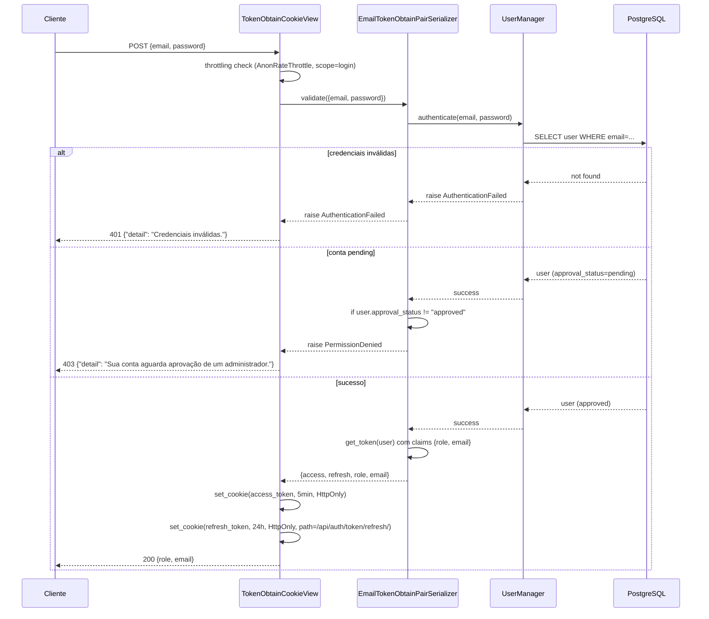
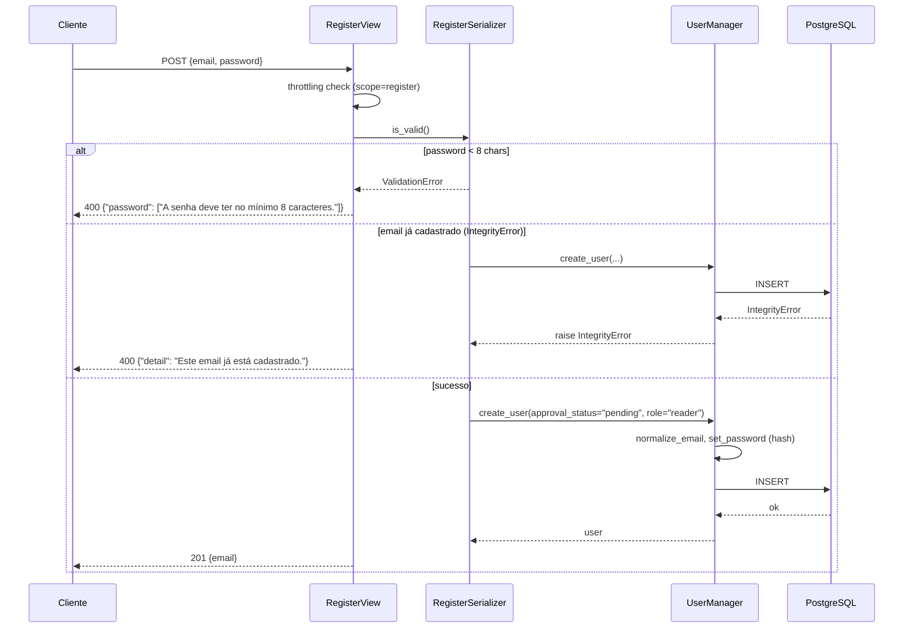
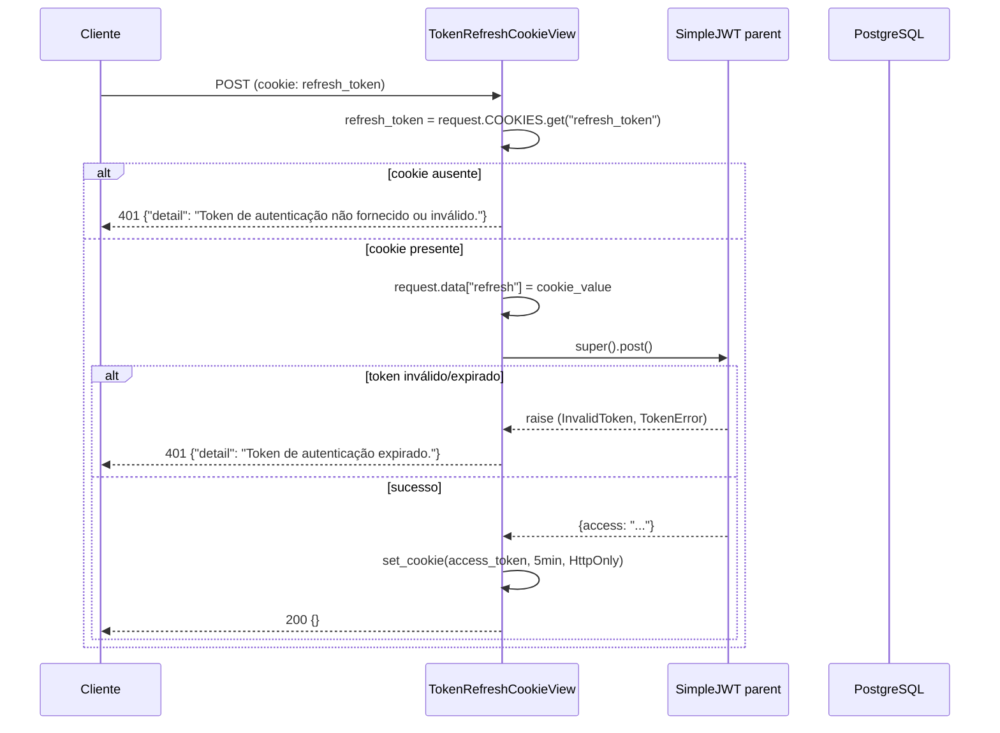
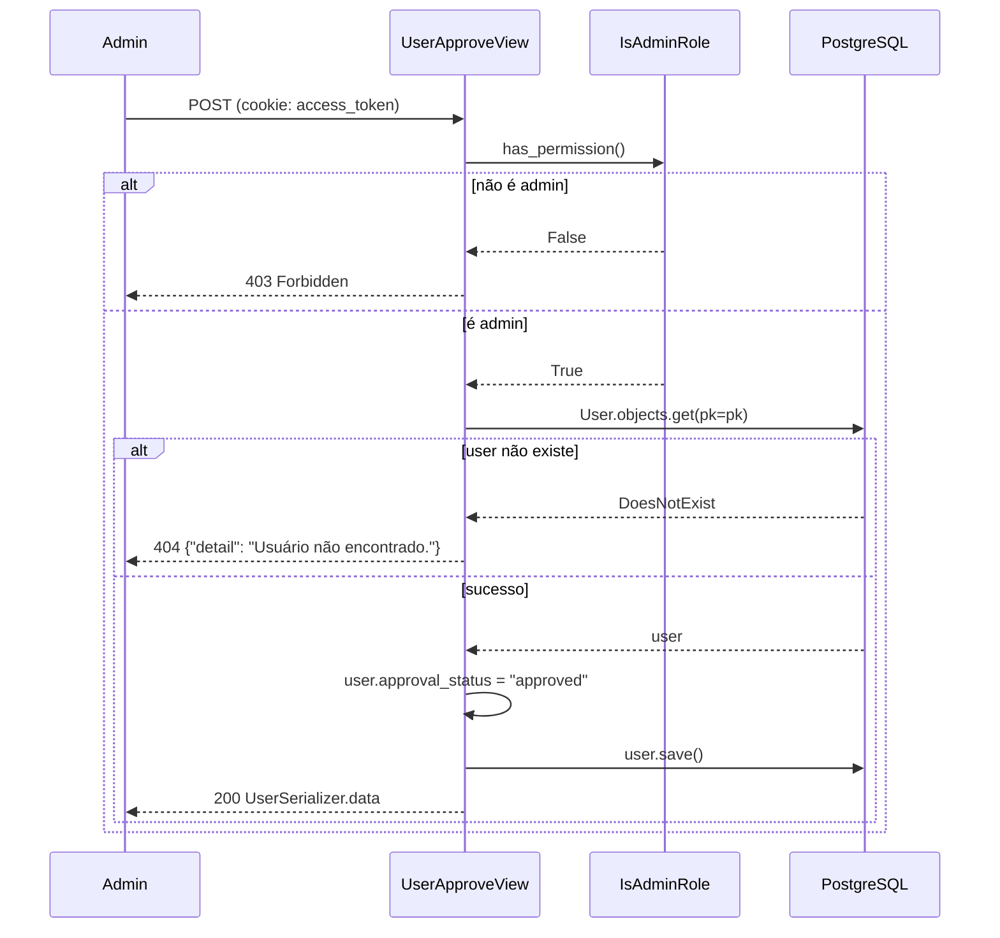
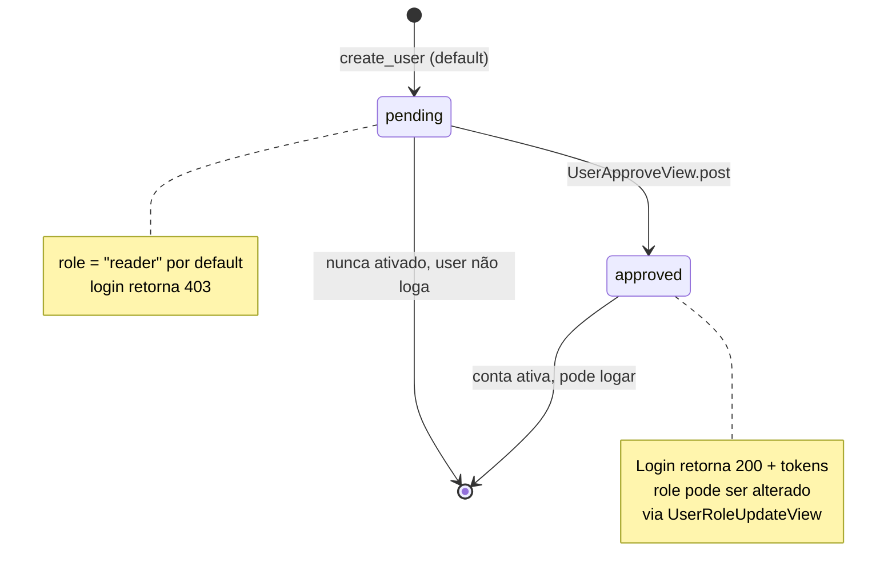
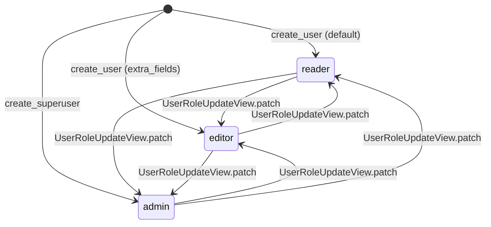

# Fluxograma — Módulo `accounts`

> Gerado pelo Arqueólogo em 2026-06-04

## Fluxo: Login (`POST /api/auth/token/`)

## Fluxo: Registro (`POST /api/auth/register/`)

## Fluxo: Refresh de token (`POST /api/auth/token/refresh/`)

## Fluxo: Aprovação de usuário (`POST /api/auth/users/{pk}/approve/`)

## Máquina de estados: `approval_status`

## Máquina de estados: `role`

