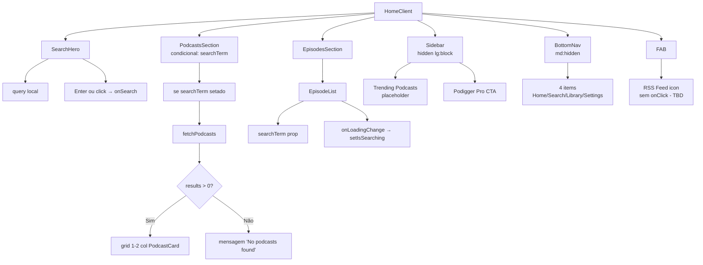
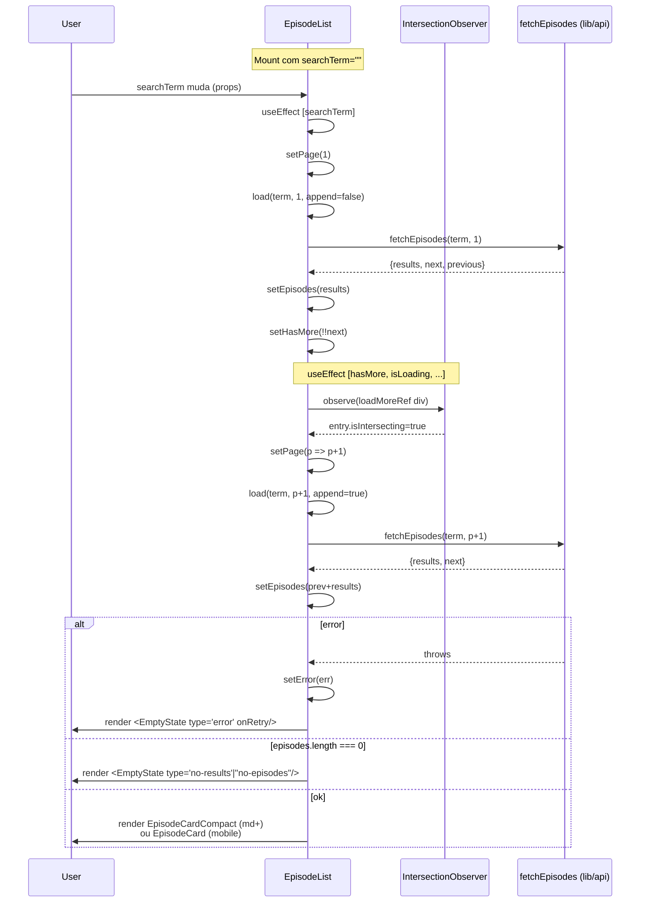
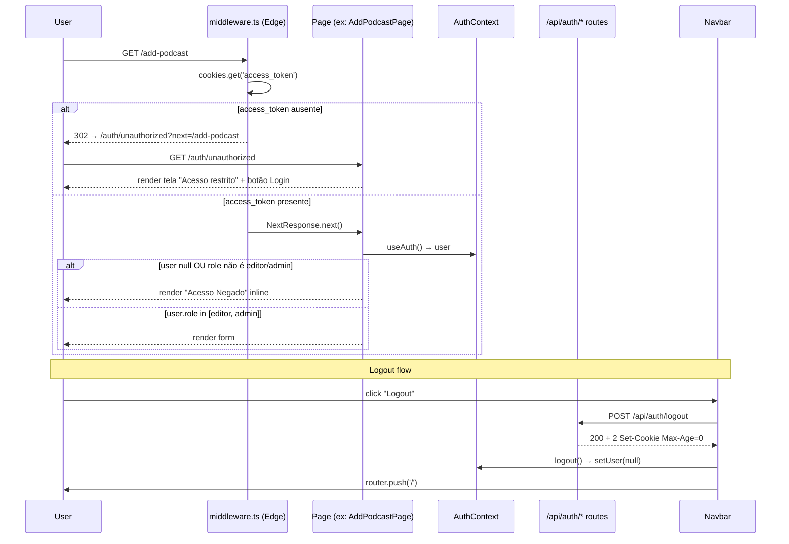
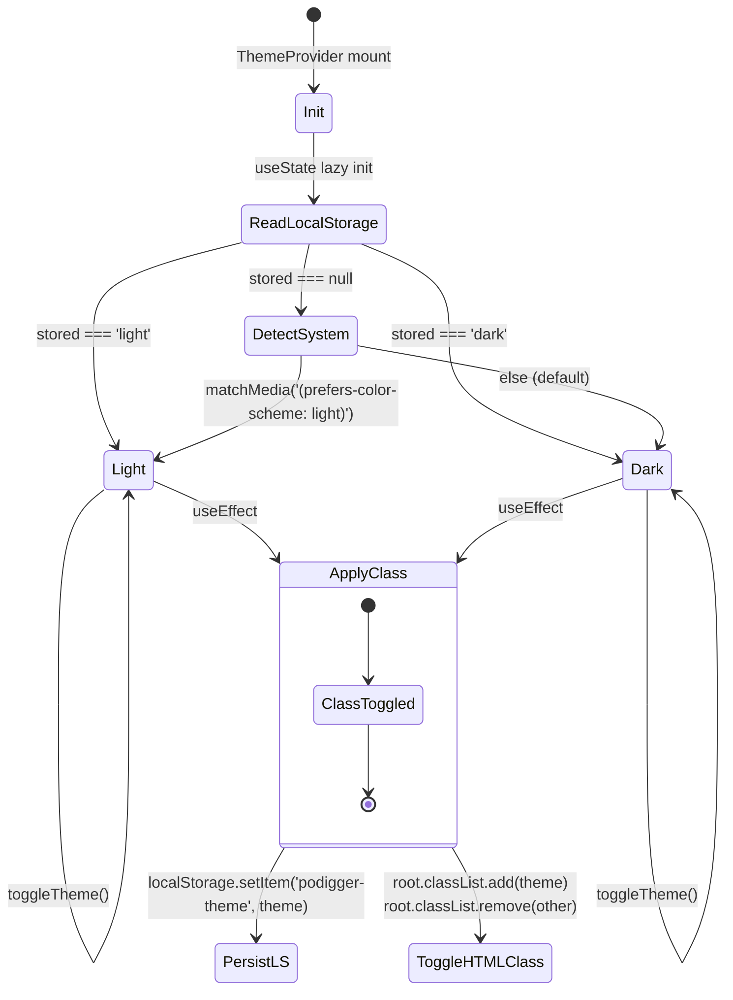
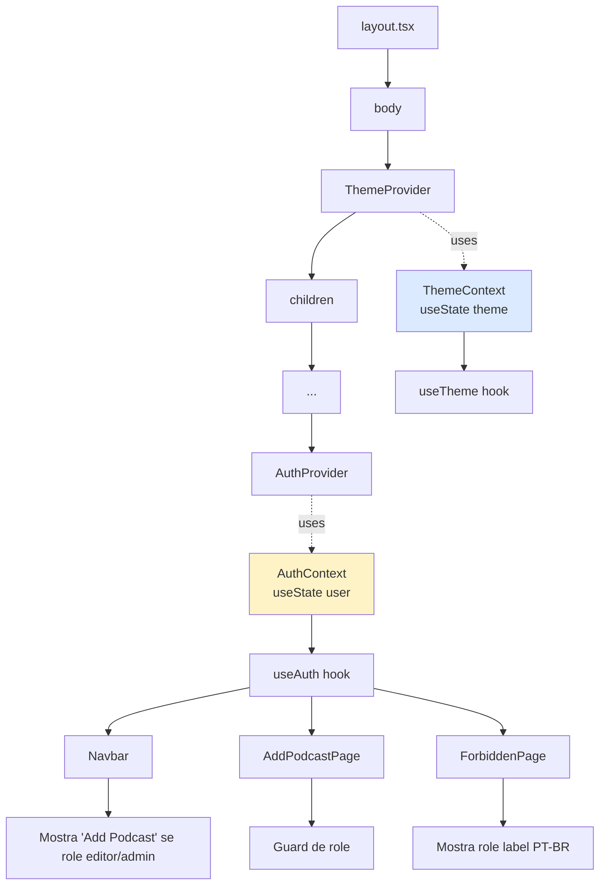
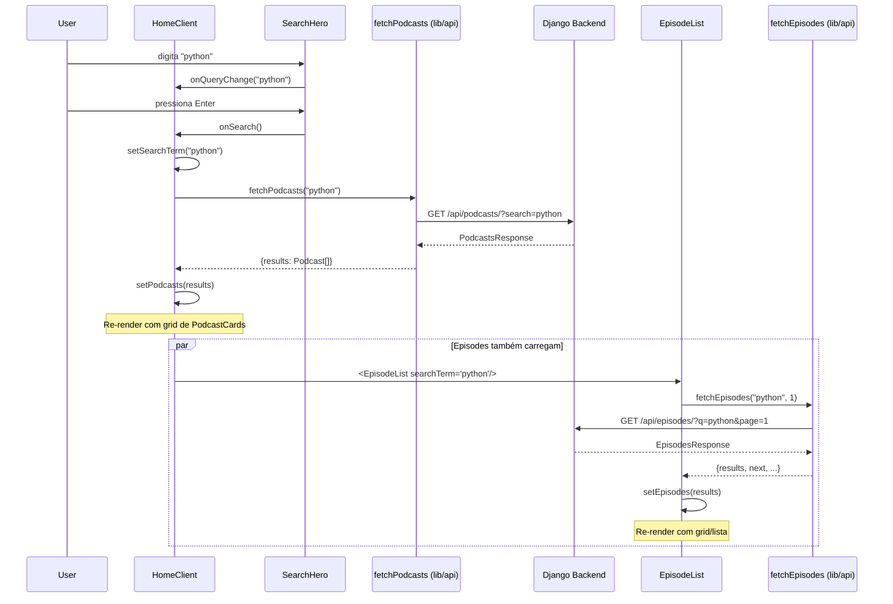

# Fluxogramas — frontend-features

> Diagramas Mermaid para o módulo `frontend-features`.
> Gerado pelo Arqueólogo em 2026-06-05.

---

## 1. Composição da Home (`HomeClient`)



---

## 2. Fluxo de infinite scroll em `EpisodeList`



---

## 3. Fluxo de auth (Defesa em camadas: middleware + page guard + UI)



---

## 4. Theme switching (`ThemeProvider` + `useTheme`)



---

## 5. `HomeClient.handleSearch` — busca de podcasts

```mermaid
flowchart TD
    A[User pressiona Enter / click Search] --> B[handleSearch async]
    B --> C[trim query]
    C --> D[setSearchTerm trimmed]
    D --> E{trimmed é vazio?}
    E -->|Sim| F[setPodcasts[]<br/>return early]
    E -->|Não| G[setIsSearchingPodcasts true]
    G --> H[fetchPodcasts trimmed]
    H --> I{sucesso?}
    I -->|Sim| J[setPodcasts res.results]
    I -->|Não| K[console.error<br/>setPodcasts[]]
    J --> L[setIsSearchingPodcasts false]
    K --> L
    L --> M[Re-render: grid de PodcastCards]
```

---

## 6. `lib/api.ts` — 3 endpoints

```mermaid
graph LR
    A[lib/api.ts] --> B[fetchEpisodes<br/>GET /api/episodes/]
    A --> C[fetchPodcasts<br/>GET /api/podcasts/]
    A --> D[addPodcast<br/>POST /api/podcasts/]

    B --> B1[params: q + page]
    B1 --> B2[DRF SearchFilter<br/>search_fields=title]

    C --> C1[params: search + page]
    C1 --> C2[DRF SearchFilter<br/>search_fields=name]

    D --> D1[body: name, feed]
    D1 --> D2[retorna AddPodcastResponse<br/>status: created|existing|error]

    B --> E[EpisodesResponse<br/>count, next, previous, results: Episode]
    C --> F[PodcastsResponse<br/>count, next, previous, results: Podcast]
    D --> G[AddPodcastResponse<br/>id?, status, message?]
```

---

## 7. AuthContext — providers tree



---

## 8. Fluxo de dados: Home → API → Backend


