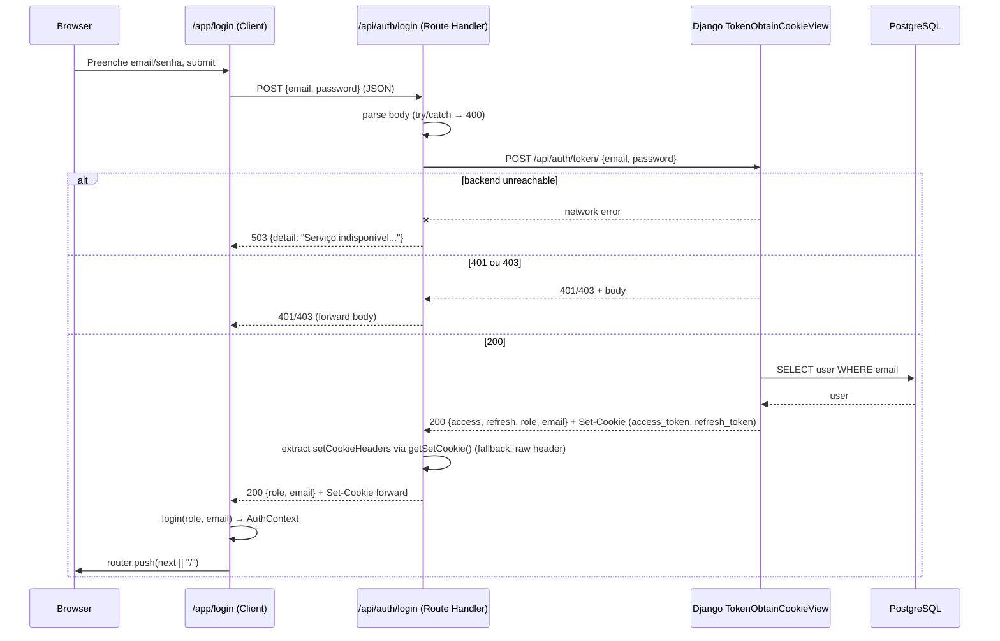
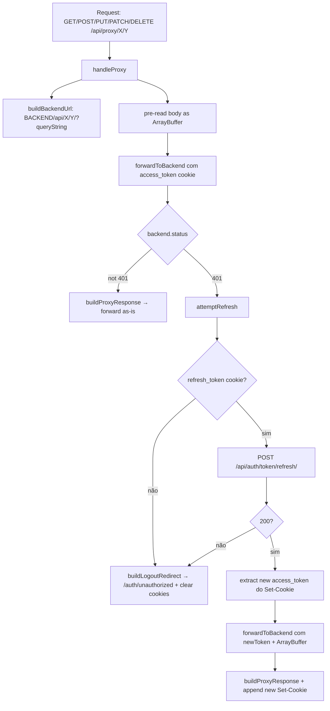
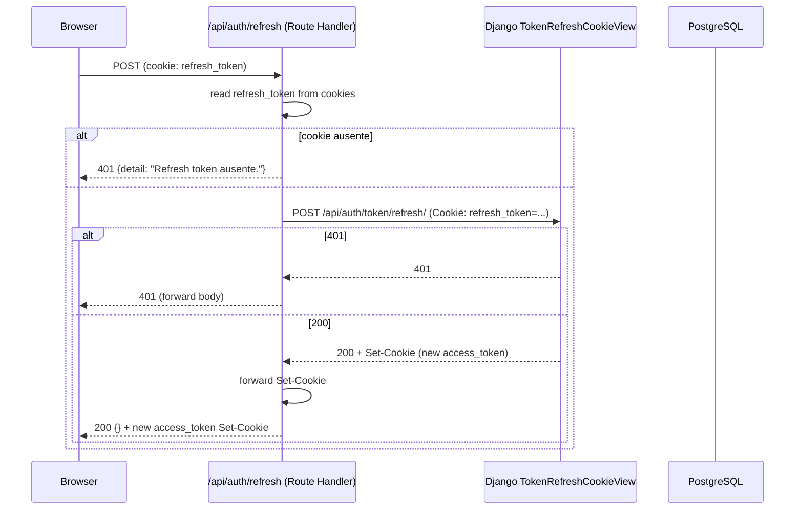
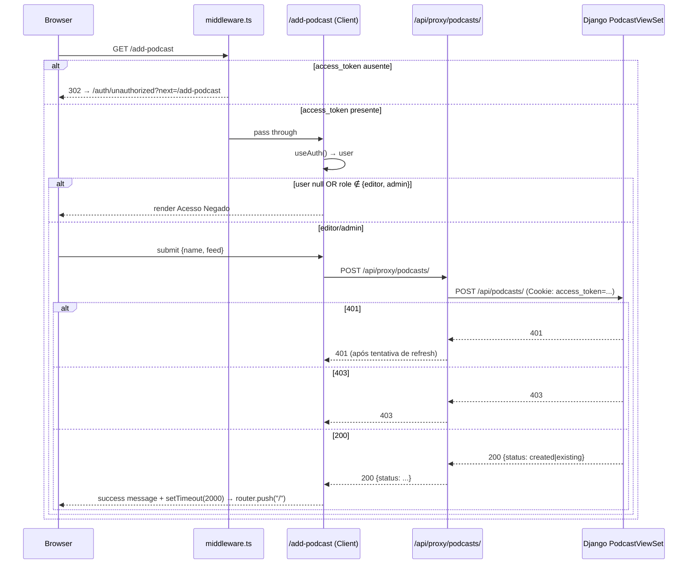
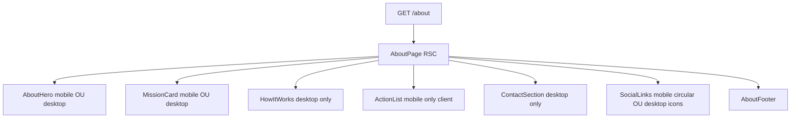
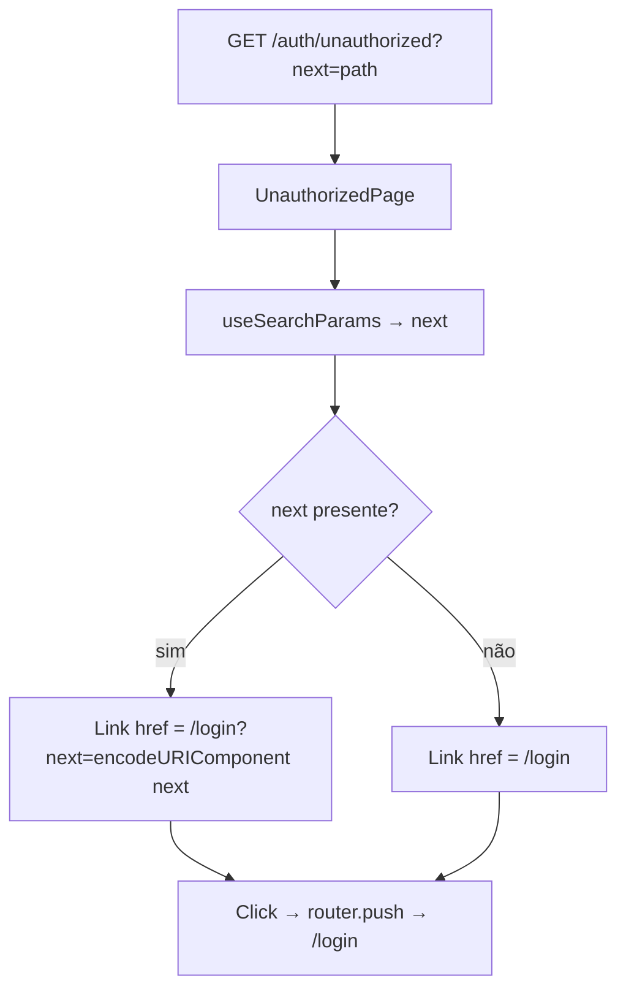
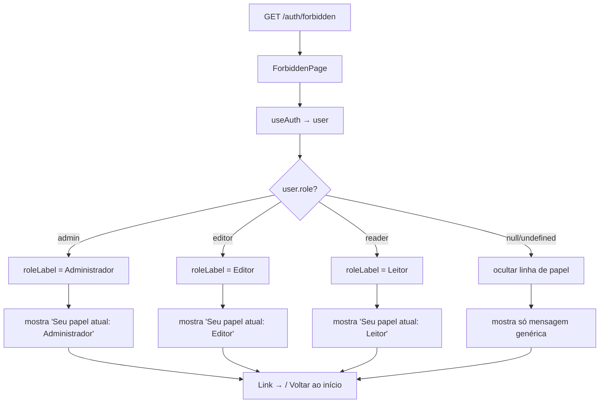
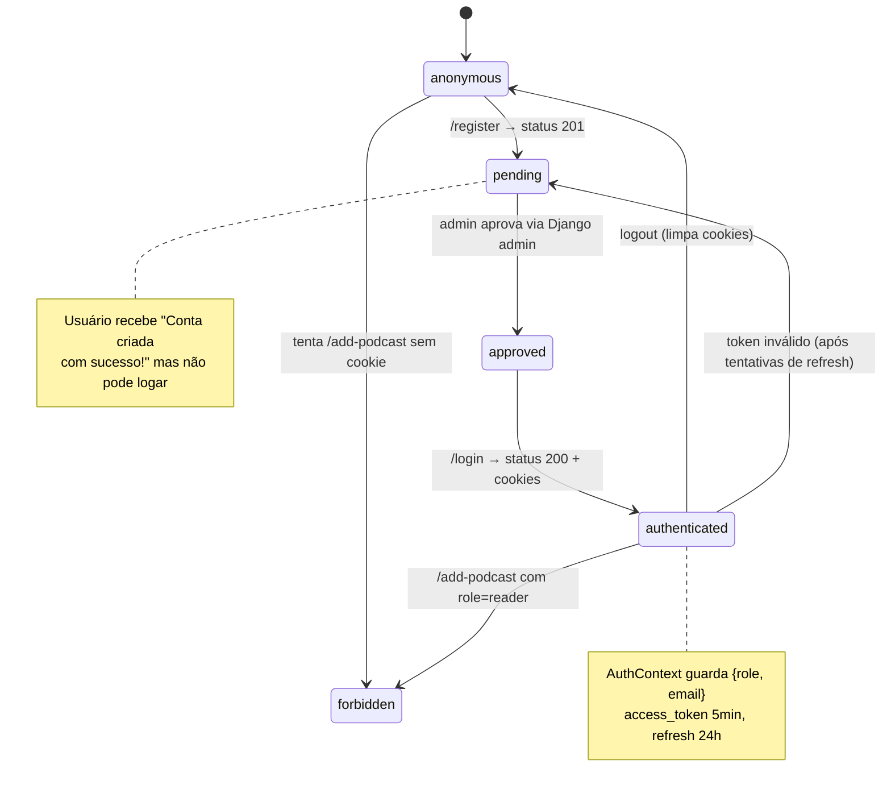

# Fluxograma — Módulo `frontend-pages`

> Gerado pelo Arqueólogo em 2026-06-04
> Módulo: `frontend-pages` (rotas Next.js App Router: home, login, register, add-podcast, about, auth/* + API proxy + middleware)

## Inventário de rotas

| Rota | Tipo | Componente | Função |
|------|------|------------|--------|
| `/` | Server Component | `app/page.tsx` | Renderiza `<HomeClient />` |
| `/login` | Client Component | `app/login/page.tsx` | Formulário de login (POST → `/api/auth/login`) |
| `/register` | Client Component | `app/register/page.tsx` | Formulário de registro (POST → `/api/auth/register`) |
| `/add-podcast` | Client Component | `app/add-podcast/page.tsx` | Formulário de cadastro de podcast (protegido por middleware) |
| `/about` | Server Component | `app/about/page.tsx` | Página estática (compõe 7 sub-componentes) |
| `/auth/unauthorized` | Client Component | `app/auth/unauthorized/page.tsx` | Redireciona para `/login?next=...` |
| `/auth/forbidden` | Client Component | `app/auth/forbidden/page.tsx` | Mostra papel atual e link para home |
| `/auth/pending` | Server Component | `app/auth/pending/page.tsx` | Mostra mensagem estática de "aguarde aprovação" |
| `/api/auth/login` | Route Handler | `app/api/auth/login/route.ts` | Proxy de login para Django |
| `/api/auth/register` | Route Handler | `app/api/auth/register/route.ts` | Proxy de registro para Django |
| `/api/auth/refresh` | Route Handler | `app/api/auth/refresh/route.ts` | Proxy de refresh para Django |
| `/api/auth/logout` | Route Handler | `app/api/auth/logout/route.ts` | Limpa cookies localmente |
| `/api/health` | Route Handler | `app/api/health/route.ts` | Health check do Next.js |
| `/api/proxy/[...path]` | Route Handler | `app/api/proxy/[...path]/route.ts` | Proxy genérico com auto-refresh |

## Fluxo: Middleware de proteção de rotas

```mermaid
flowchart TD
    A[Request: /add-podcast ou /admin/*] --> B[middleware.ts]
    B --> C{access_token cookie presente?}
    C -- não --> D[Redirect 302 → /auth/unauthorized?next=encodeURIComponent(pathname+search)]
    C -- sim --> E[NextResponse.next → handler]
```

🟢 Matcher: `'/add-podcast'`, `'/admin/:path*'`.

## Fluxo: Login (`POST /api/auth/login` → Django `/api/auth/token/`)



## Fluxo: Proxy com auto-refresh (`/api/proxy/[...path]`)



🟢 **Por que ArrayBuffer**: streams HTTP só podem ser consumidos uma vez; como o body é reenviado no retry, é necessário pré-ler como buffer.

## Fluxo: Refresh de token (`POST /api/auth/refresh`)



## Fluxo: Logout (`POST /api/auth/logout`)

```mermaid
flowchart LR
    A[POST /api/auth/logout] --> B[200 {success: true}]
    B --> C[Set-Cookie: access_token=; Max-Age=0]
    B --> D[Set-Cookie: refresh_token=; Max-Age=0; path=/api/auth/token/refresh/]
```

🟢 Logout é puramente client-side: limpa os cookies. **Não chama o backend** (Django não tem endpoint de blacklist no fluxo client-side; o JWT entra em blacklist automaticamente só após expirar o TTL).

## Fluxo: Cadastro de podcast (`/add-podcast`)



## Fluxo: Página `/about` (composição server-side)



🟢 **RSC composition**: a página `/about` é Server Component; cada sub-componente é renderizado no servidor, exceto `ActionList` (precisa de `navigator.share`/clipboard, client-only). Isso permite TTFB rápido e zero JS para Hero, MissionCard (mobile), HowItWorks, ContactSection, SocialLinks (no server-render) e AboutFooter.

## Fluxo: `/auth/unauthorized` (redirecionamento de login)



## Fluxo: `/auth/forbidden` (com contexto de papel)



## Estado: ciclo de autenticação



## Notas arquiteturais

- 🟢 **Por que o proxy**: o frontend Next.js fica isolado de `localhost:8000` (Django). O proxy centraliza o header `Cookie: access_token=...` e a lógica de auto-refresh, evitando que cada componente cliente precise conhecer o backend.
- 🟢 **Por que middleware em `middleware.ts`**: o middleware roda no Edge Runtime, sem acesso a React Context, então lê o cookie diretamente via `request.cookies.get('access_token')`. A defesa em camadas é: middleware bloqueia o acesso à rota, e dentro de `/add-podcast` o `useAuth()` ainda checa `role ∈ {editor, admin}` para UX (mostra "Acesso Negado" com botão de retorno).
- 🟡 **Dupla proteção de `/add-podcast`**: middleware (presença de cookie) + page (role do usuário). Se um usuário com `access_token` válido mas `role=reader` tentar acessar, ele é barrado na página (render condicional antes do form). O middleware não é suficiente.
- 🟡 **Logout não chama backend**: cookies são limpos localmente, mas o JWT continua válido até `exp` (5min access) ou 24h (refresh). Em produção, recomenda-se adicionar `blacklist` no logout usando o `token_blacklist` do SimpleJWT (já habilitado em settings, conforme Archaeologist § config).
- 🟡 **Inconsistência de idioma**: a maioria das páginas e mensagens é em PT-BR, mas `/add-podcast` mistura EN ("Add to Podigger", "Registration", "Podcast Name", "RSS Feed URL") com PT-BR nos comentários e status. A spec SDD deve documentar isso e propor unificação.
- 🟢 **Testes**: `add-podcast/__tests__/page.test.tsx` (151 linhas) cobre 6 cenários: render, mudança de inputs, criação bem-sucedida, podcast existente, erro de API com mensagem, network fail, botão back. Único módulo com testes robustos além de frontend-ui.
