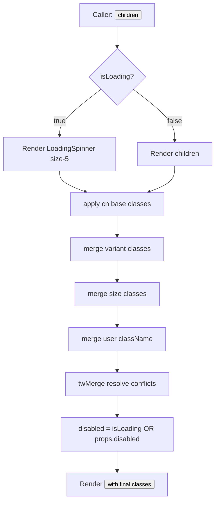
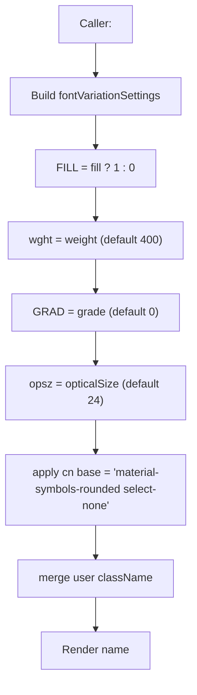
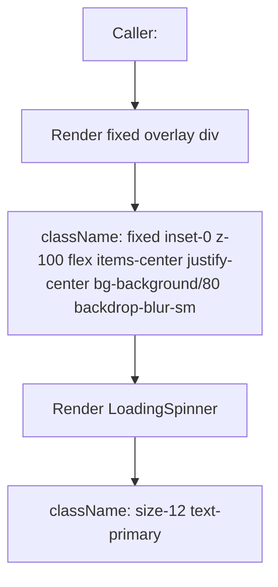
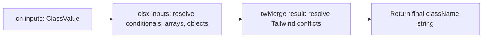
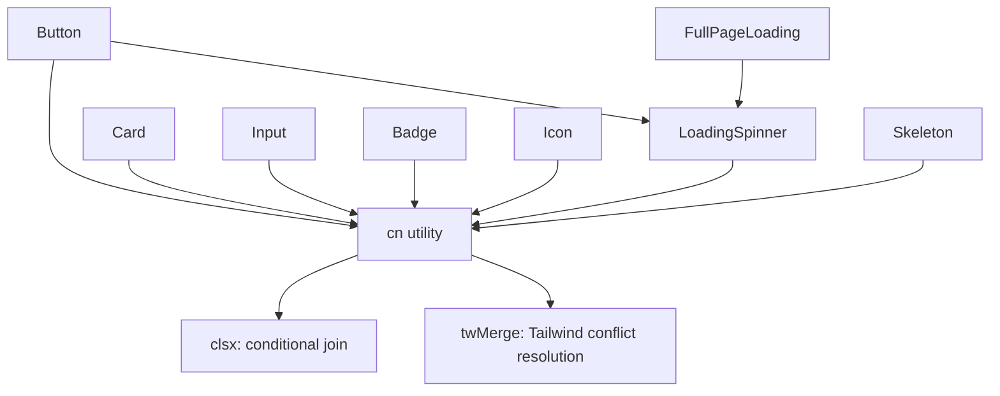
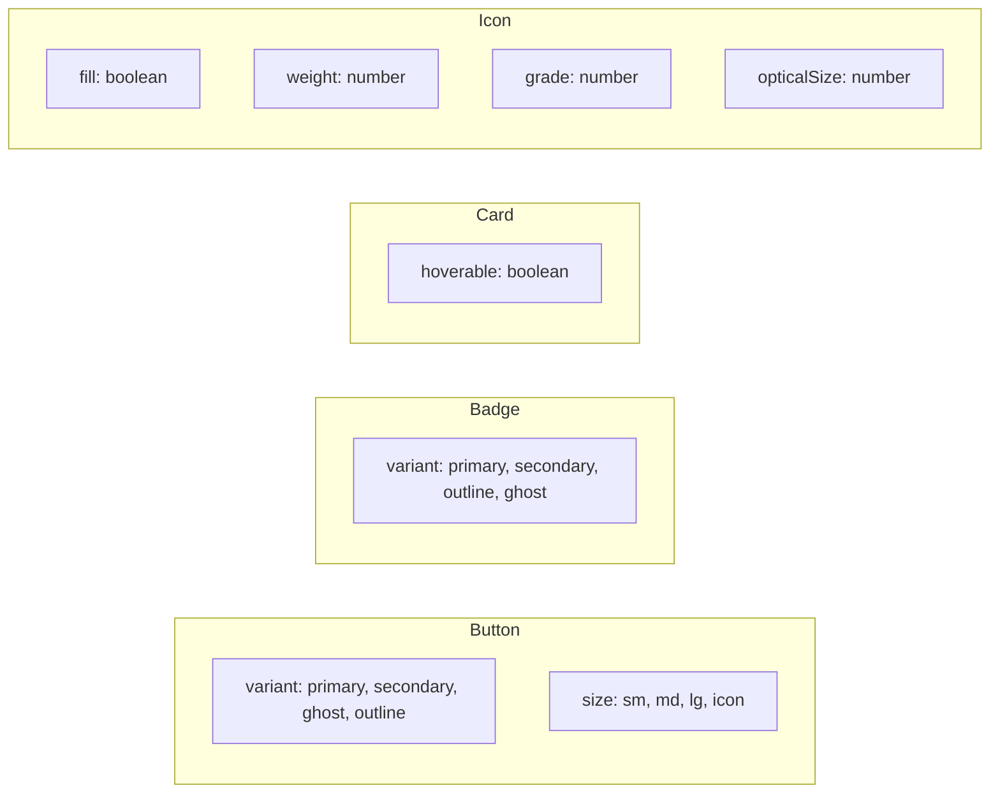

# Fluxograma — Módulo `frontend-ui`

> Gerado pelo Arqueólogo em 2026-06-04
> Módulo: `frontend-ui` (design system: Button, Card, Input, Badge, Icon, Loading)

## Inventário de componentes

| Componente | Arquivo | Tipo de export | Composição |
|------------|---------|----------------|------------|
| `Button` | `Button.tsx` | `forwardRef` (React 19) | Usa `LoadingSpinner` quando `isLoading=true` |
| `Card` | `Card.tsx` | `forwardRef` (React 19) | Puro (apenas `
`) |
| `Input` | `Input.tsx` | `forwardRef` (React 19) | Puro (apenas `<input>`) |
| `Badge` | `Badge.tsx` | function component | Puro (apenas `
`) |
| `Icon` | `Icon.tsx` | function component | Puro (apenas ``) — depende da fonte `Material Symbols Rounded` |
| `LoadingSpinner` | `Loading.tsx` | function component | Puro (apenas `<svg>`) |
| `Skeleton` | `Loading.tsx` | function component | Puro (apenas `
`) |
| `FullPageLoading` | `Loading.tsx` | function component | Usa `LoadingSpinner` |

## Fluxo: Renderização do `Button`

## Fluxo: Renderização do `Icon` (Material Symbols)

## Fluxo: Composição do `FullPageLoading`

## Fluxo: Utilitário `cn(...)` (lib/utils.ts)

## Hierarquia de composição

## Sistema de variantes — Tabela consolidada

## Notas de design

- 🟢 **Padrão `forwardRef`**: Button, Card e Input expõem `ref` para que consumers possam anexar referências DOM (essencial para integração com bibliotecas de form/animação).
- 🟢 **`cn` (clsx + tailwind-merge)**: padrão idiomático shadcn/ui — permite ao caller fazer override de classes sem conflito (`twMerge` resolve `px-4` vs `px-8` automaticamente).
- 🟢 **Material Symbols Rounded**: dependência externa da fonte (carregada no `frontend/src/app/layout.tsx`, não neste módulo). Componente só assume que a fonte está presente.
- 🟡 **`Icon` como `` com `aria-hidden`**: a fonte Material Symbols renderiza glyphs via ligatures (`search`). Sem `aria-hidden` ou label externa, este ícone é invisível para leitores de tela. Aceitável quando usado dentro de botão com texto, mas o caller é responsável pela acessibilidade.
- 🟡 **Sem testes unitários detectados** no diretório `frontend/src/components/ui/` — esses componentes são testados implicitamente via testes das features que os consomem.
