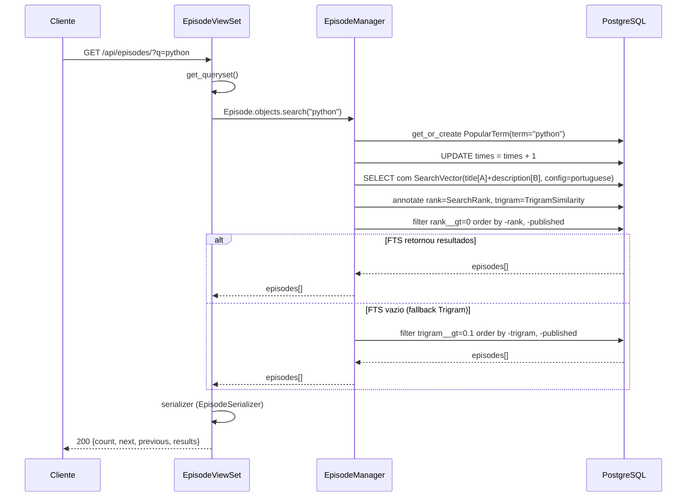
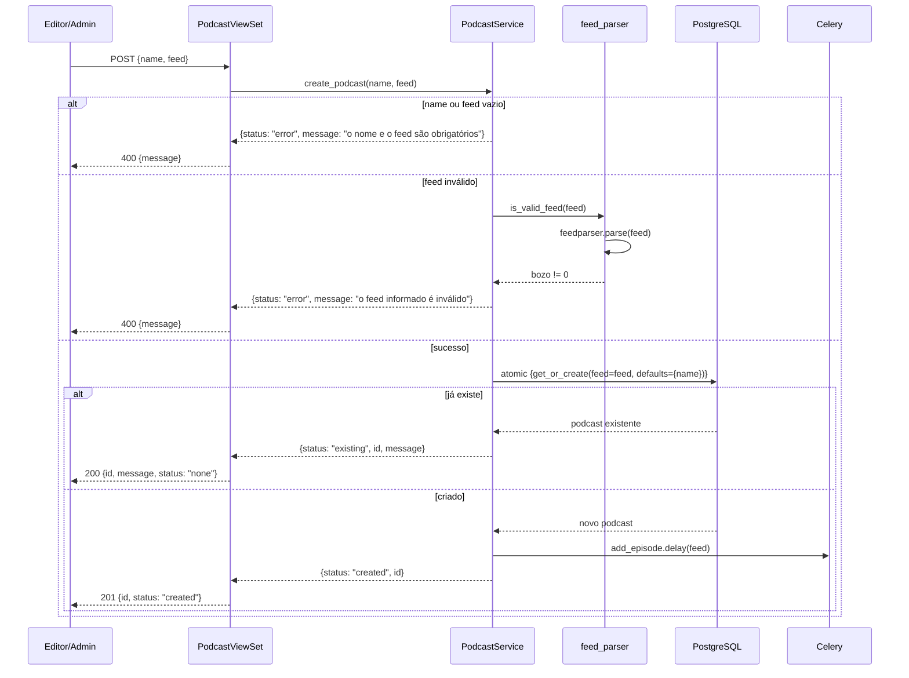
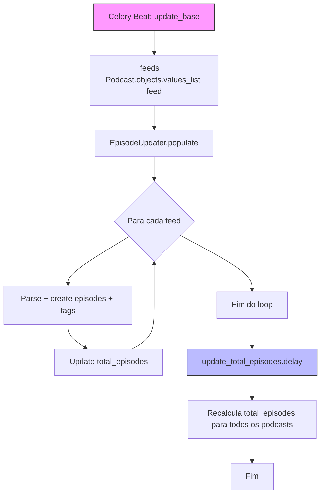
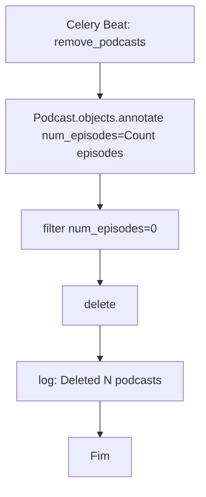
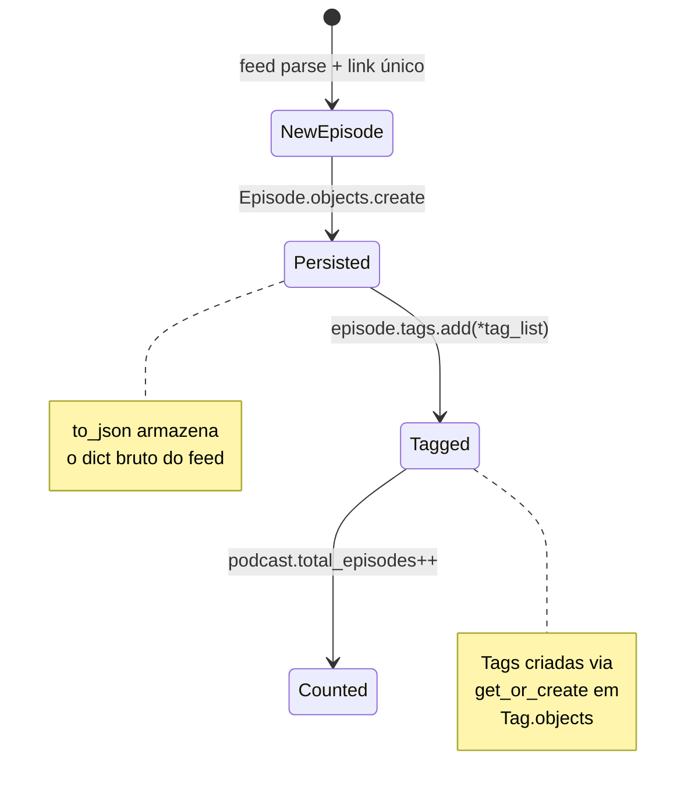

# Fluxograma — Módulo `podcasts`

> Gerado pelo Arqueólogo em 2026-06-04

## Fluxo: Busca de episódios (`GET /api/episodes/?q=termo`)



## Fluxo: Criar podcast (`POST /api/podcasts/`)



## Fluxo: População de episódios (Celery task `add_episode`)

```mermaid
sequenceDiagram
    participant Q as Celery Worker
    participant T as add_episode task
    participant U as EpisodeUpdater
    participant P as feed_parser
    participant DB as PostgreSQL

    Q->>T: add_episode(feed_url)
    T->>U: EpisodeUpdater([feed_url])
    T->>U: populate()
    loop para cada feed
        U->>DB: atomic {podcast = Podcast.objects.filter(feed).first()}
        alt podcast não existe
            U->>U: log warning, continue
        else podcast existe
            U->>P: parse_feed(feed_url)
            P-->>U: {title, language, image, items}
            U->>U: podcast.image = parsed.image
            U->>DB: PodcastLanguage.get_or_create(code=language)
            U->>U: podcast.language = language; save()
            loop para cada item
                U->>U: parse date (RFC 2822)
                alt data inválida
                    U->>U: log warning, skip
                else
                    U->>DB: Episode.objects.filter(link=item.link).exists?
                    alt link já existe
                        U->>U: skip (idempotência)
                    else
                        U->>DB: Episode.objects.create(to_json=item)
                        U->>DB: Tag.get_or_create + episode.tags.add()
                    end
                end
            end
            U->>U: total_episodes = count(episodes); save()
        end
    end
```

## Fluxo: Atualização periódica (Celery task `update_base`)



## Fluxo: Limpeza de podcasts órfãos (Celery task `remove_podcasts`)



## Máquina de estados: `Episode` (relativo ao feed)



## Diagrama de relacionamentos (ER simplificado)

```mermaid
erDiagram
    PodcastLanguage ||--o{ Podcast : "1:N"
    Podcast ||--o{ Episode : "1:N (CASCADE)"
    Episode }o--o{ Tag : "N:M"
    BaseModel <|-- PodcastLanguage : "abstract"
    BaseModel <|-- Tag : "abstract"
    BaseModel <|-- PopularTerm : "abstract"
    BaseModel <|-- TopicSuggestion : "abstract"

    Podcast {
        int id PK
        string name UK
        string feed UK
        string image
        int language FK
        int total_episodes
        datetime created_at
        datetime updated_at
    }

    Episode {
        int id PK
        string title
        string link UK
        text description
        datetime published
        string enclosure
        json to_json
        int podcast FK
    }

    Tag {
        int id PK
        string name UK
    }

    PopularTerm {
        int id PK
        string term
        int times
        date date_search
    }

    TopicSuggestion {
        int id PK
        string title
        text description
        bool is_recorded
    }
```
