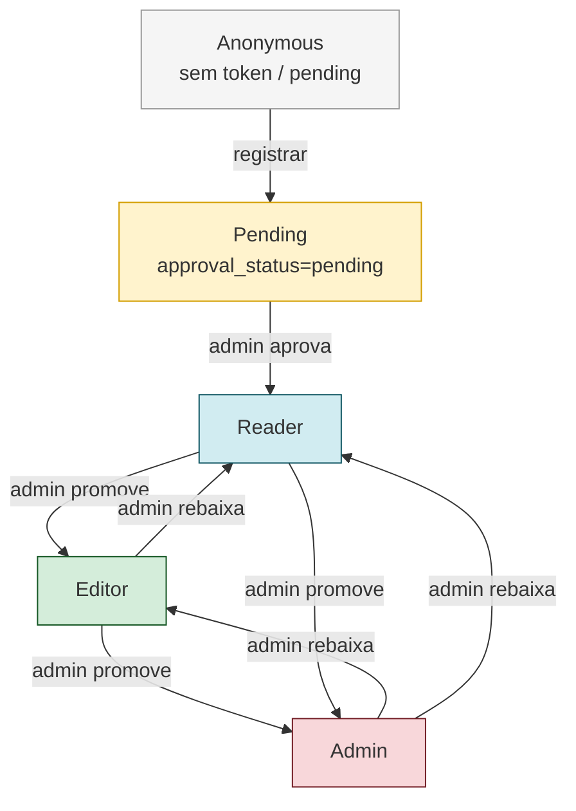

# Permissões e Papéis (RBAC) — podigger

> Gerado pelo Detetive em 2026-06-05
> `doc_level` = `completo`
> Modelo de autorização, matriz de permissões, escopos de proteção e camada de defesa.

**Escala de confiança:** 🟢 CONFIRMADO | 🟡 INFERIDO | 🔴 LACUNA

---

## Índice

1. [Modelo de papéis](#1-modelo-de-papéis)
2. [Matriz de permissões](#2-matriz-de-permissões)
3. [Camadas de defesa (defense in depth)](#3-camadas-de-defesa-defense-in-depth)
4. [Mecanismos complementares](#4-mecanismos-complementares)
5. [Lacunas e melhorias sugeridas](#5-lacunas-e-melhorias-sugeridas)

---

<a id="1-modelo-de-papéis"></a>
## 1. Modelo de papéis

### 1.1 Papéis definidos

| Papel | Código (`User.role`) | Quem recebe por default | Quem atribui |
|-------|----------------------|--------------------------|--------------|
| **Reader** (Leitor) | `"reader"` | `UserManager.create_user` (default via `setdefault`). | Admin (via `UserRoleUpdateView`). |
| **Editor** | `"editor"` | Atribuído por admin. | Admin. |
| **Admin** (Administrador) | `"admin"` | `UserManager.create_superuser` (default em `is_superuser=True`). | Outro admin. |
| **(Pending)** | `(approval_status="pending")` | Estado inicial após registro. | Promovido para "approved" via `UserApproveView`. |

🟢 Fonte: `backend/accounts/models.py:65-83`, `accounts/permissions.py:7-20`, `accounts/views.py:223-275`.

### 1.2 Hierarquia efetiva



### 1.3 Propriedades observadas

- 🟢 **3 papéis discretos** (não há "moderator", "guest" etc.).
- 🟢 **Não há hierarquia por número** (ex: admin=3, editor=2, reader=1) — é sempre `==` ou `in (...)`.
- 🟢 **Aprovação é ortogonal a role** — `approval_status` e `role` são campos independentes. Um `admin` com `approval_status=pending` **não** consegue logar (regra R-USER-04).
- 🟢 O role atual está embutido no JWT (claim `role`), permitindo checagens client-side sem round-trip ao backend.

---

<a id="2-matriz-de-permissões"></a>
## 2. Matriz de permissões

### 2.1 Backend — endpoints REST

| Recurso | Método | URL | Anonymous | Reader | Editor | Admin | Permission class | Throttle |
|---------|--------|-----|-----------|--------|--------|-------|------------------|----------|
| **Token** | POST | `/api/auth/token/` | ✅ | (n/a) | (n/a) | (n/a) | (público) | `login` 5/min |
| **Token refresh** | POST | `/api/auth/token/refresh/` | ✅ (via cookie) | — | — | — | (público) | — |
| **Registrar** | POST | `/api/auth/register/` | ✅ | (n/a) | (n/a) | (n/a) | (público) | `register` 3/min |
| **Listar usuários** | GET | `/api/auth/users/` | ❌ 401 | ❌ 403 | ❌ 403 | ✅ | `IsAdminRole` | `user` 200/min |
| **Aprovar usuário** | POST | `/api/auth/users/<pk>/approve/` | ❌ 401 | ❌ 403 | ❌ 403 | ✅ | `IsAdminRole` | `user` |
| **Mudar role** | PATCH | `/api/auth/users/<pk>/` | ❌ 401 | ❌ 403 | ❌ 403 | ✅ | `IsAdminRole` | `user` |
| **Listar podcasts** | GET | `/api/podcasts/` | ✅ | ✅ | ✅ | ✅ | `IsAuthenticatedOrReadOnly` | `anon` 100/min |
| **Detalhe podcast** | GET | `/api/podcasts/<id>/` | ✅ | ✅ | ✅ | ✅ | idem | `anon` |
| **Podcasts recentes** | GET | `/api/podcasts/recent/` | ✅ | ✅ | ✅ | ✅ | idem | `anon` |
| **Buscar podcasts** | GET | `/api/podcasts/?search=` | ✅ | ✅ | ✅ | ✅ | `SearchFilter` | `anon` |
| **Criar podcast** | POST | `/api/podcasts/` | ❌ 401/403 | ❌ 403 | ✅ | ✅ | `IsEditorOrAdmin` | `user` 200/min |
| **Listar episódios** | GET | `/api/episodes/` | ✅ | ✅ | ✅ | ✅ | `IsAuthenticatedOrReadOnly` | `anon` |
| **Buscar episódios** | GET | `/api/episodes/?q=` | ✅ | ✅ | ✅ | ✅ | FTS via manager | `anon` ⚠️ |
| **Filtrar por podcast** | GET | `/api/episodes/?podcast=<id>` | ✅ | ✅ | ✅ | ✅ | `DjangoFilterBackend` | `anon` |
| **Criar episódio** | POST | `/api/episodes/` | ❌ | ❌ | ✅ | ✅ | `IsEditorOrAdmin` | `user` |
| **Listar topic-suggestions** 🔴 Removendo | GET | `/api/topic-suggestions/` | ✅ | ✅ | ✅ | ✅ | `IsAuthenticatedOrReadOnly` | `anon` |

| **CRUD topic-suggestion** 🔴 Removendo | POST/PATCH/DELETE | `/api/topic-suggestions/<id>/` | ❌ | ❌ | ✅ | ✅ | `IsEditorOrAdmin` | `user` |
| **Listar popular-terms** | GET | `/api/popular-terms/` | ✅ | ✅ | ✅ | ✅ | read-only | `anon` |
| **Django Admin** | * | `/admin/` | ❌ | ❌ | ❌ | ✅ | `is_staff=True` (só superuser via `create_superuser`) | — |
| **Health check** | GET | `/health/` | ✅ | ✅ | ✅ | ✅ | (público) | — |

🟢 Fonte: `backend/accounts/urls.py`, `backend/podcasts/urls.py`, `backend/accounts/permissions.py`, `backend/config/settings.py:178-183`.

### 2.2 Frontend — rotas e visibilidade

| Rota | Anonymous | Reader | Editor | Admin | Defesa |
|------|-----------|--------|--------|-------|--------|
| `/` | ✅ (home pública) | ✅ | ✅ | ✅ | (nenhuma) |
| `/about` | ✅ | ✅ | ✅ | ✅ | (nenhuma) |
| `/login` | ✅ | (redireciona após login) | — | — | (público) |
| `/register` | ✅ | (idem) | — | — | (público) |
| `/add-podcast` | ❌ (middleware → `/auth/unauthorized`) | ❌ (page guard) | ✅ | ✅ | Edge middleware + page guard |
| `/admin/*` | ❌ (middleware) | ❌ | ❌ | ❌ (rota inexistente no frontend) | Edge middleware |
| `/auth/unauthorized` | ✅ | — | — | — | (público) |
| `/auth/forbidden` | — | ✅ (mostra role atual) | ✅ | ✅ | requer `useAuth` |
| `/auth/pending` | ✅ | — | — | — | (público) |
| `/api/auth/login` (proxy) | ✅ | — | — | — | (público) |
| `/api/auth/register` (proxy) | ✅ | — | — | — | (público) |
| `/api/auth/refresh` (proxy) | ✅ (via cookie) | — | — | — | (público) |
| `/api/auth/logout` (proxy) | ✅ | ✅ | ✅ | ✅ | (público) |
| `/api/health` (proxy) | ✅ | ✅ | ✅ | ✅ | (público) |
| `/api/proxy/[...path]` | ❌ (precisa de cookie válido) | ✅ | ✅ | ✅ | auto-refresh transparente |

🟢 Fonte: `frontend/src/middleware.ts:13-30`, `frontend/src/app/*/page.tsx`, `frontend/src/app/api/*/route.ts`.

### 2.3 Visibilidade de elementos no Navbar

| Elemento | Anonymous | Reader | Editor | Admin | Fonte |
|----------|-----------|--------|--------|-------|-------|
| Logo "Podigger" | ✅ | ✅ | ✅ | ✅ | `frontend/src/components/layout/Navbar.tsx` |
| Link "Home" | ✅ | ✅ | ✅ | ✅ | idem |
| Link "Adicionar Podcast" | ❌ (não renderiza) | ❌ | ✅ | ✅ | `navLinks` filtrado por role |
| Botão "Sair" | ❌ (não autenticado) | ✅ | ✅ | ✅ | render condicional |

🟢 Fonte: `frontend/src/components/layout/Navbar.tsx:navLinks` (filtro por `user.role`).

### 2.4 Operações internas (Celery)

| Operação | Quem executa | Permissão verificada? |
|----------|--------------|------------------------|
| `add_episode(feed_url)` | `PodcastService.create_podcast` (síncrono, no contexto do request de admin/editor) | Sim, indiretamente (o `create_podcast` requer `IsEditorOrAdmin`). |
| `update_base` | Celery Beat (periódico) | Nenhuma (roda no worker, sem usuário). |
| `update_total_episodes` | Encadeado de `update_base` | Nenhuma. |
| `remove_podcasts` | Celery Beat (periódico) | Nenhuma. |

🟢 Fonte: `backend/podcasts/tasks.py:12-72`.

---

<a id="3-camadas-de-defesa-defense-in-depth"></a>
## 3. Camadas de defesa (defense in depth)

O sistema aplica **3 camadas de proteção** em rotas sensíveis (ex: `/add-podcast`):

```mermaid
flowchart LR
    A[Browser request] -->|Edge Middleware| B{middleware.ts}
    B -->|access_token cookie ausente| C[302 /auth/unauthorized]
    B -->|cookie presente| D[Render page]
    D -->|useAuth carrega| E{useAuth().user}
    E -->|!user OR role ∉ editor/admin| F[Render Acesso Negado]
    E -->|role válido| G[Form de adicionar podcast]
    G -->|submit| H[POST /api/proxy/podcasts/]
    H -->|Backend Django| I{IsEditorOrAdmin}
    I -->|não| J[403 Forbidden]
    I -->|sim| K[200/201 + Celery add_episode]

    style B fill:#e1f5fe
    style E fill:#fff3e0
    style I fill:#fce4ec
```

🟢 Fonte: `frontend/src/middleware.ts:13-24`, `frontend/src/app/add-podcast/page.tsx:21-47`, `backend/podcasts/views.py:31-35`, `backend/podcasts/services/podcast_service.py:25-69`.

### 3.1 Por que 3 camadas?

| Camada | Bloqueia | Custo |
|--------|----------|-------|
| **Edge Middleware (Next.js)** | Acesso a `/add-podcast` sem cookie de auth (rápido, sem hydration). | 1 round-trip zero. |
| **Page guard (`useAuth`)** | Renderização da página com role inválido (UX clara, mensagem contextual). | Hidratação do React. |
| **DRF Permission (`IsEditorOrAdmin`)** | Bypass direto via API (defesa real). | Request completa ao Django. |

🟢 **Padrão recomendado:** confiar só no backend (DRF) é o mínimo; as outras 2 são UX/performance.

---

<a id="4-mecanismos-complementares"></a>
## 4. Mecanismos complementares

### 4.1 Throttling (rate limiting)

| Scope | Limite | Aplicado em | Tipo |
|-------|--------|-------------|------|
| `anon` | 100 req/min | Todas as views autenticadas como anonymous | `AnonRateThrottle` |
| `user` | 200 req/min | Todas as views autenticadas como user | `UserRateThrottle` |
| `login` | 5 req/min | `TokenObtainCookieView` | `ScopedRateThrottle` |
| `register` | 3 req/min | `RegisterView` | `ScopedRateThrottle` |

🟢 Fonte: `backend/config/settings.py:178-183`.

### 4.2 JWT (SimpleJWT) com cookies

| Token | TTL | Path do cookie | HttpOnly | SameSite | Secure (prod) |
|-------|-----|----------------|----------|----------|---------------|
| `access_token` | 15 min | `/` | ✅ | `Lax` | ✅ se `not DEBUG` |
| `refresh_token` | 24 h | `/api/auth/token/refresh/` | ✅ | `Lax` | ✅ se `not DEBUG` |

🟢 Fonte: `backend/accounts/views.py:68-92, 121-152`, `backend/config/settings.py:198-216`.

### 4.3 Auto-refresh transparente (proxy)

O proxy do Next.js (`/api/proxy/[...path]`) implementa um ciclo de 2 tentativas:

1. Tenta a request com o `access_token` do cookie.
2. Se 401 → tenta refresh usando o `refresh_token` cookie.
3. Se refresh OK → replay da request com novo `access_token`.
4. Se refresh falhou → 302 para `/auth/unauthorized?next=...` + clear cookies.

🟢 Fonte: `frontend/src/app/api/proxy/[...path]/route.ts:185-225`.

### 4.4 Token blacklist

- 🔴 **Desabilitado por decisão** (Perna 2026-06-06): `TOKEN_BLACKLIST_ENABLED = False`, `BLACKLIST_AFTER_ROTATION = False`.
- App `rest_framework_simplejwt.token_blacklist` pode ser removida de `INSTALLED_APPS`.
- Logout apenas limpa cookies (sem chamada de blacklist).
- Tokens permanecem válidos até `exp` (access 15min, refresh 24h).

### 4.5 CORS

| Modo | Configuração | Comportamento |
|------|--------------|----------------|
| `DEBUG=True` | `CORS_ALLOW_ALL_ORIGINS = True` | Aceita qualquer origem (dev). |
| `DEBUG=False` | `CORS_ALLOWED_ORIGINS` + `CSRF_TRUSTED_ORIGINS` via env var (lista) | Apenas origens explicitamente permitidas. |
| Sempre | `CORS_ALLOW_CREDENTIALS = True` | Necessário para cookies cross-origin. |

🟢 Fonte: `backend/config/settings.py:189-194`.

### 4.6 Headers de segurança (proxy SSL)

- 🟢 `SECURE_PROXY_SSL_HEADER` configurado para confiar no `X-Forwarded-Proto` do Nginx.
- 🟢 `CSRF_TRUSTED_ORIGINS` adicionado em workflows de deploy (commit `e50f371`).

🟢 Fonte: `backend/config/settings.py` (commit `5d4efa1`).

---

<a id="5-lacunas-e-melhorias-sugeridas"></a>
## 5. Lacunas e melhorias sugeridas

### 5.1 Lacunas críticas 🔴

| # | Lacuna | Impacto | Sugestão | Status (Q&A 2026-06-06) |
|---|--------|---------|----------|--------------------------|
| 1 | ~~Admin pode se auto-rebaixar (`PATCH /api/auth/users/<pk>/` com `pk == self.pk`).~~ | ~~Risco de "lockout" coletivo se o único admin se rebaixa.~~ | ~~Adicionar validação `if pk == request.user.pk and role != "admin": raise ValidationError`.~~ | 🟢 **Não é lacuna** — Perna confirmou que admin pode se auto-promover/rebaixar como regra de negócio. Manter como está. |
| 2 | Aprovação de usuário sem auditoria. | Sem rastreabilidade de quem/quando aprovou. | Criar `ApprovalLog(user, approver, timestamp)` ou usar `django-auditlog`. | 🔴 **Gap aceitável** (Perna 2026-06-06) — não implementar agora. |
| 3 | Logout não invalida JWT no backend. | Token roubado continua válido até `exp` (15min/24h). | Chamar `/api/auth/token/blacklist/` no `POST /api/auth/logout`. | 🔴 **Decisão: não implementar** (Perna 2026-06-06). Blacklist desabilitada. |
| 4 | Endpoint de busca sem rate limit dedicado. | Possível abuso para inflar `PopularTerm`. | Adicionar `throttle_scope = "search"` com limite agressivo. | 🔴 **Implementar** (Perna 2026-06-06). Adicionar throttle scope. |
| 5 | `UserRoleUpdateView` aceita `role=admin` sem validação extra. | Promoção silenciosa para admin sem rito (ex: 2 admins aprovam). | Exigir re-autenticação ou segundo admin. | 🟢 **Intencional** — coerente com #1 (admin pode se auto-promover). |

### 5.2 Lacunas médias 🟡

| # | Lacuna | Sugestão |
|---|--------|----------|
| 6 | Não há soft-delete de `User` (apenas `is_active=False`). | Considerar `archived_at` separado. |
| 7 | `TopicSuggestion` removido (Perna 2026-06-06). | Funcionalidade removida — não implementar. |
| 8 | Não há permission granular por recurso (ex: editor pode editar todos os episódios ou só os seus?). | Se necessário, criar `IsOwnerOrEditor`. |
| 9 | `Navbar` não expõe toggle de tema, mas `ThemeProvider` existe. | Implementar toggle ou remover `ThemeProvider`. |
| 10 | `<html lang="en">` apesar de UI 100% PT-BR. | Trocar para `lang="pt-BR"`. |
| 11 | `to_json` armazena o snapshot bruto do parser (sem limite de tamanho). | Contexto histórico (Perna 2026-06-05): herança da migração Flask→Django. Provavelmente overkill hoje, mas mantido por compatibilidade. Avaliar em refactor futuro. |

### 5.3 Boas práticas já adotadas 🟢

- 🟢 **Cookie path scoping** (refresh tem path mais restrito que access).
- 🟢 **HttpOnly + Secure em produção** para ambos os tokens.
- 🟢 **Rotação de refresh token** habilitada (sem blacklist — decisão Perna 2026-06-06).
- 🟢 **Defesa em 3 camadas** (Edge + Page + API).
- 🟢 **Throttling granular** por escopo (login, register, anon, user).
- 🟢 **Auto-refresh transparente** no proxy (UX sem 401 visível).
- 🟢 **Soft dependency** (Redis degradado não derruba health check).

---

## Resumo executivo

| Aspecto | Estado |
|---------|--------|
| **Modelo RBAC** | 3 papéis discretos (reader, editor, admin). |
| **Aprovação** | Ortogonal ao role (pending/approved). |
| **Endpoint de auth** | JWT com cookies HttpOnly + auto-refresh. |
| **Defesa em profundidade** | 3 camadas (Edge + Page + API). |
| **Throttling** | 4 escopos (anon, user, login, register). |
| **Blacklist** | Desabilitado (Perna 2026-06-06): sem blacklist após rotação, sem blacklist no logout. |
| **Maior risco** | Ausência de auditoria de aprovação + busca sem rate limit. |
| **Lacunas abertas (Q&A 2026-06-06)** | R-USER-08 (gap aceitável), AI-4 (implementar throttle busca). |
| **Lacunas resolvidas (Q&A 2026-06-05/06)** | AI-6 (auto-promoção é regra), R-TS-02 (manual é design), AI-5 (decidiu não implementar). |
