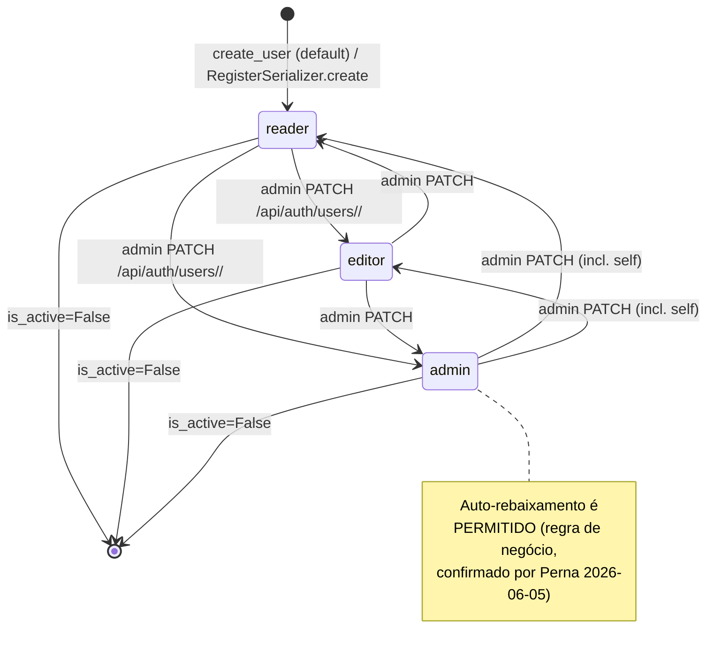
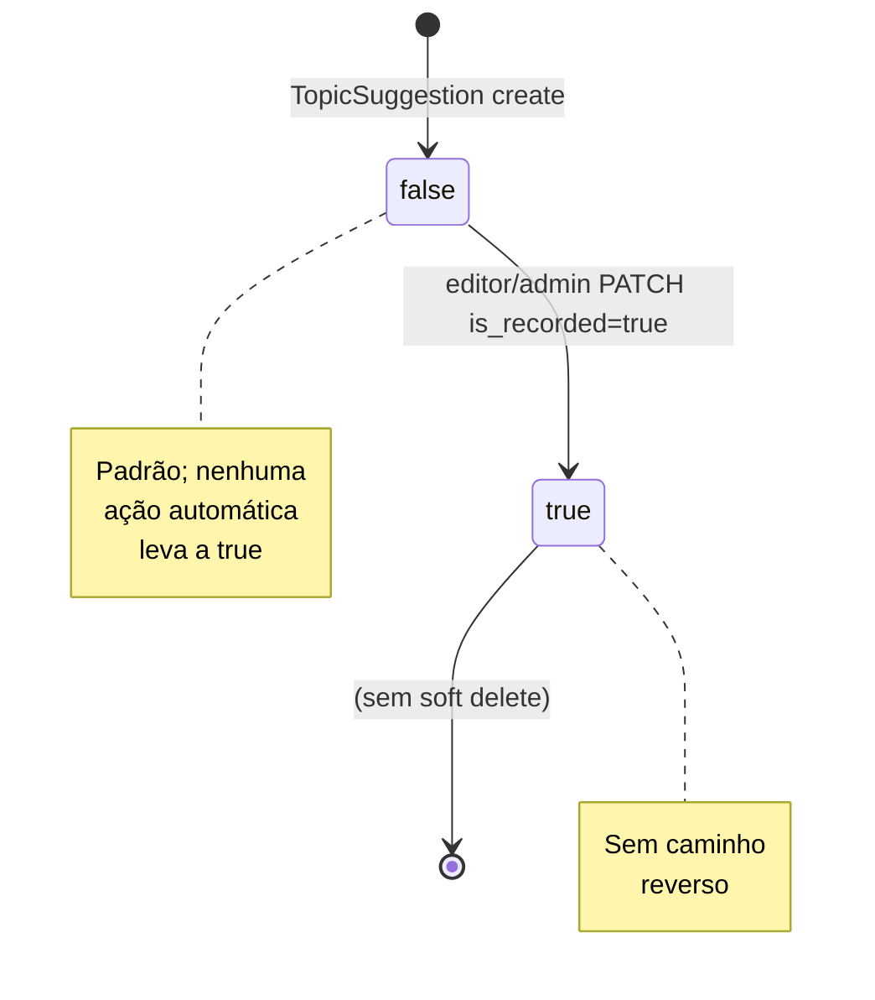
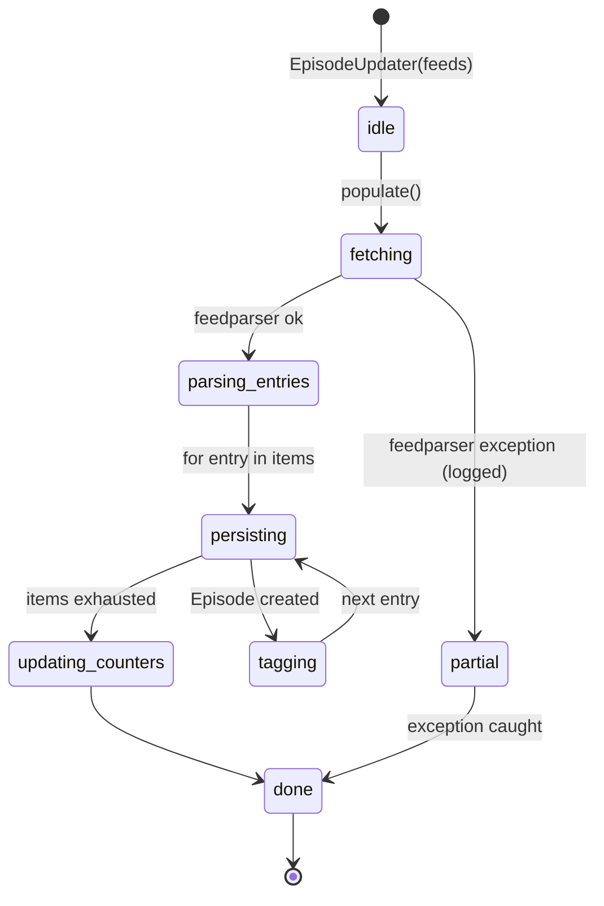
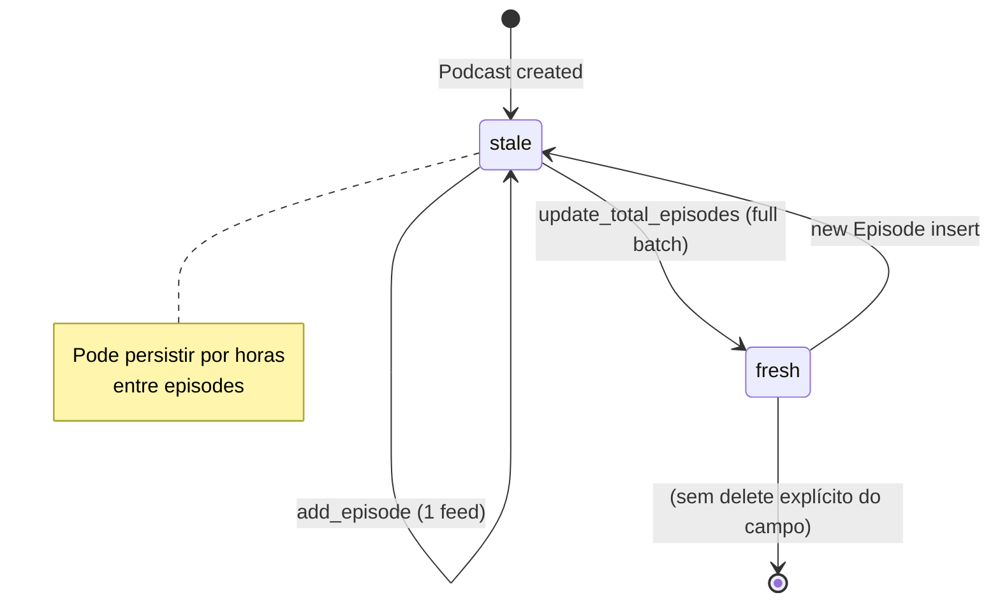

# Máquinas de Estado — podigger

> Gerado pelo Detetive em 2026-06-05
> `doc_level` = `completo`
> Cobre todas as entidades com campo `status`, `approval_status`, `is_recorded` ou flags binários de ciclo de vida.

**Escala de confiança:** 🟢 CONFIRMADO | 🟡 INFERIDO | 🔴 LACUNA

---

## Índice

1. [`User.approval_status`](#1-userapproval_status) — fluxo de aprovação
2. [`User.role`](#2-userrole) — papel RBAC (não é state machine clássica, mas transita)
3. [`TopicSuggestion.is_recorded`](#3-topicsuggestionis_recorded) — flag de ciclo
4. [`EpisodeUpdater` por feed](#4-episodeupdater-por-feed) — pipeline de processamento
5. [`Podcast.total_episodes`](#5-podcasttotal_episodes) — campo denormalizado

---

## 1. `User.approval_status`

### 1.1 Estados

| Estado | Valor literal | Descrição |
|--------|---------------|-----------|
| `pending` | `"pending"` | Conta criada pelo fluxo de registro, ainda não validada por admin. Não pode logar. |
| `approved` | `"approved"` | Conta validada; pode autenticar e usar o sistema conforme o papel. |

🟢 Fonte: `backend/accounts/models.py:75-80` (`APPROVAL_STATUS_CHOICES`).

### 1.2 Diagrama de estados

```mermaid
stateDiagram-v2
    [*] --> pending : create_user (default) / RegisterSerializer.create
    pending --> approved : admin POST /api/auth/users/<pk>/approve/
    approved --> [*] : (sem soft delete; is_active=False via Django Admin)

    note right of pending
      Bloqueia login:
      EmailTokenObtainPairSerializer.validate
      → PermissionDenied (403)
    end note

    note right of approved
      Permite login e
      qualquer ação conforme role
    end note
```

### 1.3 Transições e gatilhos

| De | Para | Trigger | Efeito colateral | Confiança | Localização |
|----|------|---------|------------------|-----------|------------|
| `(inexistente)` | `pending` | `RegisterSerializer.create` (ou `UserManager.create_user` no Django Admin) | Email único obrigatório, role default `reader`. | 🟢 | `serializers.py:59-65`, `models.py:25-26` |
| `pending` | `approved` | `POST /api/auth/users/<pk>/approve/` por admin | `User.approval_status = "approved"; save()`. **Sem registro de quem aprovou nem quando.** | 🟢 / 🔴 | `accounts/views.py:223-236` |
| `approved` | `(desativado)` | `is_active = False` no Django Admin (não é transição de `approval_status`) | Login bloqueado por `is_active` padrão do Django. | 🟡 | Django built-in |
| `approved` | `pending` | **Não há caminho reverso** no código. | Impossível via API. | 🟢 | (ausente em `views.py`) |

### 1.4 Regras

- 🟢 **Não há auto-aprovação.** Todo `pending` precisa de admin para virar `approved`.
- 🟢 **Aprovação é one-way** (sem caminho reverso no código atual).
- 🔴 **Sem auditoria.** Não há registro de quem aprovou, nem timestamp separado do `updated_at`.
- 🟡 **Mensagem de erro ao logar com pending** é `PermissionDenied` com mensagem PT-BR embutida em `accounts/views.py:78-86`.
- 🟢 **Throttle de login** (5/min) evita força bruta mesmo em contas pending.

### 1.5 Não-estados que poderiam parecer

- `rejected` / `banned` / `suspended` — **não existem** no modelo atual. A única forma de "remover" acesso é `is_active=False` (que é global, não segmentado por status de aprovação).
- Transições intermediárias (`verifying`, `manual_review`) — **não implementadas**.

---

## 2. `User.role`

> ⚠️ **Não é uma state machine clássica** (não há ordem canônica entre `admin`, `editor`, `reader`). Mas é transitada, então é documentada aqui para completude.

### 2.1 Estados

| Estado | Valor | Permissões |
|--------|-------|------------|
| `reader` | `"reader"` | Leitura de podcasts/episódios. Default no registro. |
| `editor` | `"editor"` | Tudo de reader + POST/PATCH/DELETE em podcasts/episódios/topic-suggestions. |
| `admin` | `"admin"` | Tudo de editor + gestão de usuários (listar, aprovar, mudar papel). |

🟢 Fonte: `backend/accounts/models.py:65-74` (`ROLE_CHOICES`); `accounts/views.py:250` (`VALID_ROLES`).

### 2.2 Diagrama de transições (todas as combinações são tecnicamente possíveis)

### 2.3 Transições e gatilhos

| De | Para | Trigger | Validação | Confiança |
|----|------|---------|-----------|-----------|
| `(novo user)` | `reader` | `UserManager.create_user` / `RegisterSerializer.create` | Default via `setdefault` | 🟢 |
| qualquer | `admin` / `editor` / `reader` | `PATCH /api/auth/users/<pk>/` por admin | `role` ∈ `("admin","editor","reader")` | 🟢 |
| `admin` | outro | `(mesmo endpoint)` | Sem proteção `pk != request.user.pk` | 🟡 (vulnerabilidade) |

### 2.4 Regras

- 🟢 Apenas role `admin` pode chamar `PATCH /api/auth/users/<pk>/` (`IsAdminRole`).
- 🟢 `UserRoleUpdateView.patch` valida o `role` recebido **antes** de consultar o usuário.
- 🟢 Admin pode se auto-rebaixar — **é regra de negócio** (confirmado por Perna 2026-06-05). Sem trava explícita por design.
- 🟢 O role atual está embutido no JWT (claim `role`), o que permite ao frontend checar permissões client-side.

---

## 3. `TopicSuggestion.is_recorded` 🔴 **Removendo — Perna 2026-06-06**

> ⚠️ Esta funcionalidade será removida do sistema. Model, ViewSet e rotas serão deletados no próximo ciclo. Estados abaixo documentam o comportamento ATUAL apenas para referência histórica.

### 3.1 Estados

| Estado | Valor | Descrição |
|--------|-------|-----------|
| `false` | `False` (default) | Sugestão criada, ainda não transformada em episódio. |
| `true` | `True` | Sugestão marcada como "já gravada". |

🟢 Fonte: `backend/podcasts/models.py` (campo `is_recorded: BooleanField(default=False)`).

### 3.2 Diagrama de estados

### 3.3 Transições e gatilhos

| De | Para | Trigger | Efeito | Confiança |
|----|------|---------|--------|-----------|
| `(inexistente)` | `false` | `TopicSuggestion.objects.create(...)` | Default `False`. | 🟢 |
| `false` | `true` | PATCH por editor/admin | Sem trigger automático quando o episódio é criado. | 🟡 (manual) |
| `true` | `false` | PATCH por editor/admin | Possível tecnicamente, sem uso conhecido. | 🟡 |

### 3.4 Regras

- 🟡 A flag é puramente manual — **não há gatilho automático** que marque `is_recorded=true` quando um `Episode` é criado com título igual ao da sugestão. Isso é uma oportunidade de automação.
- 🟢 Apenas editor/admin pode modificar (`IsEditorOrAdmin`).
- 🟢 Sem soft delete; `DELETE` remove fisicamente.

---

## 4. `EpisodeUpdater` por feed

> Esta é uma máquina de estado de **processamento** (não de entidade de domínio), mas é central no pipeline assíncrono.

### 4.1 Estados (por feed processado)

| Estado | Descrição |
|--------|-----------|
| `idle` | `EpisodeUpdater` instanciado, ainda não rodou `populate()`. |
| `fetching` | `feedparser.parse(feed_url)` em execução. |
| `parsing_entries` | Iterando `feed.entries` para normalizar. |
| `persisting` | `Episode.objects.create(...)` por item. |
| `tagging` | `Tag.objects.get_or_create(...)` + `episode.tags.add(...)`. |
| `updating_counters` | `podcast.total_episodes` recalculado. |
| `done` | Todos os itens processados (ou pulados por erro). |
| `partial` | Pelo menos 1 item falhou, mas o batch continuou. |

### 4.2 Diagrama

### 4.3 Transições e gatilhos

| De | Para | Trigger | Efeito | Confiança |
|----|------|---------|--------|-----------|
| `idle` | `fetching` | `populate()` chamado | Inicia iteração dos feeds. | 🟢 |
| `fetching` | `parsing_entries` | `parse_feed(feed_url)` retorna `{}` ou `dict` | Em `{}`, pula direto. | 🟢 |
| `parsing_entries` | `persisting` | `for item in items` | Cria ou skipa (link duplicado). | 🟢 |
| `persisting` | `tagging` | Após `Episode.objects.create(...)` | Associa tags M2M. | 🟢 |
| `tagging` | `persisting` | Próximo item do loop | Loop interno. | 🟢 |
| `persisting` | `updating_counters` | Fim do loop | `podcast.total_episodes = episodes.count()`. | 🟢 |
| qualquer | `partial` | Try/except em torno do item | Log + continua. | 🟢 |

### 4.4 Regras

- 🟢 **Idempotente:** pular item com mesmo `link` evita duplicação.
- 🟢 **Resiliente:** falha em 1 item não aborta o feed inteiro.
- 🟡 **Sem retry persistente:** se `feedparser` lança exceção (timeout de rede, por exemplo), o item é logado mas não é retentado. Depende do próximo `update_base` (Celery Beat) para nova tentativa.
- 🟢 **Logs estruturados:** mensagens em `logger.info` / `logger.warning` (presumido; não lido neste extrato).

---

## 5. `Podcast.total_episodes`

> Não é uma state machine de domínio, mas é um campo **denormalizado** que segue um ciclo de atualização assíncrono.

### 5.1 Estados (consistência)

| Estado | Quando ocorre |
|--------|---------------|
| `stale` | Após `Episode.objects.create(...)` em `populate()`, antes de `update_total_episodes` rodar. |
| `fresh` | Após `update_total_episodes.delay()` finalizar o batch. |

### 5.2 Diagrama

### 5.3 Regras

- 🟢 `update_total_episodes` itera todos os podcasts e recalcula via `Episode.objects.filter(podcast=p).count()`.
- 🟢 Otimização: usa `update_fields=["total_episodes"]` no `save()`.
- 🟡 **Janela de inconsistência:** entre o `Episode.objects.create` e a execução do `update_total_episodes`, o contador fica desatualizado. Para a UI, isso é aceitável (cosmético), mas pode confundir integrações externas.
- 🟢 O gatilho é encadeado no `update_base` (final do chain).

---

## Resumo de lacunas 🔴

| Tema | Lacuna | Status (Q&A 2026-06-05) |
|------|--------|-------------------------|
| `User.approval_status` | Sem auditoria (quem/quando aprovou). | 🔴 Aberto — confirmado por Perna que deveria ter log. |
| `User.role` | Admin pode se auto-rebaixar. | 🟢 Resolvido — regra de negócio intencional. |
| `TopicSuggestion.is_recorded` | Sem trigger automático quando episódio é criado. | 🟢 Resolvido — setado manualmente por design. 🔴 Funcionalidade sendo removida (Perna 2026-06-06). |
| `EpisodeUpdater` | Sem retry persistente em falhas de rede. | 🔴 Aberto (não questionado nesta sessão). |
| `Podcast.total_episodes` | Janela de inconsistência entre insert e batch. | 🟡 Aceitável (cosmético) — não questionado. |
