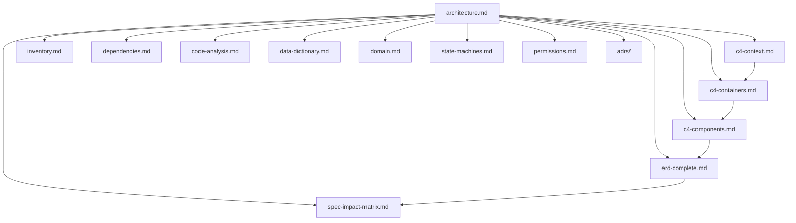

# Spec Impact Matrix — podigger

> Gerado pelo Arquiteto em 2026-06-05
> Matriz de impacto: qual mudança em uma área **A** afeta quais outras áreas **B**?
> Usada para planejar refactor, avaliar blast radius de mudanças e priorizar testes de regressão.

**Escala de confiança:** 🟢 CONFIRMADO (vínculo direto código-a-código) | 🟡 INFERIDO (vínculo semântico) | 🔴 LACUNA (vínculo provável, não comprovado)

---

## 1. Áreas (linhas = origem do impacto; colunas = destino)

**Áreas de origem (linhas):**
- **BE-ACCOUNTS** — Backend Django, app `accounts` (auth, users, permissions)
- **BE-PODCASTS** — Backend Django, app `podcasts` (models, views, services, tasks)
- **BE-CONFIG** — Backend Django, app `config` (settings, urls, celery, asgi/wsgi)
- **FE-UI** — Frontend, design system (`src/components/ui/`)
- **FE-PAGES** — Frontend, pages (`src/app/.../page.tsx`)
- **FE-FEATURES** — Frontend, features (`src/components/<domínio>/`)
- **FE-PROXY** — Frontend, route handlers (`src/app/api/**/route.ts`) + middleware
- **DB** — Schema PostgreSQL
- **CELERY** — Pipeline assíncrono (worker + beat)
- **INFRA** — Docker, CI/CD, deploy
- **EXT-FEEDS** — Integração com feeds RSS/Atom externos

---

## 2. Matriz resumo (visão panorâmica)

Legenda:
- ✅ — impacto direto e forte (mudança em A **exige** mudança em B)
- ◐ — impacto parcial (mudança em A provavelmente impacta B)
- ○ — sem impacto esperado
- 🔴 — gap conhecido

| Mudança em ↓ afeta → | BE-ACCOUNTS | BE-PODCASTS | BE-CONFIG | FE-UI | FE-PAGES | FE-FEATURES | FE-PROXY | DB | CELERY | INFRA | EXT-FEEDS |
|---|---|---|---|---|---|---|---|---|---|---|---|
| **BE-ACCOUNTS** | — | ◐ | ✅ | ○ | ✅ | ✅ | ✅ | ✅ | ○ | ◐ | ○ |
| **BE-PODCASTS** | ◐ | — | ✅ | ○ | ✅ | ✅ | ✅ | ✅ | ✅ | ◐ | ✅ |
| **BE-CONFIG** | ✅ | ✅ | — | ○ | ◐ | ◐ | ✅ | ✅ | ✅ | ✅ | ○ |
| **FE-UI** | ○ | ○ | ○ | — | ◐ | ✅ | ○ | ○ | ○ | ○ | ○ |
| **FE-PAGES** | ✅ | ✅ | ◐ | ◐ | — | ✅ | ✅ | ○ | ○ | ◐ | ○ |
| **FE-FEATURES** | ✅ | ✅ | ◐ | ✅ | ✅ | — | ✅ | ◐ | ○ | ◐ | ○ |
| **FE-PROXY** | ✅ | ✅ | ◐ | ○ | ◐ | ◐ | — | ◐ | ○ | ✅ | ◐ |
| **DB** | ✅ | ✅ | ✅ | ○ | ✅ | ✅ | ✅ | — | ✅ | ◐ | ○ |
| **CELERY** | ◐ | ✅ | ✅ | ○ | ○ | ◐ | ◐ | ✅ | — | ✅ | ✅ |
| **INFRA** | ✅ | ✅ | ✅ | ◐ | ✅ | ✅ | ✅ | ✅ | ✅ | — | ◐ |
| **EXT-FEEDS** | ○ | ✅ | ○ | ○ | ○ | ○ | ○ | ◐ | ✅ | ○ | — |

---

## 3. Matriz detalhada (com explicações e artefatos)

### 3.1 Mudança em **BE-ACCOUNTS** (auth, users, permissions, JWT, cookies)

| Afetado | Tipo | Por quê | Risco | Teste recomendado |
|---------|------|---------|-------|-------------------|
| **BE-CONFIG** | ✅ | `AUTH_USER_MODEL` em `settings.py`; throttle scopes (`login`, `register`); `INSTALLED_APPS` (token_blacklist) | Mudar `User` requer migration + ajustar `AUTH_USER_MODEL` | `pytest accounts/` + smoke login |
| **BE-PODCASTS** | ◐ | `EpisodeManager.search` não usa User, mas permissões herdadas (`IsEditorOrAdmin`) referenciam `request.user.role` | Mudar `role` exige revisar permissions | `pytest podcasts/tests/test_permissions.py` |
| **DB** | ✅ | Schema de `User` + migrations | Mudança estrutural requer migration | `pytest` + revisão de migration |
| **FE-PROXY** | ✅ | Cookie `access_token` (path `/`), cookie `refresh_token` (path `/api/auth/token/refresh/`); auto-refresh regex; logout | Mudar atributo de cookie quebra proxy | E2E login + refresh + logout |
| **FE-PAGES** | ✅ | `LoginPage` trata 200/401/403; `AddPodcastPage` re-checa role; `ForbiddenPage` usa `ROLE_LABELS` | Mudar shape de response ou role values quebra UI | E2E login flow |
| **FE-FEATURES** | ✅ | `AuthContext` expõe `{email, role}`; `Navbar` chama logout; `AddPodcastPage` consome | Mudar shape de `user` quebra consumers | Vitest `AuthContext` |
| **INFRA** | ◐ | `INSTALLED_APPS` para SimpleJWT, throttle, CORS | Mudar auth class exige reconfigurar CORS/CSRF | Smoke test em staging |

**Lacunas conhecidas com impacto em BE-ACCOUNTS:**
- 🔴 R-USER-08 (auditoria de aprovação) — afeta DB, BE-ACCOUNTS, FE-FEATURES
- 🔴 AI-4 (rate limit em busca) — afeta BE-CONFIG, BE-PODCASTS, INFRA
- 🔴 AI-5 (invalidação JWT no logout) — afeta BE-ACCOUNTS, FE-PROXY

---

### 3.2 Mudança em **BE-PODCASTS** (models, views, services, tasks)

| Afetado | Tipo | Por quê | Risco | Teste recomendado |
|---------|------|---------|-------|-------------------|
| **BE-ACCOUNTS** | ◐ | Permissões RBAC em ViewSets; user approval status indiretamente | Mudar permissão afeta quem escreve | `pytest accounts/tests/test_permissions.py` |
| **BE-CONFIG** | ✅ | Throttle scopes, DRF defaults, `INSTALLED_APPS` (`django_filters`) | Mudar settings globais afeta todos apps | Smoke test |
| **DB** | ✅ | 6 modelos: `Podcast`, `Episode`, `Tag`, `PodcastLanguage`, `PopularTerm`, `TopicSuggestion`; M2M `Episode.tags`; migrations 0001-0004 | Mudança estrutural requer migration | `pytest` + `manage.py makemigrations --check` |
| **CELERY** | ✅ | 4 tasks chamam services e models | Mudar service quebra tasks | Testar worker local |
| **FE-PROXY** | ✅ | `api.ts` chama `/api/episodes/`, `/api/podcasts/`; serializers definem shape | Mudar shape de response exige atualizar `fetchEpisodes`, `fetchPodcasts`, `addPodcast` | E2E + Vitest `api.ts` |
| **FE-PAGES** | ✅ | `HomeClient`, `AddPodcastPage` consomem | Mudar contrato exige atualizar UI | E2E + Vitest |
| **FE-FEATURES** | ✅ | `EpisodeCard`, `PodcastCard`, `SearchHero` | Tipos `Episode`, `Podcast` podem quebrar | TypeScript compile check |
| **EXT-FEEDS** | ✅ | `feedparser` é o parser; `requests` é o HTTP client | Mudar parser/mudança de shape de feed | Testar com feeds reais |
| **INFRA** | ◐ | Migrations rodam no container; Celery worker reusa image | Mudança de modelo requer redeploy | CI |

**Lacunas conhecidas com impacto em BE-PODCASTS:**
- 🔴 AI-4 (rate limit em busca) — `EpisodeViewSet` precisa de throttle scope `search`
- 🟡 DT-1 (`to_json` cresce) — requer migration para remover/normalizar
- 🟡 DT-2 (HTML stripping regex) — fácil de trocar, mas precisa de testes

---

### 3.3 Mudança em **BE-CONFIG** (settings, urls, celery, asgi/wsgi)

| Afetado | Tipo | Por quê | Risco |
|---------|------|---------|-------|
| **BE-ACCOUNTS** | ✅ | `AUTH_USER_MODEL`, throttle scopes, `INSTALLED_APPS` | Mudar auth class requer migração de usuários |
| **BE-PODCASTS** | ✅ | DRF defaults, throttle scopes, `django_filters` | Mudança global afeta todas as views |
| **FE-PROXY** | ✅ | `CORS_ALLOWED_ORIGINS`, `CSRF_TRUSTED_ORIGINS`, `ALLOWED_HOSTS` | Mudar CORS/CSRF quebra auth |
| **DB** | ✅ | `DATABASES`, `INSTALLED_APPS` (apps com models) | Mudança de DB exige migration |
| **CELERY** | ✅ | `CELERY_BROKER_URL`, `CELERY_RESULT_BACKEND` | Mudar broker exige reconfigurar worker |
| **INFRA** | ✅ | Variáveis de ambiente lidas via `django-environ` | Mudar schema de env exige atualizar `.env.*.example` |
| **FE-PAGES** | ◐ | `ALLOWED_HOSTS` afeta deploy | Sem impacto direto em runtime |
| **FE-FEATURES** | ◐ | Idem | Idem |

---

### 3.4 Mudança em **FE-UI** (design system: Button, Card, Input, Badge, Icon, Loading)

| Afetado | Tipo | Por quê |
|---------|------|---------|
| **FE-PAGES** | ◐ | Pages usam componentes UI; mudança de prop variant/size exige revisar uso |
| **FE-FEATURES** | ✅ | Feature components usam UI extensivamente |
| **INFRA** | ◐ | Bundle size pode mudar (Tailwind v4) |

> FE-UI é **isolado do backend** — não toca DB, BE, Celery. Mudanças aqui só afetam FE-*.

---

### 3.5 Mudança em **FE-PAGES** (Rotas Next.js)

| Afetado | Tipo | Por quê | Risco |
|---------|------|---------|-------|
| **FE-UI** | ◐ | Pages usam UI; mudança de design exige revisar | Regressão visual |
| **FE-FEATURES** | ✅ | Pages compõem features; ex: `HomePage` → `HomeClient` → `SearchHero`+`EpisodeList` | Mudar layout exige atualizar consumers |
| **FE-PROXY** | ✅ | `AddPodcastPage`, `LoginPage`, `RegisterPage` chamam Route Handlers | Mudar contrato HTTP exige ajustar |
| **BE-ACCOUNTS** | ✅ | LoginPage trata 200/401/403; AddPodcastPage re-checa role | Mudar response shape quebra |
| **BE-PODCASTS** | ✅ | AddPodcastPage consome `AddPodcastResponse` | Idem |
| **INFRA** | ◐ | Build do Next.js (App Router) | Build time |

---

### 3.6 Mudança em **FE-FEATURES** (SearchHero, EpisodeList, PodcastCard, etc.)

| Afetado | Tipo | Por quê | Risco |
|---------|------|---------|-------|
| **FE-UI** | ✅ | Features usam Button, Card, Input, Badge, Icon | Regressão visual |
| **FE-PAGES** | ✅ | Pages compõem features | Layout broken |
| **FE-PROXY** | ✅ | Features chamam `api.ts` que usa Route Handlers | Mudar shape quebra fetch |
| **BE-ACCOUNTS** | ✅ | `AuthContext` consumido por `AddPodcastPage` (em features) | Mudar shape de `user` quebra |
| **BE-PODCASTS** | ✅ | Tipos `Episode`, `Podcast` consumidos; serializers do backend | Mudar serialização exige atualizar tipo |
| **DB** | ◐ | Indireto: tipo do response vem de serializer que vem de model | Mudança de model exige atualizar tipo |

---

### 3.7 Mudança em **FE-PROXY** (Route Handlers + Middleware)

| Afetado | Tipo | Por quê | Risco |
|---------|------|---------|-------|
| **FE-PAGES** | ◐ | Pages chamam Route Handlers | Mudar path/contract quebra |
| **FE-FEATURES** | ◐ | Features chamam Route Handlers via `api.ts` | Idem |
| **BE-ACCOUNTS** | ✅ | Auth Route Handlers (`login`, `logout`, `refresh`); proxy genérico chama `auth/token/*` | Mudar cookie path ou JWT claim quebra auth |
| **BE-PODCASTS** | ✅ | Proxy genérico encaminha `podcasts/*`, `episodes/*`, etc. | Mudar path ou contract quebra fetch |
| **BE-CONFIG** | ◐ | `CORS_ALLOWED_ORIGINS` afeta chamadas internas | Raro |
| **INFRA** | ✅ | Build do Next.js; edge runtime | Build/deploy |

**Lacunas conhecidas com impacto em FE-PROXY:**
- 🔴 AI-5 — logout deveria chamar `/api/auth/token/blacklist/` no backend

---

### 3.8 Mudança em **DB** (Schema PostgreSQL)

| Afetado | Tipo | Por quê |
|---------|------|---------|
| **BE-ACCOUNTS** | ✅ | `User` model |
| **BE-PODCASTS** | ✅ | 6 models + M2M |
| **BE-CONFIG** | ✅ | `DATABASES`, `INSTALLED_APPS` |
| **CELERY** | ✅ | Worker lê/escreve models |
| **FE-PROXY** | ✅ | Route Handlers chamam Django que lê/escreve |
| **FE-PAGES** | ✅ | Indireto |
| **FE-FEATURES** | ✅ | Indireto |
| **INFRA** | ◐ | Migration roda no deploy; volume persistente |

**Operações de risco:**
- Mudança estrutural → migration obrigatória → janela de manutenção
- Mudança de extensão (pg_trgm, FTS) → requer `CREATE EXTENSION` (permissão)
- Mudança de UNIQUE constraint → potencial lock; cuidado em produção
- Mudança de coluna JSONField (`to_json`) → potencial lock + necessidade de backfill

---

### 3.9 Mudança em **CELERY** (Worker + Beat)

| Afetado | Tipo | Por quê | Risco |
|---------|------|---------|-------|
| **BE-PODCASTS** | ✅ | 4 tasks chamam services e models | Task falha = `total_episodes` desatualizado, podcasts órfãos não limpos |
| **BE-CONFIG** | ✅ | `CELERY_BROKER_URL`, beat schedule | Mudar broker exige reconfigurar |
| **DB** | ✅ | Worker lê/escreve | Migration precisa rodar antes do worker iniciar |
| **EXT-FEEDS** | ✅ | `add_episode` + `update_base` chamam `feedparser` | Falha de feed = log + skip (R-CEL-05) |
| **INFRA** | ✅ | Beat singleton; deploy exige reiniciar worker | Lock + estado em Redis |
| **FE-PAGES** | ○ | Indireto | Sem impacto direto |

---

### 3.10 Mudança em **INFRA** (Docker, CI/CD, deploy)

| Afetado | Tipo | Por quê |
|---------|------|---------|
| **BE-CONFIG** | ✅ | `Dockerfile` lê `requirements.txt`; env vars |
| **BE-ACCOUNTS** | ✅ | Idem |
| **BE-PODCASTS** | ✅ | Idem |
| **FE-UI / PAGES / FEATURES / PROXY** | ✅ | Build do Next.js |
| **DB** | ✅ | Volume persistente; backup strategy |
| **CELERY** | ✅ | Worker image; beat singleton |
| **EXT-FEEDS** | ◐ | Network egress |

---

### 3.11 Mudança em **EXT-FEEDS** (fontes RSS/Atom)

| Afetado | Tipo | Por quê | Risco |
|---------|------|---------|-------|
| **BE-PODCASTS** | ✅ | `feedparser` parseia; HTML stripping; data parsing | Feed malformado = exception em item individual (R-CEL-05) |
| **DB** | ◐ | `Episode.to_json` armazena snapshot bruto (DT-1) | Crescimento descontrolado se feeds incharem |
| **CELERY** | ✅ | Tasks chamam parser | Falha por item não aborta batch |
| **INFRA** | ◐ | Network egress; rate limit implícito | Sem retry exponencial |

**Risco sistêmico:** universo aberto, sem contrato. Mudança em feed específico quebra o parser — `bozo==0` é a única validação.

---

## 4. Top 5 de blast radius (mudanças com maior área de impacto)

| # | Mudança | Áreas afetadas | Por quê | Recomendação |
|---|---------|----------------|---------|---------------|
| 1 | Trocar `AUTH_USER_MODEL` (BE-ACCOUNTS) | BE-CONFIG, DB, FE-PROXY, FE-PAGES, FE-FEATURES, INFRA | Auth é transversal | Migration pesada + janela de manutenção + smoke E2E |
| 2 | Mudar shape de `Episode` ou `Podcast` (BE-PODCASTS) | DB, FE-PROXY, FE-PAGES, FE-FEATURES, CELERY, EXT-FEEDS | Core do domínio + Celery + UI | Tipos TS + testes E2E + rollback plan |
| 3 | Mudar cookie `access_token`/`refresh_token` (BE-ACCOUNTS + FE-PROXY) | BE-ACCOUNTS, FE-PROXY, FE-PAGES, FE-FEATURES | Hard-coded em ambos os lados | Coordenar deploy + smoke |
| 4 | Mudar DRF defaults/throttle (BE-CONFIG) | BE-ACCOUNTS, BE-PODCASTS, FE-PROXY | Throttle global afeta login, register, busca | Revisar scopes + testes de rate limit |
| 5 | Adicionar migration de extensão PostgreSQL (DB) | DB, INFRA | `CREATE EXTENSION` exige permissão | Validar em staging; documentar passo manual |

---

## 5. Áreas isoladas (mudanças de baixo risco)

| Área | Isolada de | Por quê |
|------|-------------|---------|
| **FE-UI** | BE, DB, CELERY, EXT-FEEDS | Design system não toca backend |
| **EXT-FEEDS** (contrato) | FE-*, INFRA (parcialmente) | Mudança em um feed não afeta outros |

---

## 6. Mapa de dependências entre artefatos arquiteturais

> Próximas etapas do plano: Redator (specs SDD por componente) usa esta matriz para dimensionar blast radius de cada spec e Revisor usa para validar cobertura.

---

## 7. Confiança

| Seção | Confiança | Origem |
|-------|-----------|--------|
| Áreas de origem (11) | 🟢 | Mapeamento direto de apps e pastas |
| Matriz resumo | 🟢 | Análise estática de imports + `__init__.py` |
| Matriz detalhada | 🟢/🟡 | Dependências diretas confirmadas; semânticas inferidas |
| Top 5 blast radius | 🟢 | Cross-check com ADRs e lacunas |
| Áreas isoladas | 🟢 | Confirmado por ausência de imports cruzados |
